# Appendix: Performance Details

---

# Approximation Framework: Range/Sort Speedup

<div class="grid grid-cols-2 gap-6 mt-2">
<div>

### <span class="text-cyan-400 border-b border-cyan-400">How It Works</span>

Converts conventional queries to **approximate processing** for speedup

<Zoom>

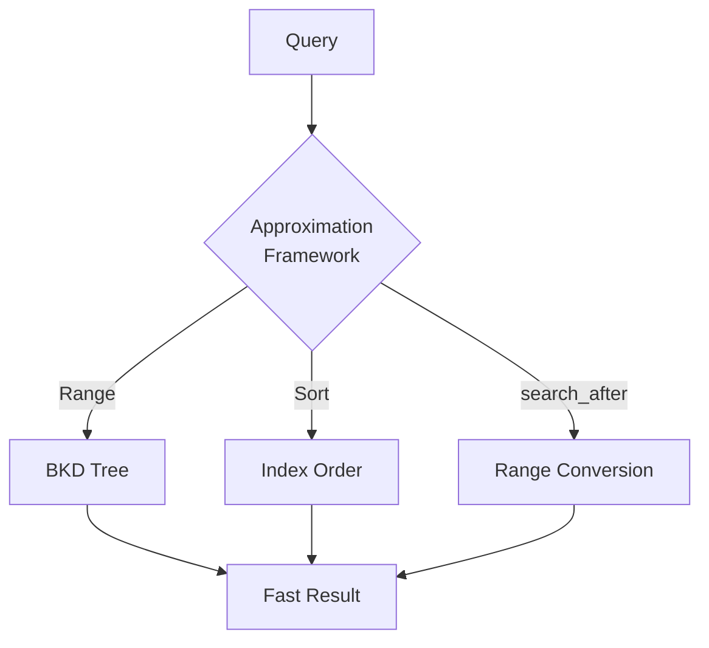

</Zoom>

</div>
<div>

### <span class="text-cyan-400 border-b border-cyan-400">Supported Queries & Effect</span>

| Query Type       | Improvement   |
| ---------------- | ------------- |
| Range            | **90% Faster** |
| Sort (timestamp) | **75% Faster** |
| search_after     | **50x Faster** |

### <span class="text-cyan-400 border-b border-cyan-400">search_after Improvement</span>

- p90: 185ms → **8ms**
- Skips via BKD tree traversal
- Highly effective for deep pagination

<div class="text-xs text-gray-400 mt-2">Introduced in 3.0, expanded in 3.2</div>

</div>
</div>

<div class="absolute bottom-4 right-4 text-xs text-gray-500">
<a href="https://opensearch.org/blog/opensearch-approximation-framework/" target="_blank">Source: OpenSearch Approximation Framework</a>
</div>

---

# Skip List: 96% Faster Date Histogram

<div class="grid grid-cols-2 gap-6 mt-2">
<div>

### <span class="text-cyan-400 border-b border-cyan-400">How It Works</span>

Records **min/max per block** in Doc Values, skips blocks outside query conditions

<Zoom>

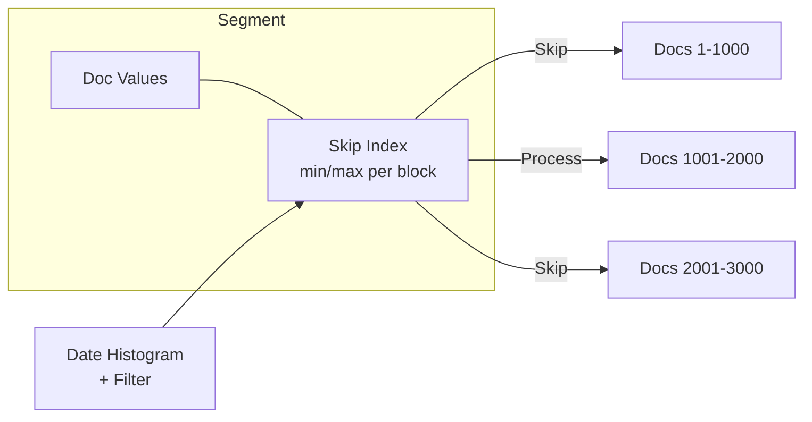

</Zoom>

</div>
<div>

### <span class="text-cyan-400 border-b border-cyan-400">Benchmark Results</span>

| Query                     | Improvement   |
| ------------------------- | ------------- |
| Hourly + Filter           | **96% Faster** |
| Hourly + Filter + Metrics | **46% Faster** |

### <span class="text-cyan-400 border-b border-cyan-400">Requirements</span>

- **Default enabled** for **@timestamp** in 3.3
- All numeric fields supported in 3.2
- Highly effective for filtered Date Histogram

<div class="text-xs text-gray-400 mt-2">
Benchmarked on 116M HTTP logs
</div>

</div>
</div>

<div class="absolute bottom-4 right-4 text-xs text-gray-500">
<a href="https://github.com/opensearch-project/OpenSearch/issues/17965" target="_blank">Source: Skip List RFC</a>
</div>

---

# Star-tree Index: Up to 100x Faster Aggregations

<div class="grid grid-cols-2 gap-6 mt-2">
<div>

### <span class="text-cyan-400 border-b border-cyan-400">Speedup via Pre-aggregation</span>

| Query              | Normal | Star-tree |
| ------------------ | ----- | --------- |
| status=200 (200M docs) | 4.2s | **6.3ms** |
| status=400 (3K docs) | 5ms   | **6.5ms** |

### <span class="text-cyan-400 border-b border-cyan-400">Effect</span>

- Query processing: **1/100th**
- **Predictable latency**
- Especially effective for high cardinality

<div class="mt-2 text-sm text-gray-400">
Introduced in 2.19, GA in 3.1, Multi-term support in 3.3
</div>

</div>
<div>

<Zoom></Zoom>

<div class="text-xs text-gray-400 mt-2">
Pre-aggregated for each dimension value combination
</div>

</div>
</div>

<div class="absolute bottom-4 right-4 text-xs text-gray-500">
<a href="https://opensearch.org/blog/the-power-of-star-tree-indexes-supercharging-opensearch-aggregations/" target="_blank">Source: The power of star-tree indexes</a>
</div>

---
layout: section
---

# Appendix: Vector Search Details

---

# GPU Acceleration: Faster Vector Index Building

<div class="grid grid-cols-2 gap-6 mt-2">
<div>

### <span class="text-cyan-400 border-b border-cyan-400">9.3x Faster with NVIDIA cuVS</span>

| Metric             | Improve           |
| ---------------- | -------------- |
| Index Build      | **9.3x Faster** |
| Cost Efficiency  | **3.75x Better**|
| CPU Usage        | **2.5x Less**   |

<div class="mt-3 text-sm">

- 3.0: Introduced as experimental
- 3.1: GA (Generally Available)
- CAGRA → HNSW auto-conversion

</div>

</div>
<div>

<Zoom></Zoom>

<div class="text-xs text-gray-400 mt-2">
Offloads index building to GPU cluster
</div>

</div>
</div>

<div class="absolute bottom-4 right-4 text-xs text-gray-500">
<a href="https://opensearch.org/blog/gpu-accelerated-vector-search-opensearch-new-frontier/" target="_blank">Source: GPU-accelerated vector search in OpenSearch</a>
</div>

---

# FP16 Vector Optimization: 55% Faster Search

<div class="grid grid-cols-2 gap-6 mt-2">
<div>

### <span class="text-cyan-400 border-b border-cyan-400">How It Works</span>

| Previous                    | 3.3 Optimized                   |
| --------------------------- | ------------------------------- |
| Java FP32 → Convert → C++ FP16 | Java FP16 → **Direct** → C++ SIMD |

- Passes FP16 data **directly** to C++ via JNI
- Faster distance calculation with SIMD instructions
- Eliminates conversion overhead

### <span class="text-cyan-400 border-b border-cyan-400">Requirements</span>

- **knn_vector** field with **data_type: float16**
- Supports Faiss / Lucene engines
- Auto-applied in 3.3

</div>
<div>

### <span class="text-cyan-400 border-b border-cyan-400">Benchmark Results</span>

| Configuration       | Improvement     |
| ------------------ | --------------- |
| Single Segment      | **55.8% Faster**|
| Multi Segment       | **16.2% Faster**|

### <span class="text-cyan-400 border-b border-cyan-400">Why Faster?</span>

1. **No Conversion**: Skips FP32→FP16 conversion
2. **SIMD**: Parallel vector operations
3. **Memory Efficiency**: Data transfer halved

</div>
</div>

<div class="absolute bottom-4 right-4 text-xs text-gray-500">
<a href="https://opensearch.org/blog/opensearch-3-3-performance-innovations-for-ai-search-solutions/" target="_blank">Source: OpenSearch 3.3 Performance Blog</a>
</div>

---

# Hybrid Search Speedup: 65% Latency Improvement

<div class="grid grid-cols-2 gap-4 mt-1">
<div>

### <span class="text-cyan-400 border-b border-cyan-400">Custom Bulk Scorer (3.1)</span>

<Zoom>

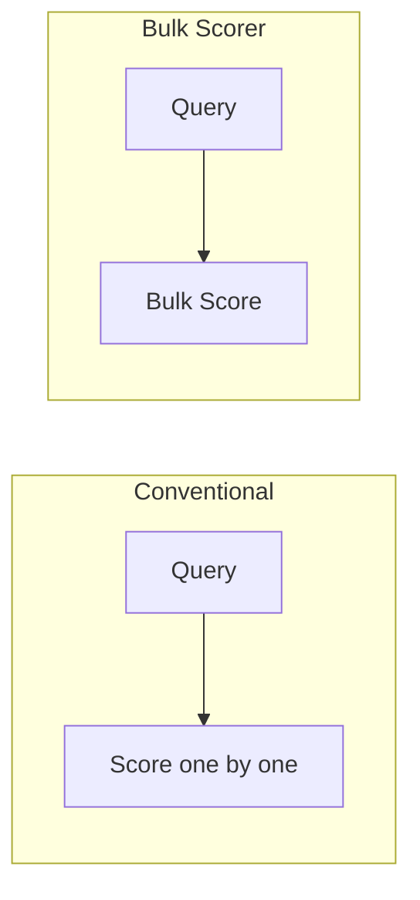

</Zoom>

- **Bulk scoring** of multiple documents
- **65% latency improvement** / **3.5x throughput gain**

</div>
<div>

### <span class="text-cyan-400 border-b border-cyan-400">QueryCollectorContextSpec (3.3)</span>

- Query collector optimization
- Additional **20% latency improvement**

### <span class="text-cyan-400 border-b border-cyan-400">What is Hybrid Search?</span>

```
BM25 + kNN → Score normalization → Final result
```

Leverages both semantic and full-text search

</div>
</div>

<div class="absolute bottom-4 right-4 text-xs text-gray-500">
<a href="https://opensearch.org/blog/opensearch-3-3-performance-innovations-for-ai-search-solutions/" target="_blank">Source: OpenSearch 3.3 Performance Blog</a>
</div>

---

# Byte/Binary Vectors: 90% Storage Reduction

<div class="grid grid-cols-2 gap-6 mt-2">
<div>

### <span class="text-cyan-400 border-b border-cyan-400">Quantization Options</span>

| Type        | Size        | Reduction |
| ----------- | ----------- | ------- |
| FP32 (prev) | 4 bytes/dim | -         |
| FP16        | 2 bytes/dim | **50%** |
| Byte (INT8) | 1 byte/dim  | **75%** |
| Binary      | 1 bit/dim   | **97%** |

### <span class="text-cyan-400 border-b border-cyan-400">Binary Vector Benefits</span>

- Memory usage: **Up to 97% reduction**
- Fast computation via Hamming distance
- Ideal for large datasets

</div>
<div>

### <span class="text-cyan-400 border-b border-cyan-400">Usage Example</span>

```json
{
  "mappings": {
    "properties": {
      "embedding": {
        "type": "knn_vector",
        "dimension": 768,
        "data_type": "binary",
        "space_type": "hamming"
      }
    }
  }
}
```

### <span class="text-cyan-400 border-b border-cyan-400">Use Cases</span>

- Large-scale image search
- Duplicate detection
- Cost-conscious RAG apps

</div>
</div>

<div class="absolute bottom-4 right-4 text-xs text-gray-500">
<a href="https://opensearch.org/docs/latest/field-types/supported-field-types/knn-vector/" target="_blank">Source: OpenSearch knn_vector Documentation</a>
</div>

---

# Memory Optimized Vector Search

<div class="grid grid-cols-2 gap-4 mt-1 text-xs">
<div>

### <span class="text-cyan-400 border-b border-cyan-400">Previous Challenges</span>

| Engine | Pros         | Cons                         |
| -------- | ------------ | ---------------------------- |
| Faiss    | SIMD fast calc | Requires all index in memory |
| Lucene   | Memory efficient | Slower distance calc         |

### <span class="text-cyan-400 border-b border-cyan-400">Lucene-on-Faiss (3.1)</span>

- Lucene's HnswGraphSearcher + Faiss HNSW index
- **On-demand loading**: Loads only required bytes

### <span class="text-cyan-400 border-b border-cyan-400">Memory Usage Comparison (768 dim)</span>

| Config          | 10M vectors | 100M vectors |
| --------------- | ----------- | ------------ |
| ConventionalFaiss       | ~30 GB      | ~300 GB      |
| Lucene-on-Faiss | ~25 MB      | ~250 MB      |

</div>
<div>

### <span class="text-cyan-400 border-b border-cyan-400">Configuration</span>

```json
{
  "settings": {
    "index.knn.memory_optimized_search": true
  }
}
```

### <span class="text-cyan-400 border-b border-cyan-400">Use Cases</span>

| Config          | Recommended Scenario   |
| --------------- | ---------------------- |
| Standard Faiss  | Best performance, ample memory |
| Lucene-on-Faiss | Memory constrained, cost-focused |
| Disk-ANN + LoF  | **Large-scale, minimal memory** |

</div>
</div>

<div class="absolute bottom-4 right-4 text-xs text-gray-500">
<a href="https://opensearch.org/blog/lucene-on-faiss-powering-opensearchs-high-performance-memory-efficient-vector-search/" target="_blank">Source: Lucene-on-Faiss Blog</a>
</div>

---
layout: section
---

# Appendix: AI/Agent Details

Late Interaction / MCP / Agentic Search / AI Search Flows / Search Relevance / UBI

---

# Late Interaction Models: Balancing Search Accuracy & Efficiency (3.3)

<div class="grid grid-cols-2 gap-4 mt-1 text-sm">
<div>

### <span class="text-cyan-400 border-b border-cyan-400">3 Approaches Compared</span>

| Model           | Accuracy | Efficiency | Features               |
| ---------------- | ---- | ---- | ------------------ |
| Bi-encoder       | Medium   | High   | Single vector       |
| Cross-encoder    | Highest | Low  | All token interaction |
| Late Interaction | High   | Medium   | Token-level matching |

### <span class="text-cyan-400 border-b border-cyan-400">How Late Interaction Works</span>

1. **Independently encode** query and document
2. Generate **individual vectors** for each token
3. **MaxSim**: Sum of max similarity for each query token

</div>
<div>

### <span class="text-cyan-400 border-b border-cyan-400">ColBERT / ColPali</span>

- **ColBERT**: Text-oriented Late Interaction model
- **ColPali**: Multimodal support (PDF, images)

### <span class="text-cyan-400 border-b border-cyan-400">Advantages</span>

- Document vectors can be **pre-computed**
- Token-level **fine-grained matching**
- More accurate than Bi-encoder, faster than Cross-encoder

</div>
</div>

<div class="absolute bottom-4 right-4 text-xs text-gray-500">
<a href="https://opensearch.org/blog/boost-search-relevance-with-late-interaction-models/" target="_blank">Source: Boost search relevance with late interaction models</a>
</div>

---

# Late Interaction: Implementation in OpenSearch 3.3

<div class="grid grid-cols-2 gap-4 mt-1">
<div>

### <span class="text-cyan-400 border-b border-cyan-400">2-Phase Search Strategy</span>

```
Phase 1: Candidate retrieval with Bi-encoder (fast)
    ↓
Phase 2: Rerank with Late Interaction (high accuracy)
```

### <span class="text-cyan-400 border-b border-cyan-400">lateInteractionScore Function</span>

```json
{
  "script_score": {
    "script": {
      "source": "lateInteractionScore(
        params.query_vectors,
        'doc_vectors',
        params._source,
        params.space_type)",
      "params": {
        "query_vectors": [[1.0, 0.0], [0.0, 1.0]],
        "space_type": "cosinesimil"
      }
    }
  }
}
```

</div>
<div>

### <span class="text-cyan-400 border-b border-cyan-400">Components</span>

| Component                      | Role                       |
| -------------------------------- | -------------------------- |
| ml-inference ingest processor    | Document multi-vector generation   |
| ml-inference search processor    | Query multi-vector generation |
| lateInteractionScore             | MaxSim score calculation           |

### <span class="text-cyan-400 border-b border-cyan-400">Use Cases</span>

- Specialized document search (legal, medical, technical)
- Multimodal search (figures in PDFs)
- RAG applications requiring high accuracy

</div>
</div>

<div class="absolute bottom-4 right-4 text-xs text-gray-500">
<a href="https://docs.opensearch.org/latest/search-plugins/search-relevance/rerank-by-field-late-interaction/" target="_blank">Source: Reranking with late interaction models</a>
</div>

---

# MCP: Connecting AI Agents with OpenSearch

<div class="grid grid-cols-2 gap-6 mt-2">
<div>

### <span class="text-cyan-400 border-b border-cyan-400">What is MCP?</span>

Model Context Protocol - Standard protocol for AI agents to discover and execute tools

### <span class="text-cyan-400 border-b border-cyan-400">3 Integration Patterns</span>

| Pattern | Description |
|---------|------|
| **Local MCP** | Connect from Claude Desktop etc. |
| **Built-in MCP** | OpenSearch built-in server |
| **MCP Client** | Calls external MCP servers |

</div>
<div>

### <span class="text-cyan-400 border-b border-cyan-400">Key Tools</span>

- **Search**: SearchIndexTool, VectorDBTool, RAGTool
- **Analysis**: PPLTool, LogPatternTool
- **Operations**: ClusterHealthTool, AlertsTool

### <span class="text-cyan-400 border-b border-cyan-400">Installation</span>

```bash
# Local
pip install opensearch-mcp-server-py

# Built-in: No config needed for 3.0+
```

</div>
</div>

<div class="absolute bottom-4 right-4 text-xs text-gray-500">
<a href="https://opensearch.org/blog/introducing-mcp-in-opensearch/" target="_blank">Source: Introducing MCP in OpenSearch</a>
</div>

---

# Agentic Search: Data Operations via Natural Language

<div class="grid grid-cols-2 gap-6 mt-2">
<div>

### <span class="text-cyan-400 border-b border-cyan-400">How It Works</span>

Natural language → LLM auto-generates DSL query → Search execution

```
"red shoes under $50"
  ↓ QueryPlanningTool
{ "query": { "bool": { "must": [...] }}}
```

### <span class="text-cyan-400 border-b border-cyan-400">2 Types of Agents</span>

|            | Conversational | Flow |
| ---------- | -------------- | ---- |
| Conversation history | ○           | ×    |
| Multiple tools | ○              | ×    |
| Latency | Higher           | Lower |

</div>
<div>

### <span class="text-cyan-400 border-b border-cyan-400">Available Tools</span>

- **Query Planning** - DSL generation (required)
- **Search Index** - Index search
- **Index Mapping** - Schema analysis
- **Web Search** - External information retrieval
- **MCP Integration** - External server calls

### <span class="text-cyan-400 border-b border-cyan-400">Supported Models</span>

Amazon Bedrock Claude, OpenAI GPT, Cohere, etc.

<div class="mt-3 text-sm text-gray-400">
Introduced in 3.2, Dashboards UI added in 3.4
</div>

</div>
</div>

<div class="absolute bottom-4 right-4 text-xs text-gray-500">
<a href="https://docs.opensearch.org/latest/vector-search/ai-search/agentic-search/index/" target="_blank">Source: Agentic search documentation</a>
</div>

---

# Agentic Search UI (3.4)

<div class="grid grid-cols-2 gap-4 mt-1">
<div>

<Zoom></Zoom>

<div class="text-xs text-gray-400 mt-1">Agent configuration</div>

</div>
<div>

<Zoom></Zoom>

<div class="text-xs text-gray-400 mt-1">Search results - Understands intent and displays products</div>

</div>
</div>

<div class="mt-2 text-sm">

**Dashboards** > **OpenSearch Plugins** > **AI Search Flows**

</div>

<div class="absolute bottom-4 right-4 text-xs text-gray-500">
<a href="https://opensearch.org/blog/opensearch-3-4s-agentic-search-in-opensearch-dashboards-hands-on-use-cases-and-examples/" target="_blank">Source: Agentic search in OpenSearch Dashboards</a>
</div>

---

# AI Search Flows: Build AI Search with No Code

<div class="grid grid-cols-2 gap-4 mt-1">
<div>

### <span class="text-cyan-400 border-b border-cyan-400">Workflow Builder</span>

<Zoom></Zoom>

<div class="text-xs text-gray-400 mt-1">IDE-style UI: Flow overview / Config / Test</div>

</div>
<div>

### <span class="text-cyan-400 border-b border-cyan-400">Preset Templates</span>

- Semantic / Hybrid / Multimodal Search
- RAG with Vector Retrieval
- **Agentic Search** (3.4)

### <span class="text-cyan-400 border-b border-cyan-400">Capabilities</span>

- Build Ingest/Search pipelines
- ML model integration setup
- Test with sample data

</div>
</div>

<div class="absolute bottom-4 right-4 text-xs text-gray-500">
<a href="https://docs.opensearch.org/latest/vector-search/ai-search/workflow-builder/" target="_blank">Source: AI Search Flows documentation</a>
</div>

---

# Search Relevance Workbench: Visualizing & Improving Search Quality

<div class="grid grid-cols-2 gap-6 mt-4">
<div>

### <span class="text-cyan-400 border-b border-cyan-400">Overview</span>

Dashboards plugin for GUI-based search configuration comparison and evaluation

### <span class="text-cyan-400 border-b border-cyan-400">Key Features</span>

| Feature | Description |
|------|------|
| **Single Query** | Side-by-side comparison of 2 configs |
| **Query Set** | Comprehensive evaluation with multiple queries |
| **Judgment List** | Quantitative evaluation with nDCG/Precision/Recall |

### <span class="text-cyan-400 border-b border-cyan-400">New in 3.4</span>

- Auto-generated Judgments via UBI
- LLM-as-a-Judge support

</div>
<div>

### <span class="text-cyan-400 border-b border-cyan-400">Evaluation Workflow</span>

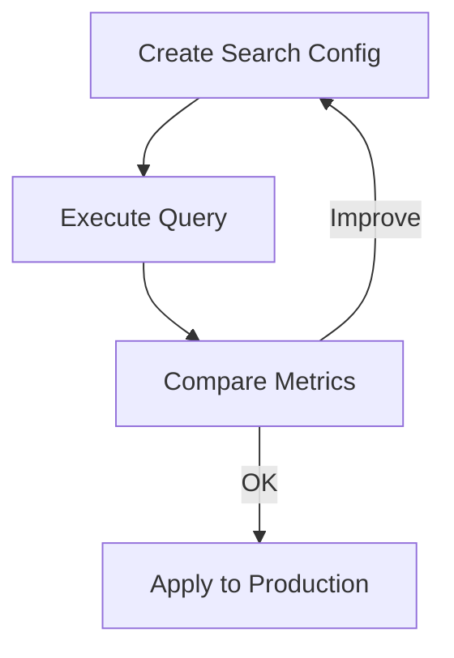

### <span class="text-cyan-400 border-b border-cyan-400">Target Users</span>

- Search engineers: Configuration tuning
- Product managers: Quality monitoring
- Data scientists: A/B test evaluation

</div>
</div>

<div class="absolute bottom-4 right-4 text-xs text-gray-500">
<a href="https://docs.opensearch.org/latest/search-plugins/search-relevance/" target="_blank">Source: Search Relevance documentation</a>
</div>

---

# User Behavior Insights (UBI): Collecting & Analyzing Search Behavior

<div class="grid grid-cols-2 gap-6 mt-4">
<div>

### <span class="text-cyan-400 border-b border-cyan-400">Overview</span>

Records and analyzes search queries linked to user actions

### <span class="text-cyan-400 border-b border-cyan-400">Collected Data</span>

| Category | Content |
|----------|------|
| **Query** | Search query, query_id |
| **Results** | Returned results, rank |
| **Events** | click, purchase, dwell_time |

### <span class="text-cyan-400 border-b border-cyan-400">Installation</span>

```bash
# Client Library
npm install ubi.js
```

</div>
<div>

### <span class="text-cyan-400 border-b border-cyan-400">Use Cases</span>

- **CTR Analysis**: Measuring & improving click-through rates
- **Zero-click Detection**: Identifying problematic queries
- **Judgment Generation**: Auto-created from implicit feedback
- **A/B Testing**: Team Draft Interleaving support

### <span class="text-cyan-400 border-b border-cyan-400">Search Relevance Integration</span>

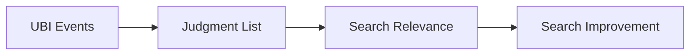

</div>
</div>

<div class="absolute bottom-4 left-4 text-sm text-gray-400">
Introduced in 2.15 / UBI Specification 1.3.0
</div>

---
layout: section
---

# Appendix: MCP Details

---

# MCP: AI Agent Integration (3 Patterns)

<div class="grid grid-cols-3 gap-4 mt-4">
<div class="text-center">

### <span class="text-cyan-400 border-b border-cyan-400">1. Local MCP</span>

<Zoom>

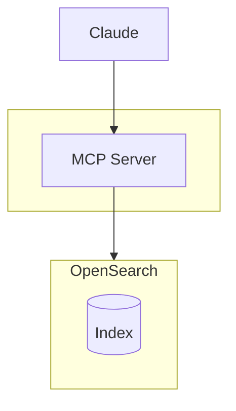

</Zoom>

</div>
<div class="text-center">

### <span class="text-cyan-400 border-b border-cyan-400">2. Built-in MCP</span>

<Zoom>

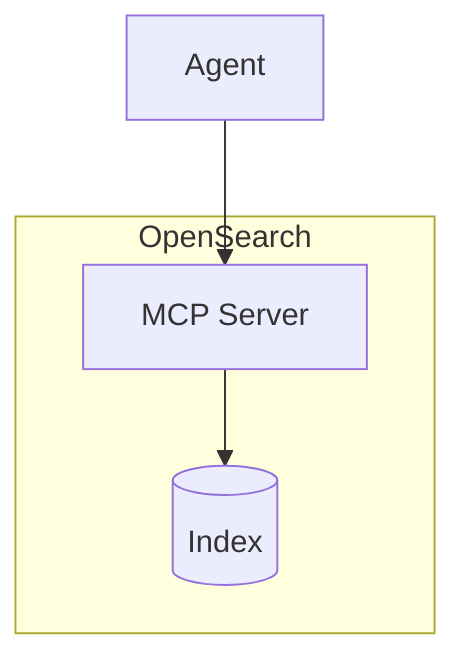

</Zoom>

</div>
<div class="text-center">

### <span class="text-cyan-400 border-b border-cyan-400">3. MCP Client</span>

<Zoom>

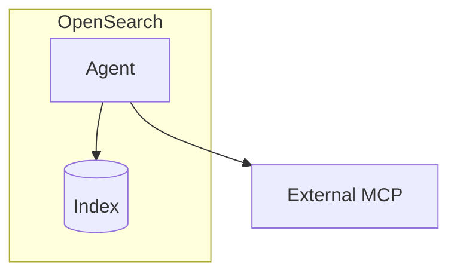

</Zoom>

</div>
</div>

<div class="absolute bottom-4 right-4 text-xs text-gray-500">
<a href="https://opensearch.org/blog/introducing-mcp-in-opensearch/" target="_blank">Source: Introducing MCP in OpenSearch</a>
</div>

---

# Local MCP Server

<div class="grid grid-cols-2 gap-4 mt-1">
<div>

### <span class="text-cyan-400 border-b border-cyan-400">Overview</span>

**opensearch-mcp-server-py**: MCP server for AI assistants

```bash
pip install opensearch-mcp-server-py
```

- Claude Desktop / LangChain integration
- stdio / SSE / Streamable HTTP
- Basic auth / IAM roles

### <span class="text-cyan-400 border-b border-cyan-400">Skills Tools</span>

- DataDistributionTool
- LogPatternAnalysisTool
- LogPatternTool

</div>
<div>

### <span class="text-cyan-400 border-b border-cyan-400">Core Tools (Default Enabled)</span>

<div class="text-xs">

ListIndexTool / IndexMappingTool / SearchIndexTool / GetShardsTool / ClusterHealthTool / CountTool / ExplainTool / MsearchTool / GenericOpenSearchApiTool

</div>

### <span class="text-cyan-400 border-b border-cyan-400">Additional Tools (Optional)</span>

<div class="text-xs">

GetClusterStateTool / GetSegmentsTool / CatNodesTool / GetNodesTool / GetIndexInfoTool / GetIndexStatsTool / GetQueryInsightsTool / GetNodesHotThreadsTool / GetAllocationTool / GetLongRunningTasksTool

</div>

</div>
</div>

<div class="absolute bottom-4 right-4 text-xs text-gray-500">
<a href="https://github.com/opensearch-project/opensearch-mcp-server-py" target="_blank">Source: opensearch-mcp-server-py</a>
</div>

---

# Built-in MCP Server (Remote)

<div class="grid grid-cols-2 gap-4 mt-1">
<div>

### <span class="text-cyan-400 border-b border-cyan-400">Overview</span>

OpenSearch built-in MCP server (3.0+)

- **Streamable HTTP** transport
- Agents discover and execute tools

### <span class="text-cyan-400 border-b border-cyan-400">MCP Server APIs</span>

```
POST /_plugins/_ml/mcp/tools/_register
GET  /_plugins/_ml/mcp/tools
DELETE /_plugins/_ml/mcp/tools/{name}
```

</div>
<div>

### <span class="text-cyan-400 border-b border-cyan-400">Built-in Tools</span>

<div class="text-xs">

**Search**: SearchIndexTool / VectorDBTool / NeuralSparseSearchTool / RAGTool / ListIndexTool / IndexMappingTool

**AI/Analysis**: PPLTool / QueryPlanningTool / MLModelTool / DataDistributionTool / LogPatternTool / LogPatternAnalysisTool

**Observability**: SearchAlertsTool / SearchMonitorsTool / SearchAnomalyDetectorsTool / SearchAnomalyResultsTool / CreateAnomalyDetectorTool

**Others**: AgentTool / ConnectorTool / VisualizationTool / WebSearchTool / ReadFromScratchPadTool / WriteToScratchPadTool

</div>

</div>
</div>

<div class="absolute bottom-4 right-4 text-xs text-gray-500">
<a href="https://docs.opensearch.org/latest/ml-commons-plugin/agents-tools/tools/index/" target="_blank">Source: Tools documentation</a>
</div>

---
layout: section
---

# Appendix: Search Relevance Details

---

# Search Relevance Workbench: Single Query Comparison

<div class="grid grid-cols-2 gap-6 mt-2">
<div>

### <span class="text-cyan-400 border-b border-cyan-400">Steps</span>

1. **Define Search Configuration**
   - Create two search configurations to compare
   - `%SearchText%` placeholder for dynamic query substitution

2. **Execute Query**
   - Execute same query against both configurations simultaneously

3. **Compare & Analyze Results**
   - Visually identify common and unique results

### <span class="text-cyan-400 border-b border-cyan-400">Primary Uses</span>

- Investigating specific query issues
- Immediate verification of config changes
- Confirming hybrid search impact

</div>
<div>

### <span class="text-cyan-400 border-b border-cyan-400">Result Comparison Format</span>

<div class="bg-gray-800/50 rounded-lg p-3 text-sm">

```
Query 1 (Keyword)    Query 2 (Hybrid)
─────────────────    ─────────────────
[A] Laptop Desk      [B] Lenovo Chromebook
[A] Foldable Table   [B] HP Laptop 15
[C] Laptop Case      [C] Laptop Case
[A] Laptop Backpack  [B] Dell Inspiron
```

<div class="mt-2 text-xs">
[A] Query 1 unique  [B] Query 2 unique  [C] Common result
</div>

</div>

<div class="mt-3 text-sm">

**Result Summary:**
- Common results: 4
- Query 1 unique: 6
- Query 2 unique: 6

</div>

</div>
</div>

<div class="absolute bottom-4 right-4 text-xs text-gray-500">
<a href="https://docs.opensearch.org/latest/search-plugins/search-relevance/comparing-search-results/" target="_blank">Source: Comparing search results</a>
</div>

---

# Search Relevance Workbench: Query Set Comparison

<div class="grid grid-cols-2 gap-6 mt-2">
<div>

### <span class="text-cyan-400 border-b border-cyan-400">Evaluation with Multiple Queries</span>

Since a single query can't capture the full picture, comprehensive evaluation is done with Query Sets

```json
// Query Set (NDJSONFormat)
{"queryText": "laptop"}
{"queryText": "red shoes"}
{"queryText": "in-ear headphones"}
{"queryText": "portable bluetooth speakers"}
```

### <span class="text-cyan-400 border-b border-cyan-400">Comparison Metrics</span>

| Metric | Description |
|-----------|------|
| **Jaccard** | Result set overlap rate |
| **RBO50** | Rank correlation emphasizing top results |
| **RBO90** | Rank correlation emphasizing all results |

</div>
<div>

### <span class="text-cyan-400 border-b border-cyan-400">Interpreting Metrics</span>

<div class="bg-gray-800/50 rounded-lg p-3 text-sm">

**Jaccard = 0.21** (low)
- Large difference in result sets
- Significant impact from config changes

**RBO50 = 0.65** (moderate)
- Top results maintain some consistency
- Confirms stability in user-visible range

</div>

### <span class="text-cyan-400 border-b border-cyan-400">Trends by Query Type</span>

| Query Type | Degree of Change |
|-------------|-----------|
| Category-oriented | Large |
| Specific product names | Small |

<div class="text-sm text-gray-400 mt-2">
RBO = Rank-Biased Overlap
</div>

</div>
</div>

<div class="absolute bottom-4 right-4 text-xs text-gray-500">
<a href="https://docs.opensearch.org/latest/search-plugins/search-relevance/explore-experiment-results/" target="_blank">Source: Exploring search evaluation results</a>
</div>

---

# Search Relevance Workbench: Quality Evaluation with Judgment Lists

<div class="grid grid-cols-2 gap-6 mt-2">
<div>

### <span class="text-cyan-400 border-b border-cyan-400">Judgment List Overview</span>

Dataset defining relevance between queries and documents

<div class="bg-gray-800/50 rounded-lg p-3 text-sm mt-2">

| Query | Document | Rating |
|--------|-------------|--------|
| led tv | Samsung 55" | 4 (Perfect) |
| led tv | TV Stand | 1 (Fair) |
| led tv | HDMI Cable | 0 (Bad) |

</div>

### <span class="text-cyan-400 border-b border-cyan-400">Rating Scale</span>

| Score | Rating | Description |
|-------|------|------|
| 4 | Perfect | Perfect match |
| 3 | Excellent | Highly relevant |
| 2 | Good | Relevant |
| 1 | Fair | Partially relevant |
| 0 | Bad | Irrelevant |

</div>
<div>

### <span class="text-cyan-400 border-b border-cyan-400">Evaluation Metrics</span>

| Metric | Measures |
|-----------|---------|
| **nDCG@k** | Ranking quality of top k results |
| **Precision@k** | Precision of top k results |
| **Recall@k** | Coverage of relevant documents |
| **MRR** | Rank of first relevant document |

### <span class="text-cyan-400 border-b border-cyan-400">nDCG Score Guidelines</span>

<div class="bg-gray-800/50 rounded-lg p-3 text-sm">

| Score Range | Rating |
|-----------|------|
| 1.0 | Ideal ranking |
| 0.8+ | Good |
| 0.5-0.8 | Room for improvement |
| Below 0.5 | Needs improvement |

</div>

<div class="text-xs text-gray-400 mt-2">
nDCG = Normalized Discounted Cumulative Gain
</div>

</div>
</div>

---
layout: section
---

# Appendix: UBI Details

---

# UBI: Data Collection Architecture

<div class="grid grid-cols-2 gap-6 mt-2">
<div>

### <span class="text-cyan-400 border-b border-cyan-400">3 Data Stores</span>

| Store | Content |
|--------|------|
| **Query** | Search query, timestamp, query_id |
| **Results** | Returned documents, score, rank |
| **Events** | Click, add to cart, purchase, etc. |

### <span class="text-cyan-400 border-b border-cyan-400">Linking by query_id</span>

```
Query Store     Results Store    Events Store
    │               │                │
    └───── query_id ─────────────────┘
```

All data linked by `query_id`

</div>
<div>

### <span class="text-cyan-400 border-b border-cyan-400">Client Implementation Example</span>

```javascript
// Auto-collection via ubi.js
import { UbiClient } from '@opensearch/ubi';

const ubi = new UbiClient({
  endpoint: 'https://opensearch:9200',
  store: 'my_ubi_store'
});

// Auto-records Query/Results on search
const results = await ubi.search({
  query: { match: { title: 'laptop' } }
});

// Record event
ubi.trackEvent('click', {
  object_id: 'product-123',
  position: 3
});
```

</div>
</div>

<div class="absolute bottom-4 right-4 text-xs text-gray-500">
<a href="https://docs.opensearch.org/latest/search-plugins/ubi/index/" target="_blank">Source: User Behavior Insights documentation</a>
</div>

---

# UBI: Key Use Cases

<div class="grid grid-cols-3 gap-4 mt-4">
<div class="bg-gray-800/50 rounded-lg p-4">

### <span class="text-cyan-400 border-b border-cyan-400">Search Quality Analysis</span>

- **Zero Result Rate**: Percentage of zero-result queries
- **Click-through Rate**: Click-through rate trends
- **Mean Reciprocal Rank**: Position of first click

<div class="text-sm text-gray-400 mt-2">
Identifies problematic query patterns
</div>

</div>
<div class="bg-gray-800/50 rounded-lg p-4">

### <span class="text-cyan-400 border-b border-cyan-400">Implicit Judgment Generation</span>

Estimates relevance from click/purchase data

| Event | Estimated Rating |
|---------|-----------|
| Purchase | 4 (Perfect) |
| Add to Cart | 3 (Excellent) |
| Click | 2 (Good) |
| View Only | 0 (Bad) |

<div class="text-sm text-gray-400 mt-2">
Search Relevance Workbenchintegration
</div>

</div>
<div class="bg-gray-800/50 rounded-lg p-4">

### <span class="text-cyan-400 border-b border-cyan-400">A/B Testing Platform</span>

- KPI comparison per search config
- Statistical testing of conversion rates
- Gradual rollout decisions

<div class="text-sm text-gray-400 mt-2">
Supports data-driven decision making
</div>

</div>
</div>

<div class="absolute bottom-4 right-4 text-xs text-gray-500">
<a href="https://opensearch.org/blog/user-behavior-insights-for-search-relevance/" target="_blank">Source: User Behavior Insights for Search Relevance</a>
</div>

---
layout: section
---

# Other Feature Details

Plan-Execute-Reflect / Derived Source / Pull-based Ingestion / Discover UI / Seismic

---

# Plan-Execute-Reflect Agent: Autonomous Problem Solving

<div class="mt-2">

<Zoom>

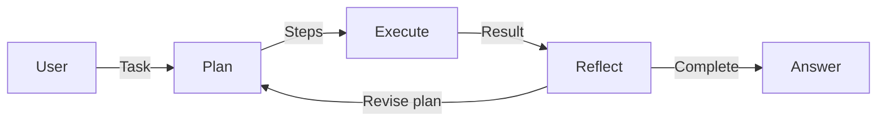

</Zoom>

</div>

<div class="grid grid-cols-2 gap-6 mt-2">
<div>

### <span class="text-cyan-400 border-b border-cyan-400">Features</span>

- Automatically decomposes complex tasks into steps
- Dynamically adjusts plan based on intermediate results
- Supports async execution and MCP integration

</div>
<div>

### <span class="text-cyan-400 border-b border-cyan-400">Use Cases</span>

- Microservice troubleshooting
- Correlation analysis of logs, traces, and metrics

</div>
</div>

<div class="absolute bottom-4 left-4 text-sm text-gray-400">
Introduced in 3.0
</div>

---

# Derived Source: Up to 3x Storage Cost Reduction

<div class="grid grid-cols-2 gap-6 mt-2">
<div>

### <span class="text-cyan-400 border-b border-cyan-400">General Fields (3.2)</span>

<Zoom>

</Zoom>

<div class="text-sm mt-2">

Dynamically reconstructs from `doc_values` without storing `_source`

- Storage **41-58% reduction**
- Index speed **18% improvement**
- Merge time **20-48% reduction**

</div>

</div>
<div>

### <span class="text-cyan-400 border-b border-cyan-400">Vector Fields (3.0)</span>

<Zoom>

</Zoom>

<div class="text-sm mt-2">

Replaces vectors with 1-byte placeholders

- Storage **3x reduction**
- SearchLatency **90%Improve**
- Default enabled since 3.0

</div>

</div>
</div>

---

# Pull-based Ingestion: Direct Streaming Data Ingestion

<div class="grid grid-cols-2 gap-6 mt-2">
<div>

### <span class="text-cyan-400 border-b border-cyan-400">Architecture</span>

<Zoom>

</Zoom>

<div class="text-sm mt-2">
OpenSearch directly pulls data from Kafka/Kinesis
</div>

</div>
<div>

### <span class="text-cyan-400 border-b border-cyan-400">Benefits</span>

- **Backpressure control**: Auto-adjusts speed based on load
- **Simple**: No intermediate components like Logstash
- **Stable**: Auto-recovery on failure
- **At-least-once guarantee**: Consistency via external versioning

### <span class="text-cyan-400 border-b border-cyan-400">Supported Data Sources</span>

- Apache Kafka
- Amazon Kinesis

<div class="mt-2 text-sm text-gray-400">
Introduced as experimental in 3.0
</div>

</div>
</div>

---

# New Discover UI: Unified Observability Experience

<div class="grid grid-cols-2 gap-6 mt-2">
<div>

### <span class="text-cyan-400 border-b border-cyan-400">Unified Logs, Traces & Metrics</span>

<Zoom></Zoom>

<div class="text-xs text-gray-400 mt-1">
Auto-visualization of log volume by service
</div>

</div>
<div>

### <span class="text-cyan-400 border-b border-cyan-400">React Flow Service Map</span>

<Zoom></Zoom>

<div class="text-xs text-gray-400 mt-1">
Interactive trace visualization
</div>

### <span class="text-cyan-400 border-b border-cyan-400">Key Features</span>

- One-click from anomaly detection to related logs
- Auto chart selection
- Build PPL queries with clicks

</div>
</div>

---

# Seismic: Up to 100x Faster Neural Sparse Search

<div class="grid grid-cols-2 gap-6 mt-2">
<div>

### <span class="text-cyan-400 border-b border-cyan-400">Features</span>

<Zoom>

</Zoom>

<div class="text-sm mt-2">

1. **Clustered inverted index**: Groups similar documents
2. **Summary vectors**: Retains only representative tokens per cluster
3. **2-stage pruning**: Token → Cluster → Document candidate filtering

</div>

</div>
<div>

### <span class="text-cyan-400 border-b border-cyan-400">Benchmark (1.29B Documents)</span>

| Method        | Avg Latency |
| ------------- | -------------- |
| BM25          | 41.5ms         |
| Neural Sparse | 125ms          |
| **Seismic**   | **11.8ms**     |

**10x faster** than previous, **3.5x faster** than BM25

### <span class="text-cyan-400 border-b border-cyan-400">Use Cases</span>

- Large-scale semantic search
- RAG applications
- Hybrid search speedup

<div class="mt-2 text-sm text-gray-400">
Introduced in 3.3
</div>

</div>
</div>

---

# Seismic: Approximate Nearest Neighbor for Sparse Vectors

<div class="grid grid-cols-2 gap-8 mt-4">
<div>

### <span class="text-cyan-400 border-b border-cyan-400">Conventional vs Seismic</span>

|        | Conventional       | Seismic        |
| ------ | ---------- | -------------- |
| Method   | Full scan | **ANN (Approximate)** |
| Recall | 100%       | ~90%           |
| Memory | Low        | ~1GB/1M docs   |

### <span class="text-cyan-400 border-b border-cyan-400">Why Faster & Lower Recall</span>

- Judges relevance using cluster **summary vectors**
- Low-score clusters **excluded from scanning**
- → **10x faster** by reducing scan volume
- → Relevant docs in excluded clusters become misses

</div>
<div>

### <span class="text-cyan-400 border-b border-cyan-400">Comparison with Dense k-NN</span>

Just as HNSW is ANN for dense vectors, Seismic is ANN for sparse vectors

### <span class="text-cyan-400 border-b border-cyan-400">When to Use</span>

| Requirement          | Recommended       |
| -------------------- | ----------------- |
| 100% accuracy needed | Standard Neural Sparse |
| Large-scale, low latency | Seismic       |

### <span class="text-cyan-400 border-b border-cyan-400">Best Practices</span>

- Segments: **5M-10M docs**
- Memory: **1GB / 1M docs**

</div>
</div>


---
layout: section
---

# Foundation Details

Members / Governing Board / TSC / TAGs / Ambassadors

---

# Foundation Members List

Organizations participating in the project and providing operational funding. Gain voting rights and director appointment rights.

### <span class="text-cyan-400 border-b border-cyan-400">Premier Members</span>

<div class="flex flex-wrap gap-6 items-center justify-center my-4">
  
  <div class="flex flex-col items-center">
    
    <span class="text-green-400 text-xs">New in 2025</span>
  </div>
  
  
</div>

### <span class="text-cyan-400 border-b border-cyan-400">General Members</span>

<div class="grid grid-cols-6 gap-2 my-3">
  
  
  <div class="flex flex-col items-center">
    
    <span class="text-green-400 text-xs">New in 2025</span>
  </div>
  <div class="flex flex-col items-center">
    
    <span class="text-green-400 text-xs">New in 2025</span>
  </div>
  
  <div class="flex flex-col items-center">
    
    <span class="text-green-400 text-xs">New in 2025</span>
  </div>
  
  <div class="flex flex-col items-center">
    
    <span class="text-green-400 text-xs">New in 2025</span>
  </div>
  
  
  
  <div class="flex flex-col items-center">
    
    <span class="text-green-400 text-xs">New in 2025</span>
  </div>
</div>

---

# Governing Board

Determines strategy, budget & policy. Premier Members appoint directors, General Members elect representatives.

<div class="grid grid-cols-4 gap-4 text-center text-xs mt-2">
  <div class="flex flex-col items-center">
    <Zoom></Zoom>
    <div class="font-bold">Carl Meadows</div>
    <div class="text-gray-400">AWS</div>
    <div class="text-blue-400">Chair</div>
  </div>
  <div class="flex flex-col items-center">
    <Zoom></Zoom>
    <div class="font-bold">Andrew Ross</div>
    <div class="text-gray-400">AWS</div>
    <div class="text-blue-400">TSC Representative</div>
  </div>
  <div class="flex flex-col items-center">
    <Zoom></Zoom>
    <div class="font-bold">Verena Lommatzsch</div>
    <div class="text-gray-400">SAP</div>
    <div class="text-blue-400">Premier Member</div>
  </div>
  <div class="flex flex-col items-center">
    <Zoom></Zoom>
    <div class="font-bold">Shanshan Song</div>
    <div class="text-gray-400">Uber</div>
    <div class="text-blue-400">Premier Member</div>
  </div>
</div>

<div class="grid grid-cols-4 gap-4 text-center text-xs mt-4">
  <div class="flex flex-col items-center">
    <Zoom></Zoom>
    <div class="font-bold">Ben Slater</div>
    <div class="text-gray-400">NetApp</div>
    <div class="text-green-400">General Member</div>
  </div>
  <div class="flex flex-col items-center">
    <Zoom></Zoom>
    <div class="font-bold">Ed Anuff</div>
    <div class="text-gray-400">DataStax</div>
    <div class="text-green-400">General Member</div>
  </div>
  <div class="flex flex-col items-center">
    <Zoom></Zoom>
    <div class="font-bold">Mehul Shah</div>
    <div class="text-gray-400">Aryn</div>
    <div class="text-green-400">General Member</div>
  </div>
  <div class="flex flex-col items-center">
    <Zoom></Zoom>
    <div class="font-bold">Yakun Li</div>
    <div class="text-gray-400">ByteDance</div>
    <div class="text-green-400">General Member</div>
  </div>
</div>

---

# Technical Steering Committee (TSC)

Technical oversight and roadmap decisions. Elected by vote of current TSC members.

<div class="grid grid-cols-2 gap-6 text-sm">
<div>

| Affiliation      | Members ('YY=year joined)                                                         |
| --------- | ----------------------------------------------------------------------------- |
| Apple     | Mikhail Stepura '25                                                           |
| AWS       | **Chair** Andrew Ross '24<br>Pallavi Priyadarshini '24<br>Prudhvi Godithi '25 |
| ByteDance | Yakun Li '24                                                                  |
| Eliatra   | Nils Bandener '25                                                             |
| IBM       | Samuel Herman '25                                                             |

</div>
<div>

| Affiliation        | Members ('YY=year joined)                                  |
| ----------- | ------------------------------------------------------ |
| Independent | Amitai Stern '25                                       |
| OSC         | Eric Pugh '25                                          |
| Paessler    | Jonah Kowall '25                                       |
| Salesforce  | Bryan Burkholder '24                                   |
| SAP         | Karsten Schnitter '24                                  |
| Uber        | Yupeng Fu '24<br>Shubham Gupta '24<br>Michael Froh '25 |

</div>
</div>

---

# Technical Advisory Groups (TAGs)

Long-standing groups reporting to TSC. Oversee and coordinate needs in specific technical areas. Meetings are public, anyone can join.

<div class="grid grid-cols-3 gap-4 text-sm">
<div class="border border-gray-600 rounded-lg p-3">

### <span class="text-cyan-400 border-b border-cyan-400">Build TAG</span>

Build & CI/CD related

</div>
<div class="border border-purple-500 rounded-lg p-3">

### <span class="text-cyan-400 border-b border-cyan-400">Observability TAG</span>

Logs, Metrics & Traces

OpenTelemetry, Prometheus,<br>Jaeger, Fluent Bit integration

**Launched September 2025**

AWS, Uber, SAP, Apple, Paessler

</div>
<div class="border border-gray-600 rounded-lg p-3">

### <span class="text-cyan-400 border-b border-cyan-400">Security TAG</span>

Security related

</div>
</div>

---

# Ambassadors

Recognition of leaders who promote community activities as individuals. Program started September 2025.

<div class="grid grid-cols-4 gap-3 text-xs mt-4">
  <div class="text-center">
    <Zoom></Zoom>
    <div class="font-bold mt-1">Amanda Katona</div>
    <div class="text-gray-400">NetApp</div>
  </div>
  <div class="text-center">
    <Zoom></Zoom>
    <div class="font-bold mt-1">Charlie Hull</div>
    <div class="text-gray-400">The Search Juggler</div>
  </div>
  <div class="text-center">
    <Zoom></Zoom>
    <div class="font-bold mt-1">Dotan Horovits</div>
    <div class="text-gray-400">AWS</div>
  </div>
  <div class="text-center">
    <Zoom></Zoom>
    <div class="font-bold mt-1">Eric Pugh</div>
    <div class="text-gray-400">OSC</div>
  </div>
  <div class="text-center">
    <Zoom></Zoom>
    <div class="font-bold mt-1">Itamar Syn-Hershko</div>
    <div class="text-gray-400">BigData Boutique</div>
  </div>
  <div class="text-center">
    <Zoom></Zoom>
    <div class="font-bold mt-1">Kassian Rosner Wren</div>
    <div class="text-gray-400">NetApp</div>
  </div>
  <div class="text-center">
    <Zoom></Zoom>
    <div class="font-bold mt-1">Kris Freedain</div>
    <div class="text-gray-400">AWS</div>
  </div>
  <div class="text-center">
    <Zoom></Zoom>
    <div class="font-bold mt-1">Laysa Uchoa</div>
    <div class="text-gray-400">Nordcloud</div>
  </div>
</div>

---

# How to Become an Ambassador

<div class="grid grid-cols-2 gap-4 mt-4">
<div class="border border-blue-500 rounded-lg p-4">

### <span class="text-cyan-400 border-b border-cyan-400">Requirements</span>

Track record of contributions (code, content, docs, etc.) and ability to commit to community activities for 1 year

</div>
<div class="border border-green-500 rounded-lg p-4">

### <span class="text-cyan-400 border-b border-cyan-400">Application Process</span>

Twice yearly (**Mar/Sep**) → Apply with contribution record → Foundation review → 1-year term

</div>
<div class="border border-yellow-500 rounded-lg p-4">

### <span class="text-cyan-400 border-b border-cyan-400">Benefits</span>

Official site listing / Networking with core contributors / Exclusive resources & toolkit / Swag

</div>
<div class="border border-purple-500 rounded-lg p-4">

### <span class="text-cyan-400 border-b border-cyan-400">Activities</span>

Hosting meetups & workshops / Creating blogs & tutorials / Mentoring new contributors

</div>
</div>


---
layout: section
---

# 2026 Roadmap Details

Composable Query Engine / Streaming / Core Optimization / Vector Search / AI/ML

---

# Composable Query Engine

<div class="grid grid-cols-2 gap-6 mt-2">
<div>

### <span class="text-cyan-400 border-b border-cyan-400">New Architecture</span>

<Zoom>

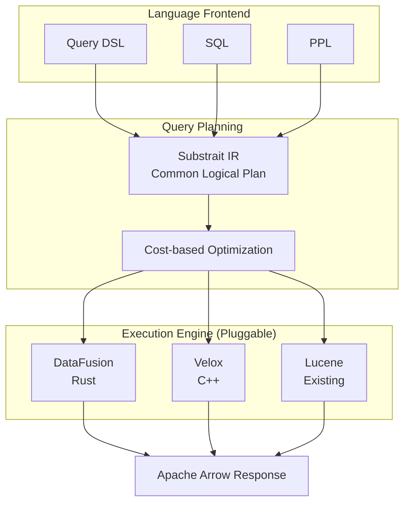

</Zoom>

</div>
<div>

### <span class="text-cyan-400 border-b border-cyan-400">Current Challenges</span>

- Constraints from tight coupling with Lucene
- Memory bottleneck in large-scale aggregations
- Duplicated expression engines across DSL/SQL/PPL

### <span class="text-cyan-400 border-b border-cyan-400">Community Activity</span>

- **ByteDance**: OLAP plugin
- **Velox4J**: Velox integration proposal
- **Segmentless design**: For vector search

### <span class="text-cyan-400 border-b border-cyan-400">Compatibility</span>

- Existing Lucene-based aggregations maintained
- Implemented as **opt-in plugin**

</div>
</div>

---

# Streaming Query Architecture

<div class="grid grid-cols-2 gap-6 mt-2">
<div>

### <span class="text-cyan-400 border-b border-cyan-400">Conventional vs Streaming</span>

<Zoom>

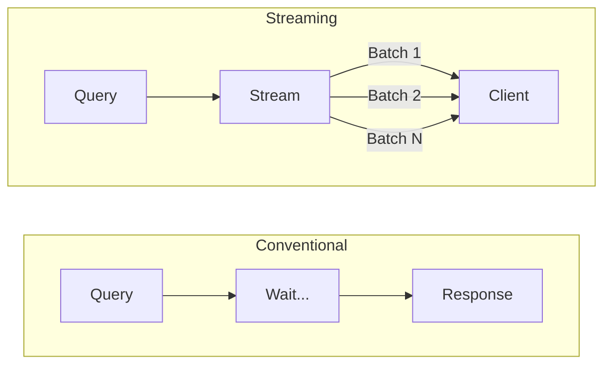

</Zoom>

**Conventional**: Wait until all processing complete → High memory  
**New**: Incremental return via Arrow Batch → Low memory

</div>
<div>

### <span class="text-cyan-400 border-b border-cyan-400">Expected Benefits</span>

| Metric         | Improve            |
| ------------ | --------------- |
| Response Time     | **Up to 2x faster** |
| Memory Usage | Significant reduction        |
| Partial Results | Immediate return possible    |

### <span class="text-cyan-400 border-b border-cyan-400">Goals for 3.5</span>

- **Default enable** streaming aggregations
- Query planning improvements / Virtual Threads

### <span class="text-cyan-400 border-b border-cyan-400">Supported Aggregations</span>

Numeric terms / Cardinality count (expanding)

</div>
</div>

---

# Core Search Engine Optimization (2026)

<div class="grid grid-cols-2 gap-6 mt-2">
<div>

### <span class="text-cyan-400 border-b border-cyan-400">Skip List Expansion</span>

Expanded sub-aggregation support in 3.4:

- Range / Auto Date Histogram
- Faster Min / Max aggregations
- Pre-aggregation via `DocValuesSkipper`

### <span class="text-cyan-400 border-b border-cyan-400">Bulk Collection API</span>

Leveraging new APIs in Lucene 10.3/10.4:

- `LeafCollector#collectRange`
- `NumericDocValues#longValues`
- `DocIdStream#intoArray`

→ Reduces virtual call overhead

</div>
<div>

### <span class="text-cyan-400 border-b border-cyan-400">Intra-segment Parallel Search</span>

Leveraging features introduced in Lucene 10:

- Splits single segment by Doc ID
- Parallel processing with multiple threads
- Improved CPU utilization for large segments

### <span class="text-cyan-400 border-b border-cyan-400">Other Optimizations</span>

- **Missing Terms Aggregator**: Extended Rare Terms optimization
- **gRPC Search API**: Protobuf support for 50+ aggregation types
- **Concurrent Search Improvements**: Load balancing optimization

</div>
</div>

---

# Vector Search Roadmap (2026)

<div class="grid grid-cols-2 gap-4 mt-1 text-sm">
<div>

### <span class="text-cyan-400 border-b border-cyan-400">BFloat16 Support</span>

| Format         | Range          | Memory Reduction |
| ------------ | ------------- | ---------- |
| FP32         | ± 3.4 × 10³⁸     | -          |
| FP16         | ± 65,504       | 50%        |
| **BFloat16** | **± 3.4 × 10³⁸** | **50%**    |

- Resolves FP16 range limits
- Hardware acceleration with Intel AVX512 BF16

### <span class="text-cyan-400 border-b border-cyan-400">Memory-Optimized Search</span>

- Tail latency reduction with Warmup
- Default FP16 → 50% memory reduction

</div>
<div>

### <span class="text-cyan-400 border-b border-cyan-400">Disk-based Search v2</span>

- **BPGP**: Disk read optimization via vector reordering
- **Gorder-PQ**: Efficiency via priority queue
- **Better Binary Quantization**: Flat/approximate search support

### <span class="text-cyan-400 border-b border-cyan-400">GPU Acceleration Improvements</span>

- Index file transfer optimization
- Target **2x speedup**

### <span class="text-cyan-400 border-b border-cyan-400">Extensibility Improvements</span>

Move k-NN interface to core → JVector etc. support

</div>
</div>

---

# AI/ML Roadmap (2026)

<div class="grid grid-cols-2 gap-4 mt-1">
<div>

### <span class="text-cyan-400 border-b border-cyan-400">Agentic Conversation Memory</span>

Persistent context management for built-in agents:

- Conversation history retention across sessions
- Tool execution trace recording
- Remote memory storage support

### <span class="text-cyan-400 border-b border-cyan-400">Context Management & Hook System</span>

Dynamic optimization of LLM context window:

- Sliding Window / Summarization Manager
- Tools Output Truncate

</div>
<div>

### <span class="text-cyan-400 border-b border-cyan-400">MCP Expansion</span>

- **Passthrough Headers**: Transparent forwarding of auth info
- **OAuth 2.x support**: MCP spec-compliant authentication

### <span class="text-cyan-400 border-b border-cyan-400">Connector Improvements</span>

- Retry policy: Streaming support
- Terraform Provider: ML Connector/Model support

### <span class="text-cyan-400 border-b border-cyan-400">3.5 Targets</span>

Context Management API / Remote Agentic Memory

</div>
</div>

---

# Pluggable Per-Field Codecs (2026)

<div class="grid grid-cols-2 gap-4 mt-1">
<div>

### <span class="text-cyan-400 border-b border-cyan-400">Current Challenges</span>

Multiple plugins cannot coexist on the same index:

- k-NN + Seismic → CodecServiceFactory conflict
- Each plugin wraps its own Codec

### <span class="text-cyan-400 border-b border-cyan-400">Solution: Per-Field Codec Builder</span>

```java
interface PerFieldCodecBuilder {
  Optional<PerFieldDocValuesFormat> docValuesFormat();
  Optional<PerFieldKnnVectorsFormat> knnVectorsFormat();
}
```

### <span class="text-cyan-400 border-b border-cyan-400">Benefits</span>

- k-NN + Seismic coexistence / backward compatibility

</div>
<div>

### <span class="text-cyan-400 border-b border-cyan-400">New Architecture</span>

<Zoom>

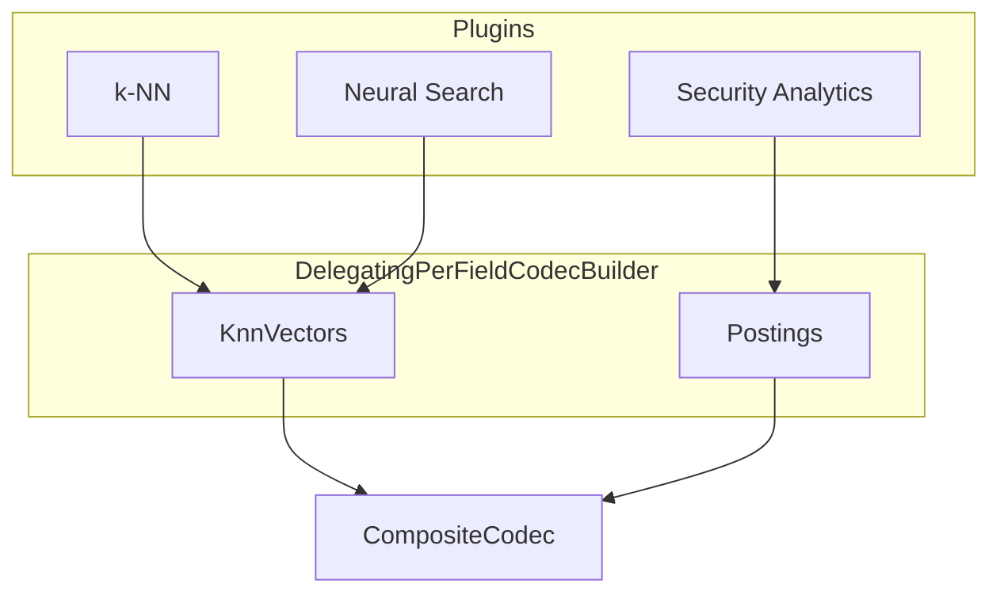

</Zoom>

</div>
</div>

---

# PPL Unified Query API (2026)

<div class="grid grid-cols-2 gap-4 mt-1">
<div>

### <span class="text-cyan-400 border-b border-cyan-400">Current Challenges</span>

Multiple PPL processing paths exist:

- Separate implementations in Calcite V3 / Async Query / Spark
- Code duplication, behavior divergence risk

### <span class="text-cyan-400 border-b border-cyan-400">Unified Query API</span>

```
PPL → UnifiedParser → AST → Planner → Execute
```

| Component | Integration Content    |
| -------------- | -------------------- |
| Calcite V3     | Planner/Compiler sharing |
| Async Query    | Parser/Validator unification |

</div>
<div>

### <span class="text-cyan-400 border-b border-cyan-400">New PPL Commands (3.5)</span>

- **nomv**: Multi-value → single-value conversion
- **inputlookup**: Simplified index lookup
- **array_agg pushdown**: Converts to TopHits aggregation

### <span class="text-cyan-400 border-b border-cyan-400">Benefits</span>

- Consistent PPL behavior
- Maintenance cost reduction
- Batch rollout of new features

</div>
</div>

---

# Vector Search Detailed Roadmap (2026)

<div class="grid grid-cols-2 gap-4 mt-1 text-sm">
<div>

### <span class="text-cyan-400 border-b border-cyan-400">NVQ (Non-Uniform Vector Quantization)</span>

New quantization for Exact Scoring/Re-Ranking:

- **3-3.4x** storage reduction
- **<0.01 recall@10** accuracy maintained
- For final reranking / cold storage

### <span class="text-cyan-400 border-b border-cyan-400">Radial Search for Disk-based</span>

- Current: k-NN search only
- Goal: Retrieve all with min_score

### <span class="text-cyan-400 border-b border-cyan-400">Cosine Similarity Improvements</span>

Return original vectors when Derived Source enabled

</div>
<div>

### <span class="text-cyan-400 border-b border-cyan-400">Pull-based Ingestion Improvements</span>

Enhanced ingestion from Kafka/Kinesis:

- **Lag Catch-up wait**: Sync complete before serving
- Improved consistency during shard relocation

### <span class="text-cyan-400 border-b border-cyan-400">Multi-client Benchmarks</span>

Parallel client testing with OSB:

- `clients: [2,4,8,16,32]`specification

</div>
</div>

---

# Dashboards & Observability (2026)

<div class="grid grid-cols-2 gap-4 mt-1">
<div>

### <span class="text-cyan-400 border-b border-cyan-400">Dashboards Improvements</span>

**Explore Enhancement**:

- Arbitrary interval specification (e.g., 10-second units)

**Version Separation Vision**:

- Independent releases of OpenSearch core and Dashboards

**Anonymous LoginImprove**:

- Anonymous login without Basic auth form

</div>
<div>

### <span class="text-cyan-400 border-b border-cyan-400">Observability TAG</span>

- Best practices definition
- Unified management of Logs/Metrics/Traces

### <span class="text-cyan-400 border-b border-cyan-400">Security Analytics</span>

- INVESTIGATION field addition
- Context improvement for AI/LLM integration

</div>
</div>

---

# Infrastructure & Build Improvements (2026)

<div class="grid grid-cols-2 gap-4 mt-1">
<div>

### <span class="text-cyan-400 border-b border-cyan-400">CI/CD Improvements</span>

**LLM-powered PR Review**:

- Diff analysis before Gradle checks
- Added Amazon Bedrock access

**AlmaLinux 10 Migration**:

- AlmaLinux 8 end-of-support migration
- Full migration planned for 2029

</div>
<div>

### <span class="text-cyan-400 border-b border-cyan-400">Remote Metadata SDK</span>

- Remote store schema version management
- Auto-check on plugin startup

### <span class="text-cyan-400 border-b border-cyan-400">Terraform Provider</span>

ML Commons API support:

- ML Connector / Model Group / Model resources

</div>
</div>

---

# 3.5 Planned Features Summary

<div class="grid grid-cols-3 gap-3 mt-2 text-xs">
<div class="bg-blue-900/30 rounded-lg p-2">

### <span class="text-cyan-400">AI/ML</span>

- Agentic Conversation Memory
- Context Management API
- MCP Header Passthrough

</div>
<div class="bg-green-900/30 rounded-lg p-2">

### <span class="text-cyan-400">SearchEngine</span>

- Pluggable Per-Field Codecs
- PPL Unified Query API
- nomv / inputlookup

</div>
<div class="bg-purple-900/30 rounded-lg p-2">

### <span class="text-cyan-400">Vector Search</span>

- NVQ Quantization
- Radial Search (Disk)
- Return original Cosine vectors

</div>
</div>

<div class="grid grid-cols-3 gap-3 mt-2 text-xs">
<div class="bg-orange-900/30 rounded-lg p-2">

### <span class="text-cyan-400">Dashboards</span>

- Arbitrary interval specification
- Anonymous LoginImprove

</div>
<div class="bg-red-900/30 rounded-lg p-2">

### <span class="text-cyan-400">Security</span>

- INVESTIGATION field
- Detection rule enhancement

</div>
<div class="bg-gray-700/30 rounded-lg p-2">

### <span class="text-cyan-400">Infrastructure</span>

- LLM PR Review
- AlmaLinux 10 Migration

</div>
</div>

<div class="mt-3 text-center text-gray-400 text-sm">
Expected release: 2026 Q2
</div>
