<style>
:not(pre) > code {
  background-color: #374151 !important;
  color: #e5e7eb !important;
}
</style>

# OpenSearch 2025 - 2026

Project & Community Growth and Software Advances

<div class="mt-8 text-gray-400">
Amazon Web Services Japan G.K.
<br>
Analytics Solutions Architect
<br>
Takayuki Enomoto
</div>

---
layout: section
---

# Agenda

<div class="flex justify-center gap-12 mt-16">
<div class="text-center">
<div class="text-5xl mb-4">🚀</div>
<div class="text-xl font-bold">2025<br>Release Highlights</div>
</div>
<div class="text-center">
<div class="text-5xl mb-4">🌏</div>
<div class="text-xl font-bold">Community Activity<br>Recap</div>
</div>
<div class="text-center">
<div class="text-5xl mb-4">🔮</div>
<div class="text-xl font-bold">2026<br>Roadmap</div>
</div>
</div>

---
layout: section
---

# 2025 Highlights

---
layout: default
---

<div class="absolute inset-0 overflow-hidden">
  <Zoom></Zoom>
</div>

---

# OpenSearch Project Overview

<div class="grid grid-cols-3 gap-6 mt-4">
  <div class="text-center">
    <div class="text-2xl">⬇️</div>
    <div class="text-5xl font-bold text-blue-400">1.3B+</div>
    <div class="text-base text-white">Total Downloads</div>
  </div>
  <div class="text-center">
    <div class="text-2xl">📊</div>
    <div class="text-5xl font-bold text-blue-400">1M+</div>
    <div class="text-base text-white">Page Views</div>
  </div>
  <div class="text-center">
    <div class="text-2xl">🏢</div>
    <div class="text-5xl font-bold text-blue-400">100+</div>
    <div class="text-base text-white">Solution Providers</div>
  </div>
</div>

<div class="grid grid-cols-4 gap-4 mt-6">
  <div class="text-center">
    <div class="text-xl">📦</div>
    <div class="text-4xl font-bold text-green-400">140+</div>
    <div class="text-sm text-white">Repositories</div>
  </div>
  <div class="text-center">
    <div class="text-xl">👥</div>
    <div class="text-4xl font-bold text-green-400">3.3K+</div>
    <div class="text-sm text-white">Contributors</div>
  </div>
  <div class="text-center">
    <div class="text-xl">🌐</div>
    <div class="text-4xl font-bold text-green-400">400+</div>
    <div class="text-sm text-white">Participating Organizations</div>
  </div>
  <div class="text-center">
    <div class="text-xl">💬</div>
    <div class="text-4xl font-bold text-green-400">7K+</div>
    <div class="text-sm text-white">Forum Members</div>
  </div>
</div>

<div class="grid grid-cols-2 gap-8 mt-6">
  <div class="text-center">
    <div class="text-xl">💜</div>
    <div class="text-4xl font-bold text-purple-400">4K+</div>
    <div class="text-sm text-white">Slack Members</div>
  </div>
  <div class="text-center">
    <div class="text-xl">🚀</div>
    <div class="text-4xl font-bold text-purple-400">8 Weeks</div>
    <div class="text-sm text-white">Release Cycle</div>
  </div>
</div>

<div class="absolute bottom-4 right-4 text-xs text-gray-500">
<a href="https://youtu.be/cUx4-c73RJ4?t=62" target="_blank">OpenSearchCon Japan 2025 - Keynote: Opening Remarks (Bianca Lewis)</a>
</div>

---

# 2025 Releases and Key Updates


<div class="grid grid-cols-5 gap-6 mt-4">
<div class="col-span-2">

### <span class="text-cyan-400 border-b border-cyan-400">Release Timeline</span>

<div class="grid grid-cols-3 gap-1 mt-4 text-center text-sm">
<div class="p-2 rounded bg-gray-700/50">Jan</div>
<div class="p-2 rounded bg-cyan-600 text-white font-bold">Feb<br/>2.19</div>
<div class="p-2 rounded bg-gray-700/50">Mar</div>
<div class="p-2 rounded bg-gray-700/50">Apr</div>
<div class="p-2 rounded bg-yellow-500 text-black font-bold">May<br/>3.0★</div>
<div class="p-2 rounded bg-cyan-600 text-white font-bold">Jun<br/>3.1</div>
<div class="p-2 rounded bg-gray-700/50">Jul</div>
<div class="p-2 rounded bg-cyan-600 text-white font-bold">Aug<br/>3.2</div>
<div class="p-2 rounded bg-gray-700/50">Sep</div>
<div class="p-2 rounded bg-cyan-600 text-white font-bold">Oct<br/>3.3</div>
<div class="p-2 rounded bg-gray-700/50">1Jan</div>
<div class="p-2 rounded bg-cyan-600 text-white font-bold">1Feb<br/>3.4</div>
</div>

</div>
<div class="col-span-3">

### <span class="text-cyan-400 border-b border-cyan-400">Key Update Areas</span>

<div class="grid grid-cols-2 gap-3 mt-4">
<div class="bg-blue-900/30 rounded-lg p-3">
<div class="text-blue-400 font-bold">Core Engine Optimization</div>
<div class="text-lg text-white">11.3x Faster</div>
</div>
<div class="bg-teal-900/30 rounded-lg p-3">
<div class="text-teal-400 font-bold">Cost Efficiency Improvements</div>
<div class="text-lg text-white">58% Storage Reduction, Workload Isolation, Query Monitoring</div>
</div>
<div class="bg-green-900/30 rounded-lg p-3">
<div class="text-green-400 font-bold">Search Improvements</div>
<div class="text-lg text-white">Agentic Search, Memory-Optimized Vector Search</div>
</div>
<div class="bg-purple-900/30 rounded-lg p-3">
<div class="text-purple-400 font-bold">Relevance & Ranking Improvements</div>
<div class="text-lg text-white">Expanded Rescoring, Search Quality Evaluation</div>
</div>
<div class="bg-yellow-900/30 rounded-lg p-3">
<div class="text-purple-400 font-bold">AI/Agent Support</div>
<div class="text-lg text-white">Agent Framework, MCP Support, Agent Memory</div>
</div>
<div class="bg-orange-900/30 rounded-lg p-3">
<div class="text-orange-400 font-bold">Observability</div>
<div class="text-lg text-white">Unified UI + PPL Overhaul</div>
</div>
</div>

</div>
</div>

---

# Core Engine Optimization: Technologies Behind 11.3x Faster

<div class="grid grid-cols-2 gap-6 mt-2">
<div>
<div class="text-cyan-400 font-bold mb-2">Latency Trend (Geometric Mean)</div>
<Zoom>

</Zoom>
<div class="text-center text-sm text-gray-400 mt-1">OS 1.3 → 3.3: 159ms → 14ms</div>
</div>

<div>
<div class="text-cyan-400 font-bold mb-2">Key Technologies <span class="text-gray-500 font-normal text-sm">(click for details)</span></div>
<div class="grid grid-cols-2 gap-2">

<TechCard title="gRPC/Protobuf" color="blue">
GA in v3.2. Multiplexing & binary protocol for 20% throughput improvement, 50% client processing time reduction.
</TechCard>

<TechCard title="Concurrent Segment Search" color="blue">
Parallel segment processing. Auto mode enabled in v3.0, Thread Balancing added in v3.3 (assigns larger segments first to idle threads, tail latency 3-5%↓).
</TechCard>

<TechCard title="Approximation Framework" color="green">
GA in v3.0. Stops scanning once enough results collected for Range/Sort/search_after. 50x+ speedup using numeric index (BKD tree).
</TechCard>

<TechCard title="Range Query" color="green">
Optimized in v2.17. 90% faster numeric range queries using BKD tree. Effective for time-series data filtering.
</TechCard>

<TechCard title="Skip List" color="purple">
Introduced in v3.0, default for timestamp fields in v3.3. Processes only matching buckets in Date Histogram, 96% faster.
</TechCard>

<TechCard title="Star-tree Index" color="purple">
Introduced in v2.19. Pre-aggregated index for 40x faster multi-terms aggregation. Ideal for dashboards.
</TechCard>

<TechCard title="Streaming Aggregation" color="purple">
Experimental in v3.3. 2x faster high-cardinality aggregations with Apache Arrow. Improved memory efficiency.
</TechCard>

<TechCard title="Lucene 10 / JDK 21+" color="orange">
Lucene 10.1/JDK 21 in v3.0, Lucene 10.3/JDK 24 in v3.3. 89% faster text search with SIMD optimization.
</TechCard>

</div>
</div>
</div>

<div class="absolute bottom-4 right-4 text-xs text-gray-500">
<a href="https://opensearch.org/blog/opensearch-3-3-performance-innovations-for-ai-search-solutions/" target="_blank">Source: OpenSearch 3.3 Performance Blog</a>
</div>

---

# Approximation Framework: Speedup via Early Termination

<div class="grid grid-cols-2 gap-6 mt-4">
<div>

### <span class="text-cyan-400">Problem and Solution</span>

Lucene **scans all segments** processing more documents than needed

→ Uses BKD tree to **stop scanning once enough results collected**

<div class="mt-4 space-y-2 text-sm">
<div class="bg-yellow-900/30 rounded p-2">
<b class="text-yellow-400">Range</b>: Scans BKD tree, stops at size
</div>
<div class="bg-green-900/30 rounded p-2">
<b class="text-green-400">Sort</b>: Converts match_all+sort to Range<br/>
<span class="text-xs text-gray-400 ml-4">ASC→scan from left / DESC→scan from right</span>
</div>
<div class="bg-blue-900/30 rounded p-2">
<b class="text-blue-400">search_after</b>: Converts to Range from specified position<br/>
<span class="text-xs text-gray-400 ml-4">Skips scanning of previous pages</span>
</div>
</div>

</div>
<div>

### <span class="text-cyan-400">Benchmark Results</span>

| Query Type | Improvement |
|-----------|------|
| Range | **90% Faster** |
| Sort (timestamp) | **75% Faster** |
| search_after | **50x Faster** |

<div class="mt-4 bg-gray-800/50 rounded p-3 text-sm">
<div class="text-gray-400 mb-1">Examples:</div>
<div>search_after: 185ms → <b class="text-cyan-400">8ms</b></div>
<div>desc_sort: 2,111ms → <b class="text-cyan-400">6ms</b></div>
</div>

<div class="text-xs text-gray-400 mt-3">Introduced in v3.0, all numeric types in v3.2</div>

</div>
</div>

---

# Skip List: 96% Faster Filtered Aggregations

<div class="grid grid-cols-2 gap-6 mt-2">
<div>

### <span class="text-cyan-400">How It Works</span>

Records **min/max per block** in Doc Values

<div class="mt-4 bg-gray-800/50 rounded-lg p-3 text-sm font-mono">
<div class="text-gray-400 mb-2">Block min/max index:</div>
<div class="flex gap-2">
  <div class="bg-gray-700 rounded px-2 py-1 opacity-50">1-100</div>
  <div class="bg-cyan-900 rounded px-2 py-1 border border-cyan-500">101-200 ✓</div>
  <div class="bg-gray-700 rounded px-2 py-1 opacity-50">201-300</div>
</div>
<div class="text-gray-500 mt-2 text-xs">→ Skips blocks outside filter range</div>
</div>

</div>
<div>

### <span class="text-cyan-400">Benchmark Results</span>

| Query | Improvement |
|--------|------|
| Date Histogram + Filter | **96% Faster** |
| + Metrics Agg | **46% Faster** |

### <span class="text-cyan-400">Requirements</span>

- **Default enabled** for **@timestamp** in v3.3
- Supports **all numeric fields** in v3.2
- Effective for Range Filter + all aggregations

<div class="text-xs text-gray-400 mt-2">Benchmarked on 116M HTTP logs</div>

</div>
</div>

---

# Star-tree Index: Up to 100x Faster Aggregations


<div class="grid grid-cols-2 gap-6 mt-2">
<div>

### <span class="text-cyan-400">Speedup via Pre-aggregation</span>

| Query | Normal | Star-tree |
|--------|------|-----------|
| status=200 (200M docs) | 4.2s | **6.3ms** |
| status=400 (3K docs) | 5ms | **6.5ms** |


### <span class="text-cyan-400">Requirements</span>

- **Append-only** index (no updates/deletes)
- For **time-series data** like logs and metrics

<div class="text-xs text-gray-400 mt-2">Introduced in v2.19, GA in v3.1, Multi-term support in v3.3</div>

</div>
<div>

<Zoom></Zoom>

<div class="text-xs text-gray-400 mt-2">
Pre-aggregated for each dimension value combination
</div>

</div>
</div>

---

# Cost Efficiency & Operations: Key Technologies

<div class="grid grid-cols-2 gap-4 mt-4 text-sm">
<div class="bg-blue-900/30 rounded-lg p-4">

### <span class="text-cyan-400">Storage Reduction</span>

- Derived Source eliminates _source field storage by reconstructing on demand. 58% reduction, merge 20-48% faster

</div>
<div class="bg-green-900/30 rounded-lg p-4">

### <span class="text-cyan-400">Workload Management</span>

- Workload Management enables resource usage limits and allocation
- Rules can be applied per index, request type, user, and role

</div>
</div>

<div class="grid grid-cols-2 gap-4 mt-3 text-sm">
<div class="bg-purple-900/30 rounded-lg p-4">

### <span class="text-cyan-400">Query Performance Analysis</span>

- Query Insights visualizes Top-N query latency and resource consumption in real-time to identify bottlenecks
- Live queries dashboards make it easy to identify running long-running queries

</div>
<div class="bg-orange-900/30 rounded-lg p-4">

### <span class="text-cyan-400">Read/Write Separation</span>

- Separates search and write nodes, enabling different hardware allocation and scaling based on workload characteristics
- Adding read-only and write replica concepts makes generation management of time-series data easier

</div>
</div>

---

# Derived Source: Storage Cost Reduction (3.0/3.2)

<div class="grid grid-cols-2 gap-6 mt-2">
<div>

### <span class="text-cyan-400 border-b border-cyan-400">General Fields (3.2)</span>

<Zoom>

</Zoom>

<div class="text-sm mt-2">

Dynamically reconstructs from `doc_values` etc. without storing `_source`

- Storage **41-58% reduction** / Merge **20-48% faster**

</div>

</div>
<div>

### <span class="text-cyan-400 border-b border-cyan-400">Vector Fields (3.0)</span>

<Zoom>

</Zoom>

<div class="text-sm mt-2">

Replaces vectors with 1-byte placeholders

- Storage **3x reduction** / Default enabled since 3.0

</div>

</div>
</div>

---

# Workload Management: Resource Limits & Allocation (2.18)

<div class="grid grid-cols-2 gap-6 mt-2">
<div>

### <span class="text-cyan-400 border-b border-cyan-400">Dashboards UI</span>

<Zoom></Zoom>

<div class="text-sm mt-2">

Visualizes CPU/memory usage by workload group

</div>

</div>
<div>

### <span class="text-cyan-400 border-b border-cyan-400">Rule Scope</span>

- Index patterns (e.g., `logs-*`)
- Request type / User / Role

### <span class="text-cyan-400 border-b border-cyan-400">Controllable Resources</span>

- CPU usage / Memory usage
- Reject or cancel when threshold exceeded

### <span class="text-cyan-400 border-b border-cyan-400">Effect</span>

Heavy queries don't impact other workloads

</div>
</div>

---

# Query Insights: Query Performance Visualization (2.12)

<div class="grid grid-cols-2 gap-6 mt-2">
<div>

### <span class="text-cyan-400 border-b border-cyan-400">Top-N Queries</span>

<Zoom></Zoom>

<div class="text-sm mt-2">

Identifies top queries by latency / CPU / memory consumption

</div>

</div>
<div>

### <span class="text-cyan-400 border-b border-cyan-400">Key Features</span>

- **Top-N Analysis**: Ranks heavy queries
- **Grouping**: Analyzes similar queries together
- **History Export**: Saves to local index

### <span class="text-cyan-400 border-b border-cyan-400">Live Queries (3.1)</span>

- Real-time monitoring of running queries
- Immediate identification of long-running queries

</div>
</div>

---

# Reader/Writer Separation: Flexible Scaling 

<div class="grid grid-cols-2 gap-6 mt-2">
<div>

<Zoom></Zoom>

</div>
<div>

### <span class="text-cyan-400 border-b border-cyan-400">Benefits</span>

- **Independent Scaling**: Scale search nodes based on search load
- **Cost Optimization**: Writer for high I/O, Reader for high memory
- **Fault Isolation**: Writer failures don't affect search

### <span class="text-cyan-400 border-b border-cyan-400">Benchmark Results</span>

- Query latency **34% improvement**
- Cost **8% reduction**

</div>
</div>

<div class="absolute bottom-4 right-4 text-xs text-gray-500">
<a href="https://opensearch.org/blog/improve-opensearch-cluster-performance-by-separating-search-and-indexing-workloads/" target="_blank">Source: Separating search and indexing workloads</a>
</div>

---

# Search: New Features & Improvements

<div class="grid grid-cols-2 gap-6 mt-4">
<div class="bg-blue-900/30 rounded-lg p-5">

### <span class="text-cyan-400">New Features</span>

- **Agentic Search**: Auto-generates optimal queries from natural language
- **Semantic Field/Highlighting**: Semantic search without pipelines
- **BM25F**: Improved multi-field scoring
- **Multi-vector Support**: Improved accuracy with Late Interaction
- **Template Query**: Placeholder variable support

</div>
<div class="bg-green-900/30 rounded-lg p-5">

### <span class="text-cyan-400">Improvements</span>

- **Hybrid Query**: Collapse / Pagination / Score Explanation
- **ML Inference Extension**: Pass external parameters outside query to ML models
- **Terms Lookup by Query**: Dynamic filtering using query results from another index (subquery-like)

</div>
</div>

---

# Search: Relevance & Ranking / Performance


<div class="grid grid-cols-2 gap-6 mt-4">
<div class="bg-purple-900/30 rounded-lg p-5">

### <span class="text-cyan-400">Relevance & Ranking</span>

- **RRF / Z-score Normalization**: Improved hybrid search score fusion
- **Asymmetric Distance**: Quantization preserving query precision
- **Random Rotation**: Reduces information loss in quantization
- **Maximal Marginal Relevance**: Ensures result diversity
- **Learning to Rank**: ML model-based rescoring
- **Search Relevance Workbench**: Search quality evaluation & comparison tool

</div>
<div class="bg-orange-900/30 rounded-lg p-5">

### <span class="text-cyan-400">Search Performance</span>

- **Vector Search**
  - Lucene-on-Faiss: Throughput 2x
  - NVIDIA cuVS: Index build 9x faster
- **Sparse Search**
  - Seismic: Up to 100x faster
- **Hybrid Search**
  - Bulk Scorer: 85% latency reduction
- **ML Inference**
  - Skip Existing: Skips unchanged inputs, 70% cost reduction

</div>
</div>

---

# Agentic Search: Query Generation from Natural Language (3.2+)

<div class="grid grid-cols-2 gap-4 mt-1">
<div>

<Zoom></Zoom>

<div class="text-xs text-gray-400 mt-1">Agent configuration (Dashboards > AI Search Flows)</div>

</div>
<div>

### <span class="text-cyan-400 border-b border-cyan-400">Agentic Query</span>

```json
GET /products/_search?search_pipeline=agentic-pipeline
{ "query": { "agentic": {
    "query_text": "red shoes under $50" }}}
```


### <span class="text-cyan-400 border-b border-cyan-400">Converted Query DSL</span>

```json
{ "query": { "bool": { "must": [
    { "match": { "color": "red" }},
    { "match": { "category": "shoes" }},
    { "range": { "price": { "lte": 5000 }}}]}}}
```

</div>
</div>

<div class="absolute bottom-4 right-4 text-xs text-gray-500">
<a href="https://docs.opensearch.org/latest/query-dsl/specialized/agentic/" target="_blank">Source: Agentic query documentation</a>
</div>

---

# Semantic Field: Easier Semantic Search (3.3+)

<div class="grid grid-cols-2 gap-6 mt-2">
<div>

### <span class="text-cyan-400">Features</span>
- Just specify model_id on a semantic field
- No Ingest Pipeline / Search Pipeline needed
- knn_vector / rank_features auto-generated
- Supports both Dense / Sparse models

### <span class="text-cyan-400">Considerations</span>
- Index recreation required when changing models (traditional Neural Search can update models by changing pipeline only)

</div>
<div>

```json
// Mapping definition
"content": {
  "type": "semantic",
  "model_id": "my-model"
}
```

```json
// Auto-generated fields
"content_semantic_info": {
  "embedding": {
    "type": "knn_vector",
    "dimension": 384,
    "method": { "engine": "faiss" }
  },
  "model": { "id": "...", "name": "..." }
}
```

</div>
</div>

<div class="absolute bottom-4 right-4 text-xs text-gray-500">
<a href="https://docs.opensearch.org/latest/field-types/supported-field-types/semantic/" target="_blank">Source: Semantic field type documentation</a>
</div>

---

# Combined Fields Query: Multi-field Search with BM25F (3.2)

<div class="grid grid-cols-2 gap-6 mt-2">
<div>

### <span class="text-cyan-400">Previous Issue: cross_fields</span>

Calculates TF and saturation per field, leading to high dependency on boost for score optimization

```json
{
  "query": {
    "multi_match": {
      "query": "javascript book",
      "fields": ["title^0.5", "body"],
      "type": "cross_fields"
    }
  }
}
```

</div>
<div>

### <span class="text-cyan-400">BM25F Solution</span>

- Applies saturation after merging TF, reducing dependency on boost
- Constraint: All fields must use the same analyzer

```json
{
  "query": {
    "combined_fields": {
      "query": "javascript book",
      "fields": ["title", "body"]
    }
  }
}
```

</div>
</div>

<div class="absolute bottom-4 right-4 text-xs text-gray-500">
<a href="https://docs.opensearch.org/latest/query-dsl/full-text/combined-fields/" target="_blank">Source: Combined fields query documentation</a>
</div>

---

# Terms Lookup by Query: Dynamic Filtering (3.3)

<div class="grid grid-cols-2 gap-6 mt-2">
<div>

### <span class="text-cyan-400 border-b border-cyan-400">Overview</span>

Dynamic filtering using query results from another index (subquery-like)

### <span class="text-cyan-400 border-b border-cyan-400">Use Cases</span>

- Exclude related products from user purchase history
- Document filtering based on permission tables
- Filter by real-time inventory status

</div>
<div>

### <span class="text-cyan-400 border-b border-cyan-400">Query Example</span>

```json
GET products/_search
{
  "query": {
    "terms": {
      "product_id": {
        "index": "user_purchases",
        "query": {
          "term": { "user_id": "user123" }
        },
        "path": "purchased_product_ids"
      }
    }
  }
}
```

</div>
</div>

<div class="absolute bottom-4 right-4 text-xs text-gray-500">
<a href="https://docs.opensearch.org/latest/query-dsl/term/terms/" target="_blank">Source: Terms query documentation</a>
</div>

---

# Maximal Marginal Relevance (MMR): Ensuring Result Diversity (3.2)

<div class="grid grid-cols-2 gap-6 mt-2">
<div>

### <span class="text-cyan-400">Features</span>

- Automatically balances relevance and diversity
- Eliminates redundant results, improving information coverage
  - e.g., Search "Python intro" → Returns various intro books, not different editions of the same book

### <span class="text-cyan-400">How MMR Works</span>

```
MMR = (1-λ) × Relevance - λ × Similarity to selected
```

- **Relevance**: Similarity to query
- **Diversity**: Difference from already selected results
- **λ (diversity)**: Closer to 1 = more diversity

</div>
<div>

### <span class="text-cyan-400">Configuration Example</span>

```json
{
  "query": { "knn": { "my_vector": {
    "vector": [0.12, 0.54, 0.91],
    "k": 10 } } },
  "ext": { "mmr": { "diversity": 0.7 } }
}
```

### <span class="text-cyan-400">Effect</span>

- Improved information coverage in RAG
- Diverse options in product search

</div>
</div>

<div class="absolute bottom-4 right-4 text-xs text-gray-500">
<a href="https://opensearch.org/blog/improving-vector-search-diversity-through-native-mmr/" target="_blank">Source: Improving vector search diversity through native MMR</a>
</div>

---

# Learning to Rank: ML Model-based Rescoring (2.19)

<div class="grid grid-cols-2 gap-6 mt-2">
<div>

### <span class="text-cyan-400">Features</span>

- Rescoring with lightweight XGBoost / RankLib ML models
- Feature Set: Define search queries as features
- Feature Logging: Training data collection
- Originally external plugin → Official plugin in 2.19

### <span class="text-cyan-400">Use Cases</span>

- Ranking considering click-through rate
- Combining business rules and relevance
- Model improvement via A/B testing

</div>
<div>

### <span class="text-cyan-400">Usage Example</span>

```json
// Feature Set Definition
PUT _ltr/_featureset/my_features
{ "featureset": { "features": [
  { "name": "title_match",
    "params": ["keywords"],
    "template": { "match": { "title": "{{keywords}}" }}
  }]}}
```

```json
// Search with LTR
POST my_index/_search
{ "query": { "sltr": {
    "params": { "keywords": "search term" },
    "model": "my_model" }}}
```

</div>
</div>

<div class="absolute bottom-4 right-4 text-xs text-gray-500">
<a href="https://docs.opensearch.org/latest/search-plugins/ltr/index/" target="_blank">Source: Learning to Rank documentation</a>
</div>

---

# Lucene-on-Faiss: Memory-Efficient Vector Search (3.1)

<div class="grid grid-cols-2 gap-6 mt-4">
<div>

### <span class="text-cyan-400">Processing Flow</span>

<Zoom></Zoom>

- Lucene determines next node to visit. Loads only required vectors from Faiss index
- Performs distance calculation on Faiss and returns results to Lucene

</div>
<div>

### <span class="text-cyan-400">Features</span>

- Reduces memory by loading only visited node vectors on-demand from disk.
  - Successfully processed a 30GB Faiss index on an 8GB memory instance (t2.large).
- Lucene's early termination logic may also improve search speed
  - Benchmarks on 32x quantized index showed ~2x QPS improvement.

</div>
</div>

<div class="absolute bottom-4 right-4 text-xs text-gray-500">
<a href="https://opensearch.org/blog/lucene-on-faiss-powering-opensearchs-high-performance-memory-efficient-vector-search/" target="_blank">Source: Lucene-on-Faiss Blog</a>
</div>

---

# ADC + Random Rotation: Improving Quantization Accuracy (3.2)

<div class="grid grid-cols-2 gap-4 mt-2">
<div>

### <span class="text-cyan-400 border-b border-cyan-400">Random Rotation</span>

<Zoom></Zoom>

<div class="mt-2 text-sm">

**Problem**: Information in specific dimensions easily lost during quantization

**Solution**: Random rotation distributes information across all dimensions
→ **Recall improved up to 5%**

</div>

</div>
<div>

### <span class="text-cyan-400 border-b border-cyan-400">ADC (Asymmetric Distance)</span>

<Zoom></Zoom>

<div class="mt-2 text-sm">

**Problem**: Quantizing both query and document doubles the error

**Solution**: Distance calculation with query at full precision
→ **Recall improved up to 10%**

</div>

</div>
</div>

<div class="absolute bottom-4 right-4 text-xs text-gray-500">
<a href="https://opensearch.org/blog/the-benefits-of-random-rotation-in-quantized-vector-search/" target="_blank">Source: Random Rotation Blog</a> / 
<a href="https://opensearch.org/blog/asymmetric-distance-computation-for-binary-quantization/" target="_blank">ADC Blog</a>
</div>

---

# Skip Existing: Reducing ML Inference Cost (3.2)

<div class="grid grid-cols-2 gap-6 mt-2">
<div>

<Zoom></Zoom>

</div>
<div>

### <span class="text-cyan-400 border-b border-cyan-400">Features</span>

- Reuses existing embeddings if input fields haven't changed
- Supports `text_embedding`, `sparse_encoding`, `text_image_embedding`
- **84% processing time reduction for unchanged documents**

### <span class="text-cyan-400 border-b border-cyan-400">Configuration Example</span>

```json
{
  "text_embedding": {
    "model_id": "...",
    "field_map": { "text": "embedding" },
    "skip_existing": true
  }
}
```

</div>
</div>

<div class="absolute bottom-4 right-4 text-xs text-gray-500">
<a href="https://opensearch.org/blog/optimizing-inference-processors-for-cost-efficiency-and-performance/" target="_blank">Source: Optimizing inference processors Blog</a>
</div>

---

# Search Quality: Search Relevance Workbench

**Query Set Comparison** - Discover patterns across multiple queries

<div class="grid grid-cols-3 gap-4 mt-2">
<div class="text-center">
<div class="text-sm font-bold text-cyan-400 mb-2">1. Create Query Set</div>
<Zoom></Zoom>
<div class="text-xs text-gray-400 mt-2 text-left">
Define the set of queries to evaluate<br/>
• Sample from real user query logs<br/>
• Can also manually add problematic queries
</div>
</div>
<div class="text-center">
<div class="text-sm font-bold text-cyan-400 mb-2">2. Define Search Config</div>
<Zoom></Zoom>
<div class="text-xs text-gray-400 mt-2 text-left">
Define two search configurations to compare<br/>
• Query body + pipeline<br/>
• e.g., keyword vs hybrid search
</div>
</div>
<div class="text-center">
<div class="text-sm font-bold text-cyan-400 mb-2">3. Experiment Results</div>
<Zoom></Zoom>
<div class="text-xs text-gray-400 mt-2 text-left">
• Jaccard / RBO: Measure result changes<br/>
• nDCG: Quantitative evaluation with Judgments<br/>
• Judgment: Explicit / UBI / LLM
</div>
</div>
</div>

<div class="absolute bottom-4 right-4 text-xs text-gray-500">
<a href="https://opensearch.org/blog/taking-your-first-steps-towards-search-relevance/" target="_blank">Source: OpenSearch Blog</a>
</div>

---

# Search Quality: User Behavior Insights (UBI)

Records search queries linked to user actions

<div class="grid grid-cols-2 gap-6 mt-4">
<div class="space-y-3">

### <span class="text-red-400">Key Features</span>

- **Event Collection**: Records queries / results / events (click, purchase, etc.)
- **CTR Analysis**: Detects click-through rates and zero-click searches
- **A/B Testing**: Compare configurations with Team Draft Interleaving

### <span class="text-cyan-400">SRW Integration</span>

- Uses user behaviors like clicks as **implicit Judgments**
- Enables nDCG evaluation without manual labeling

</div>
<div>

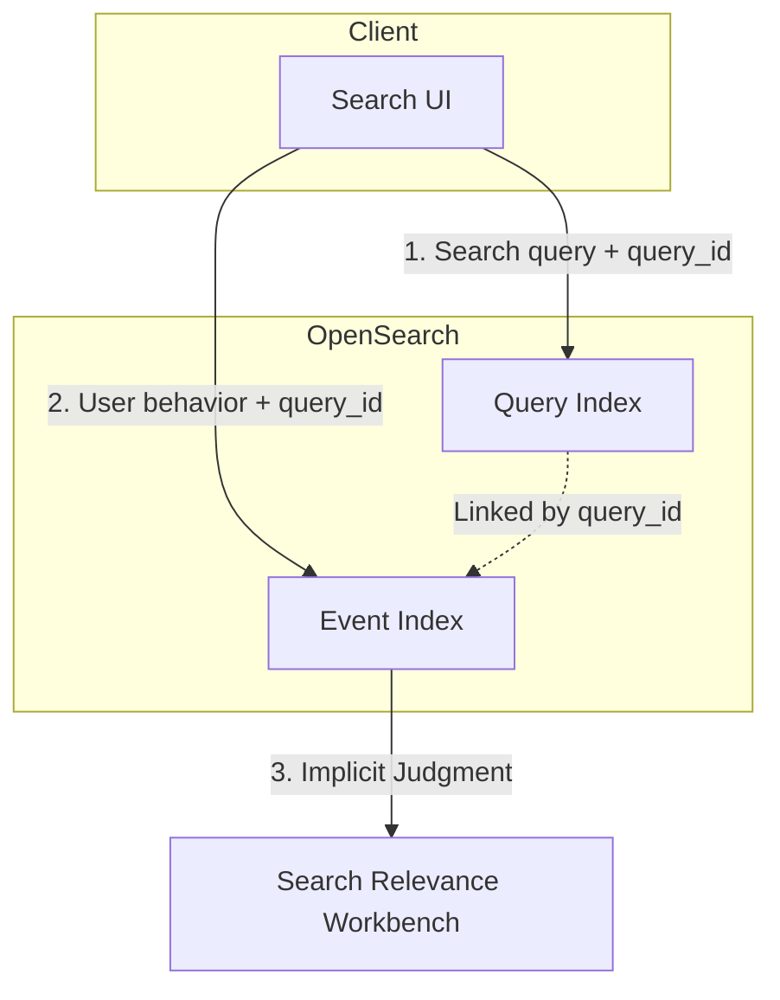

</div>
</div>

<div class="absolute bottom-4 right-4 text-xs text-gray-500">
<a href="https://docs.opensearch.org/docs/search-plugins/ubi/index/" target="_blank">Source: OpenSearch Documentation</a>
</div>


---

# AI/Agent: Integrating OpenSearch into Agents

<div class="grid grid-cols-2 gap-6 mt-6">
<div class="bg-blue-900/30 rounded-lg p-5">

### <span class="text-cyan-400">MCP Server</span>

- External agents can call OpenSearch
- Local / Built-in MCP server

### <span class="text-cyan-400">Conversation Memory</span>

- Stores agent conversation history in OpenSearch
- Improved accuracy through context retention

</div>
<div class="bg-green-900/30 rounded-lg p-5">

### <span class="text-cyan-400">No-code Building</span>

- **AI Search Flows**: Build RAG / agents with no code
- **Processor Chains**: Process search pipeline I/O

### <span class="text-cyan-400">Agent Execution Platform</span>

- Create and run agents on OpenSearch
- **Plan-Execute-Reflect** decomposes complex tasks

</div>
</div>

---

# MCP: AI Agent Integration (3 Patterns)

<div class="grid grid-cols-3 gap-4 mt-4">
<div class="text-center">

### <span class="text-cyan-400 border-b border-cyan-400">1. Local MCP</span>

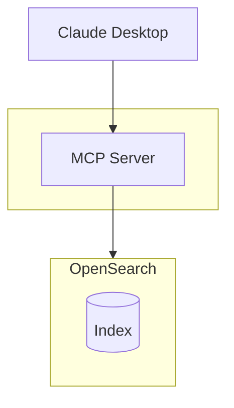

<div class="text-sm mt-2">

`pip install opensearch-mcp-server-py`

</div>

</div>
<div class="text-center">

### <span class="text-cyan-400 border-b border-cyan-400">2. Built-in MCP</span>

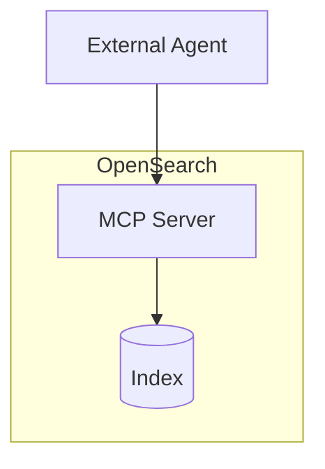

<div class="text-sm mt-2">

No configuration needed for 3.0+

</div>

</div>
<div class="text-center">

### <span class="text-cyan-400 border-b border-cyan-400">3. MCP Client</span>

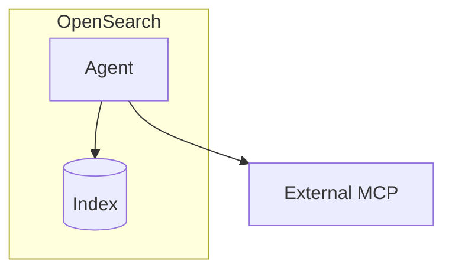

<div class="text-sm mt-2">

Calls external tools

</div>

</div>
</div>

<div class="absolute bottom-4 right-4 text-xs text-gray-500">
<a href="https://opensearch.org/blog/introducing-mcp-in-opensearch/" target="_blank">Source: Introducing MCP in OpenSearch</a>
</div>

---

# Agentic Memory: Short-term and Long-term Memory (3.3)

<div class="mt-4">

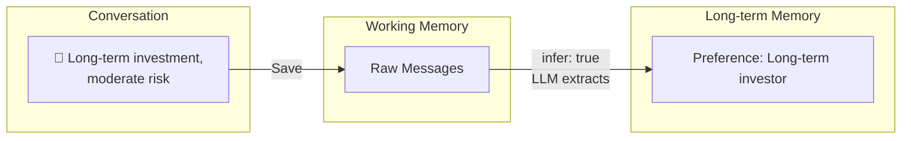

</div>

<div class="grid grid-cols-2 gap-8 mt-4">
<div>

### <span class="text-cyan-400 border-b border-cyan-400">Working Memory (Short-term)</span>

- **Stores raw conversation data as-is**
- Maintains context during session
- Direct reference within token limits

</div>
<div>

### <span class="text-cyan-400 border-b border-cyan-400">Long-term Memory</span>

- LLM **auto-extracts important information**
- SEMANTIC / USER_PREFERENCE / SUMMARY
- Persists across sessions

</div>
</div>

<div class="absolute bottom-4 right-4 text-xs text-gray-500">
<a href="https://opensearch.org/blog/opensearch-as-an-agentic-memory-solution-building-context-aware-agents-using-persistent-memory/" target="_blank">Source: OpenSearch as an Agentic Memory Solution</a>
</div>

---

# AI Search Flows: Build AI Search with No Code

<div class="grid grid-cols-2 gap-4 mt-1">
<div>

### <span class="text-cyan-400 border-b border-cyan-400">Workflow Builder</span>

<Zoom></Zoom>

<div class="text-xs text-gray-400 mt-1">IDE-style UI: Flow overview / Config / Test</div>

</div>
<div>

### <span class="text-cyan-400 border-b border-cyan-400">Preset Templates</span>

- Semantic / Hybrid / Multimodal Search
- RAG with Vector Retrieval
- **Agentic Search** (3.4)

### <span class="text-cyan-400 border-b border-cyan-400">Capabilities</span>

- Build Ingest/Search pipelines
- ML model integration setup
- Test with sample data

</div>
</div>

<div class="absolute bottom-4 right-4 text-xs text-gray-500">
<a href="https://docs.opensearch.org/latest/vector-search/ai-search/workflow-builder/" target="_blank">Source: AI Search Flows documentation</a>
</div>

---

# Plan-Execute-Reflect Agent: Autonomous Problem Solving (3.0)

<div class="grid grid-cols-5 gap-4 mt-2">
<div class="col-span-2">

### <span class="text-cyan-400">Features</span>

- Automatically decomposes complex tasks into steps
- Dynamically adjusts plan based on intermediate results
- Supports async execution and MCP integration

### <span class="text-cyan-400">Use Cases</span>

- Microservice troubleshooting
- Correlation analysis of logs, traces, and metrics

</div>
<div class="col-span-3">

```mermaid {scale: 0.38, theme: 'dark'}
sequenceDiagram
    participant U as Client
    participant PER as PER Agent
    participant LLM
    participant EX as Executor Agent
    participant T as Tools/MCP
    participant I as Index

    U->>PER: Task
    
    loop Until complete
        rect rgb(50, 50, 80)
        Note over PER,LLM: 1. Plan
        PER->>LLM: Prompt
        LLM-->>PER: Step generation
        end
        
        rect rgb(50, 80, 50)
        Note over PER,I: 2. Execute
        PER->>EX: Execute step
        EX->>T: Tool call
        T->>I: Search/Retrieve
        I-->>T: Result
        T-->>EX: Result
        EX-->>PER: Execution result
        end
        
        rect rgb(80, 50, 50)
        Note over PER,LLM: 3. Reflect
        PER->>LLM: Evaluate result
        LLM-->>PER: Continue or Complete
        end
    end
    
    PER-->>U: Answer
```

</div>
</div>

---

# Observability: Key Technologies (1/2)

<div class="grid grid-cols-2 gap-6 mt-6">
<div class="bg-blue-900/30 rounded-lg p-5">

### <span class="text-cyan-400">Discover UI Overhaul</span>

- New UI integrating logs / traces / visualization (3.3 preview, 3.4 default)
- **Auto Chart Selection**: Optimal visualization based on data patterns
- **Discover Traces**: Build PPL queries with clicks (3.3)
- **AI Assistance**: Context-aware chat UI (3.3 experimental)

</div>
<div class="bg-green-900/30 rounded-lg p-5">

### <span class="text-cyan-400">PPL Enhancement</span>

- **Apache Calcite** engine introduced (3.0), default (3.3)
- lookup / join / subsearch（3.0）
- flatten / expand / json_extract（3.1）
- timechart / bin / regex / rex / spath（3.3）
- chart / streamstats（3.4）
- Aggregation / filter pushdown optimization (3.2)

</div>
</div>

---

# Observability: Key Technologies (2/2)

<div class="grid grid-cols-2 gap-6 mt-6">
<div class="bg-purple-900/30 rounded-lg p-5">

### <span class="text-cyan-400">Trace Analytics Overhaul</span>

- **Full OpenTelemetry compatibility** (3.2)
- Service map visualization with React Flow (3.3)
- Custom index name / field mapping support (3.1)
- Multi-cluster analysis with cross-cluster search (3.1)

</div>
<div class="bg-orange-900/30 rounded-lg p-5">

### <span class="text-cyan-400">Other Enhancements</span>

- Launch anomaly detectors directly from Discover (3.0)
- Dashboard improvement with flattened anomaly detection results (2.19)
- Granular spike/dip detection settings (2.19)
- ML Commons OpenTelemetry metrics integration (3.1)

</div>
</div>

---

# New Discover UI: Unified Observability Experience

<div class="grid grid-cols-2 gap-6 mt-2">
<div>

### <span class="text-cyan-400 border-b border-cyan-400">Unified Logs, Traces & Metrics</span>

<Zoom></Zoom>

<div class="text-sm mt-2">

Auto-visualization of log volume by service

</div>

</div>
<div>

### <span class="text-cyan-400 border-b border-cyan-400">React Flow Service Map</span>

<Zoom></Zoom>

<div class="text-sm mt-2">

Interactive trace visualization

</div>

</div>
</div>

<div class="absolute bottom-4 left-4 text-sm text-gray-400">
3.3 Preview / 3.4 Default
</div>

---

# PPL on Apache Calcite: Query Engine Overhaul (3.0)

<div class="grid grid-cols-2 gap-6 mt-2">
<div>

<Zoom></Zoom>

</div>
<div>

### <span class="text-cyan-400">Features</span>

- New query engine based on **Apache Calcite**
- Introduced in 3.0, default in 3.3
- Unified optimization foundation for SQL/PPL
- Aggregation / filter pushdown (3.2)

### <span class="text-cyan-400">New Features</span>

- `lookup` / `join` / `subsearch` (3.0)
- `flatten` / `expand` / `json_extract` (3.1)
- `timechart` / `bin` / `rex` / `spath` (3.3)
- `chart` / `streamstats` (3.4)

</div>
</div>

<div class="absolute bottom-4 right-4 text-xs text-gray-500">
<a href="https://opensearch.org/blog/enhanced-log-analysis-with-opensearch-ppl-introducing-lookup-join-and-subsearch/" target="_blank">Source: Enhanced log analysis with OpenSearch PPL</a>
</div>

---

# Operations Tool Updates

<div class="grid grid-cols-2 gap-4 mt-4 text-sm">
<div class="bg-orange-900/30 rounded-lg p-4">

### <span class="text-orange-400">Data Prepper</span>

Data collection, transformation & routing pipeline

- Added SQS / Kinesis / Lambda sources
- MySQL / PostgreSQL CDC support (Aurora/RDS only)
- Kafka sink, conditional routing

</div>
<div class="bg-blue-900/30 rounded-lg p-4">

### <span class="text-cyan-400">Migration Assistant</span>

Elasticsearch → OpenSearch migration toolkit

- EKS / Helm deployment support
- Traffic replay improvements
- Metadata migration automation

</div>
<div class="bg-green-900/30 rounded-lg p-4">

### <span class="text-green-400">OpenSearch Benchmark</span>

Performance measurement & load testing tool

- Redline Testing: Automatic peak performance detection
- Simplified custom workload creation
- Enhanced reporting

</div>
<div class="bg-purple-900/30 rounded-lg p-4">

### <span class="text-purple-400">Prometheus Exporter</span>

Exposes OpenSearch metrics in Prometheus format

- Migrated to OpenSearch project (3.2)
- Official support & maintenance
- Grafana dashboard integration

</div>
</div>

---

# Data Prepper: RDS/Aurora CDC Support

<div class="grid grid-cols-5 gap-4 mt-2">
<div class="col-span-2">

### <span class="text-cyan-400">Features</span>

- MySQL / PostgreSQL CDC (Change Data Capture)
- Supports Aurora / RDS
- Export: Initial load (via S3)
- Stream: Real-time sync from binlog / WAL
- Detects INSERT / UPDATE / DELETE

### <span class="text-cyan-400">Use Cases</span>

- Real-time RDB → OpenSearch sync

</div>
<div class="col-span-3">

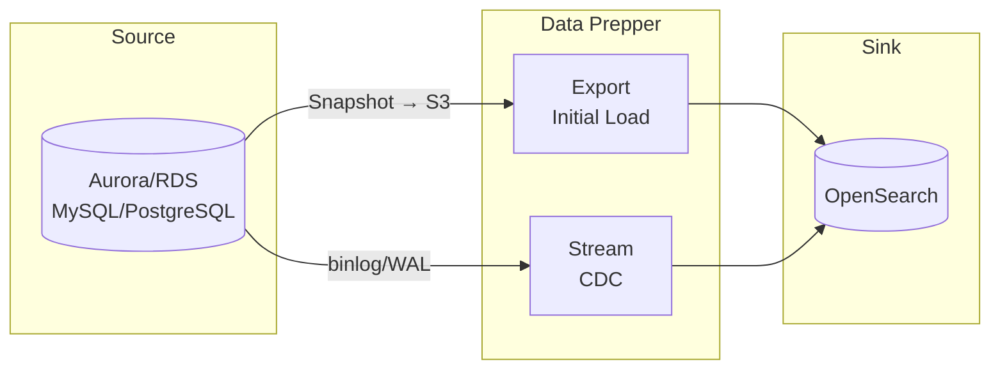

</div>
</div>

<div class="absolute bottom-4 right-4 text-xs text-gray-500">
<a href="https://docs.opensearch.org/latest/data-prepper/pipelines/configuration/sources/rds/" target="_blank">Source: Data Prepper RDS source documentation</a>
</div>

---

# Migration Assistant: Flexible Migration Options

<div class="grid grid-cols-2 gap-4 mt-2">
<div>

### <span class="text-cyan-400">3 Migration Scenarios</span>

1. **Backfill only** - Snapshot → RFS
2. **Live Capture only** - Traffic Replay
3. **Both** - Zero-downtime migration

### <span class="text-cyan-400">EKS / Helm Support</span>

- Cloud-agnostic (usable outside AWS)
- Automation with Argo Workflows
- Pod-level scaling

### <span class="text-cyan-400">Metadata Transformation</span>

- dense_vector → knn_vector
- flattened → flat_object

</div>
<div>

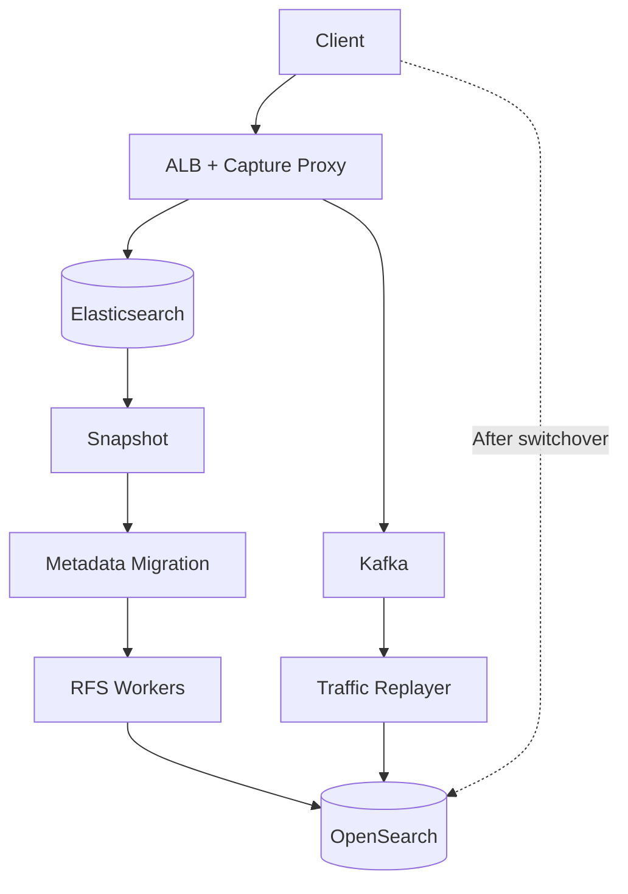

</div>
</div>

<div class="absolute bottom-4 right-4 text-xs text-gray-500">
<a href="https://docs.opensearch.org/latest/migration-assistant/" target="_blank">Source: Migration Assistant documentation</a>
</div>

---

# Reindex-from-Snapshot (RFS): Fast Data Migration


<div class="grid grid-cols-2 gap-4 mt-2">
<div>

### <span class="text-yellow-400">Differences from Standard Snapshot Restore</span>

| | Snapshot| RFS |
|---|:---:|:---:|
| Cross major versions | ❌ Up to 1 | ✅ Multiple OK |
| ES 6.x → OS 2.x | ❌ | ✅ |
| Source cluster load | High | **Zero** |
| Shard parallel processing | ❌ | ✅ |

### <span class="text-cyan-400">How It Works</span>

Directly extracts `_source` from Lucene files in snapshot and re-indexes to target via Bulk API

</div>
<div>


</div>
</div>

<div class="absolute bottom-4 right-4 text-xs text-gray-500">
<a href="https://aws.amazon.com/jp/blogs/big-data/accelerate-your-migration-to-amazon-opensearch-service-with-reindexing-from-snapshot/" target="_blank">Source: AWS Blog</a>
</div>

---
layout: section
---

# 2025 Activity Recap

Foundation, Community & Events

---

# What is the OpenSearch Software Foundation?

<div class="text-sm mb-2">

Established under the Linux Foundation in **September 2024**. Vendor-neutral governance ensuring long-term project sustainability.

</div>

<div class="flex justify-center gap-8 mt-2 text-xs">
<div class="border border-blue-500 rounded-lg p-3 w-56 text-center">

### <span class="text-cyan-400 border-b border-cyan-400">Governing Board</span>

Determines strategy, budget & policy

</div>
<div class="text-2xl self-center">⟷</div>
<div class="border border-green-500 rounded-lg p-3 w-56 text-center">

### <span class="text-cyan-400 border-b border-cyan-400">Technical Steering Committee (TSC)</span>

Determines technical direction

</div>
</div>

<div class="flex justify-center mt-2 text-xs text-gray-400">
<div class="w-56 text-center">↑ Appoints directors</div>
<div class="w-16"></div>
<div class="w-56 text-center">↑ Reports</div>
</div>

<div class="flex justify-center gap-8 text-xs">
<div class="border border-yellow-500 rounded-lg p-3 w-56 text-center">

### <span class="text-cyan-400 border-b border-cyan-400">Members</span>

Organizational participation & funding

</div>
<div class="w-16"></div>
<div class="border border-orange-500 rounded-lg p-3 w-56 text-center">

### <span class="text-cyan-400 border-b border-cyan-400">Technical Advisory Groups (TAGs)</span>

Specialized groups per technical area

</div>
</div>

<div class="flex justify-center mt-4">

</div>

---

# Foundation Members

<div class="text-sm mb-2">Organizations participating in the project and providing operational funding. Gain voting rights and director appointment rights.</div>

### <span class="text-cyan-400">Premier Members</span>

<div class="flex flex-wrap gap-6 items-center justify-center my-3">
  
  <div class="flex flex-col items-center">
    
    <span class="text-green-400 text-xs">New in 2025</span>
  </div>
  
  
</div>

### <span class="text-cyan-400">General Members</span>

<div class="grid grid-cols-6 gap-2 my-2">
  
  
  <div class="flex flex-col items-center">
    
    <span class="text-green-400 text-xs">New</span>
  </div>
  <div class="flex flex-col items-center">
    
    <span class="text-green-400 text-xs">New</span>
  </div>
  
  <div class="flex flex-col items-center">
    
    <span class="text-green-400 text-xs">New</span>
  </div>
  
  <div class="flex flex-col items-center">
    
    <span class="text-green-400 text-xs">New</span>
  </div>
  
  
  
  <div class="flex flex-col items-center">
    
    <span class="text-green-400 text-xs">New</span>
  </div>
</div>

---

# Governing Board

<div class="text-sm mb-2">Determines strategy, budget & policy. Premier Members appoint directors, General Members elect representatives.</div>

<div class="grid grid-cols-4 gap-4 text-center text-xs mt-2">
  <div class="flex flex-col items-center">
    
    <div class="font-bold">Carl Meadows</div>
    <div class="text-gray-400">AWS</div>
    <div class="text-blue-400">Chair</div>
  </div>
  <div class="flex flex-col items-center">
    
    <div class="font-bold">Andrew Ross</div>
    <div class="text-gray-400">AWS</div>
    <div class="text-blue-400">TSC Representative</div>
  </div>
  <div class="flex flex-col items-center">
    
    <div class="font-bold">Verena Lommatzsch</div>
    <div class="text-gray-400">SAP</div>
    <div class="text-blue-400">Premier Member</div>
  </div>
  <div class="flex flex-col items-center">
    
    <div class="font-bold">Shanshan Song</div>
    <div class="text-gray-400">Uber</div>
    <div class="text-blue-400">Premier Member</div>
  </div>
</div>

<div class="grid grid-cols-4 gap-4 text-center text-xs mt-3">
  <div class="flex flex-col items-center">
    
    <div class="font-bold">Ben Slater</div>
    <div class="text-gray-400">NetApp</div>
    <div class="text-green-400">General Member</div>
  </div>
  <div class="flex flex-col items-center">
    
    <div class="font-bold">Ed Anuff</div>
    <div class="text-gray-400">DataStax</div>
    <div class="text-green-400">General Member</div>
  </div>
  <div class="flex flex-col items-center">
    
    <div class="font-bold">Mehul Shah</div>
    <div class="text-gray-400">Aryn</div>
    <div class="text-green-400">General Member</div>
  </div>
  <div class="flex flex-col items-center">
    
    <div class="font-bold">Yakun Li</div>
    <div class="text-gray-400">ByteDance</div>
    <div class="text-green-400">General Member</div>
  </div>
</div>

---

# Technical Steering Committee (TSC)

<div class="text-sm mb-2">Technical oversight and roadmap decisions. Elected by vote of current TSC members.</div>

<div class="grid grid-cols-2 gap-6 text-sm">
<div>

| Affiliation      | Members ('YY=year joined)                                                         |
| --------- | ----------------------------------------------------------------------------- |
| Apple     | Mikhail Stepura '25                                                           |
| AWS       | **Chair** Andrew Ross '24<br>Pallavi Priyadarshini '24<br>Prudhvi Godithi '25 |
| ByteDance | Yakun Li '24                                                                  |
| Eliatra   | Nils Bandener '25                                                             |
| IBM       | Samuel Herman '25                                                             |

</div>
<div>

| Affiliation        | Members ('YY=year joined)                                  |
| ----------- | ------------------------------------------------------ |
| Independent | Amitai Stern '25                                       |
| OSC         | Eric Pugh '25                                          |
| Paessler    | Jonah Kowall '25                                       |
| Salesforce  | Bryan Burkholder '24                                   |
| SAP         | Karsten Schnitter '24                                  |
| Uber        | Yupeng Fu '24<br>Shubham Gupta '24<br>Michael Froh '25 |

</div>
</div>

---

# Technical Advisory Groups (TAGs)

<div class="text-sm mb-2">Long-standing groups reporting to TSC. Oversee and coordinate needs in specific technical areas. Meetings are public, anyone can join.</div>

<div class="grid grid-cols-3 gap-4 text-sm mt-4">
<div class="border border-gray-600 rounded-lg p-4">

### <span class="text-cyan-400">Build TAG</span>

Build & CI/CD related

</div>
<div class="border border-purple-500 rounded-lg p-4">

### <span class="text-cyan-400">Observability TAG</span>

Logs, Metrics & Traces

OpenTelemetry, Prometheus,<br>Jaeger, Fluent Bit integration

**Launched September 2025**

AWS, Uber, SAP, Apple, Paessler

</div>
<div class="border border-gray-600 rounded-lg p-4">

### <span class="text-cyan-400">Security TAG</span>

Security related

</div>
</div>

---

# Ambassadors

<div class="text-sm mb-2">Recognition of leaders who promote community activities. Program started September 2025.</div>

<div class="grid grid-cols-4 gap-3 text-xs mt-2">
  <div class="text-center">
    
    <div class="font-bold mt-1">Amanda Katona</div>
    <div class="text-gray-400">NetApp</div>
  </div>
  <div class="text-center">
    
    <div class="font-bold mt-1">Charlie Hull</div>
    <div class="text-gray-400">The Search Juggler</div>
  </div>
  <div class="text-center">
    
    <div class="font-bold mt-1">Dotan Horovits</div>
    <div class="text-gray-400">AWS</div>
  </div>
  <div class="text-center">
    
    <div class="font-bold mt-1">Eric Pugh</div>
    <div class="text-gray-400">OSC</div>
  </div>
  <div class="text-center">
    
    <div class="font-bold mt-1">Itamar Syn-Hershko</div>
    <div class="text-gray-400">BigData Boutique</div>
  </div>
  <div class="text-center">
    
    <div class="font-bold mt-1">Kassian Rosner Wren</div>
    <div class="text-gray-400">NetApp</div>
  </div>
  <div class="text-center">
    
    <div class="font-bold mt-1">Kris Freedain</div>
    <div class="text-gray-400">AWS</div>
  </div>
  <div class="text-center">
    
    <div class="font-bold mt-1">Laysa Uchoa</div>
    <div class="text-gray-400">Nordcloud</div>
  </div>
</div>

<div class="grid grid-cols-2 gap-4 mt-4 text-xs">
<div class="border border-blue-500 rounded-lg p-3">

**Requirements**: Track record of contributions (code, content, docs, etc.) and ability to commit to community activities for 1 year

</div>
<div class="border border-green-500 rounded-lg p-3">

**Application Process**: Twice yearly (Mar/Sep) → Apply with contribution record → Foundation review → 1-year term

</div>
</div>

---

# User Group Growth

Technical sessions, hands-on workshops, use case sharing & contributor development worldwide

<UserGroupMap />

<div class="flex justify-between text-sm mt-2">
  <div>Click pins for group details <span class="inline-block w-3 h-3 rounded-full bg-sky-500 border-2 border-white ml-2"></span> Japan</div>
  <div class="flex gap-6">
    <div class="text-center"><div class="text-2xl font-bold">19</div><div class="text-xs opacity-70">Countries</div></div>
    <div class="text-center"><div class="text-2xl font-bold">37</div><div class="text-xs opacity-70">Groups</div></div>
    <div class="text-center"><div class="text-2xl font-bold">7,933</div><div class="text-xs opacity-70">Members</div></div>
  </div>
</div>

---

# OpenSearchCon

<div class="grid grid-cols-3 gap-4">
<div class="col-span-1">

Official conference of the OpenSearch project

- Technical sessions & workshops
- Latest feature announcements
- Community networking

<a href="https://www.youtube.com/@OpenSearchProject/playlists" target="_blank" class="text-xs text-blue-400 hover:underline">All Playlists</a>

</div>
<div class="col-span-2 space-y-3">

<div>
<div class="text-sm font-bold mb-1">2025 <span class="text-gray-400 font-normal">5 cities</span></div>
<div class="grid grid-cols-5 gap-1 text-base">
<div class="bg-gray-800 rounded p-2 text-center"><a href="https://events.linuxfoundation.org/archive/2025/opensearchcon-europe/" target="_blank" class="text-blue-400 hover:underline font-bold">Europe</a><div class="text-gray-500 text-xs">4-May</div><a href="https://www.youtube.com/playlist?list=PLzgr9zSpws16qm6E3OsNqzR8iFA3eScak" target="_blank" class="text-blue-400 hover:underline">Videos</a></div>
<div class="bg-gray-800 rounded p-2 text-center"><a href="https://events.linuxfoundation.org/archive/2025/opensearchcon-india/" target="_blank" class="text-blue-400 hover:underline font-bold">India</a><div class="text-gray-500 text-xs">Jun</div><a href="https://www.youtube.com/playlist?list=PLzgr9zSpws17d1gG58q3WpqEB1Cu5U2vj" target="_blank" class="text-blue-400 hover:underline">Videos</a></div>
<div class="bg-gray-800 rounded p-2 text-center"><a href="https://events.linuxfoundation.org/archive/2025/opensearchcon-north-america/" target="_blank" class="text-blue-400 hover:underline font-bold">N.America</a><div class="text-gray-500 text-xs">Sep</div><a href="https://www.youtube.com/playlist?list=PLzgr9zSpws14nCUmupVPypGXq87rcFp5Y" target="_blank" class="text-blue-400 hover:underline">Videos</a></div>
<div class="bg-gray-800 rounded p-2 text-center"><a href="https://events.linuxfoundation.org/opensearchcon-korea/" target="_blank" class="text-blue-400 hover:underline font-bold">Korea</a><div class="text-gray-500 text-xs">1Jan</div><a href="https://www.youtube.com/playlist?list=PLzgr9zSpws16DPeI08ZXYQI2zz-EuJfyA" target="_blank" class="text-blue-400 hover:underline">Videos</a></div>
<div class="bg-gray-800 rounded p-2 text-center"><a href="https://events.linuxfoundation.org/opensearchcon-japan/" target="_blank" class="text-blue-400 hover:underline font-bold">Japan</a><div class="text-gray-500 text-xs">1Feb</div><a href="https://www.youtube.com/playlist?list=PLzgr9zSpws14G2KEgIMXAx6OceBgMin91" target="_blank" class="text-blue-400 hover:underline">Videos</a></div>
</div>
</div>

<div>
<div class="text-sm font-bold mb-1">2024 <span class="text-gray-400 font-normal">3 cities</span></div>
<div class="grid grid-cols-5 gap-1 text-base">
<div class="bg-gray-800 rounded p-2 text-center"><span class="font-bold">Europe</span><div class="text-gray-500 text-xs">Berlin</div><a href="https://www.youtube.com/playlist?list=PLzgr9zSpws14zCETcKtCBwcOuTGMccpV9" target="_blank" class="text-blue-400 hover:underline">Videos</a></div>
<div class="bg-gray-800 rounded p-2 text-center"><span class="font-bold">India</span><div class="text-gray-500 text-xs">Bengaluru</div><a href="https://www.youtube.com/playlist?list=PLzgr9zSpws14KqWMk7IaR2roc62ocYADi" target="_blank" class="text-blue-400 hover:underline">Videos</a></div>
<div class="bg-gray-800 rounded p-2 text-center"><span class="font-bold">N.America</span><div class="text-gray-500 text-xs">San Francisco</div><a href="https://www.youtube.com/playlist?list=PLzgr9zSpws17ZYDb12UTIgEXq5vrUA4b1" target="_blank" class="text-blue-400 hover:underline">Videos</a></div>
</div>
</div>

<div class="grid grid-cols-2 gap-2">
<div>
<div class="text-sm font-bold mb-1">2023</div>
<div class="bg-gray-800 rounded p-2 text-center"><span class="font-bold">N.America</span><span class="text-gray-500 text-sm ml-1">Seattle</span><a href="https://www.youtube.com/playlist?list=PLzgr9zSpws166-ndhm5W49L9bJmiWjsrm" target="_blank" class="text-blue-400 hover:underline ml-2">Videos</a></div>
</div>
<div>
<div class="text-sm font-bold mb-1">2022 <span class="text-gray-400 font-normal">First event</span></div>
<div class="bg-gray-800 rounded p-2 text-center"><span class="font-bold">N.America</span><span class="text-gray-500 text-sm ml-1">Seattle</span><a href="https://www.youtube.com/playlist?list=PLzgr9zSpws14N5WSzs1OgBahFiN5ymjGo" target="_blank" class="text-blue-400 hover:underline ml-2">Videos</a></div>
</div>
</div>

</div>
</div>

<div class="absolute bottom-4 right-4 text-xs text-gray-500">
<a href="https://opensearch.org/events/" target="_blank" class="text-blue-400 hover:underline">Source: opensearch.org</a>
</div>

---

# OpenSearchCon Japan 2025

<div class="grid grid-cols-3 gap-4 mt-2">
<div class="bg-gray-800 rounded-lg p-4 text-center">
<div class="text-5xl font-bold text-blue-400">131</div>
<div class="text-gray-300">In-Person Attendees</div>
</div>
<div class="bg-gray-800 rounded-lg p-4 text-center">
<div class="text-5xl font-bold text-blue-400">42</div>
<div class="text-gray-300">Organizations</div>
</div>
<div class="bg-gray-800 rounded-lg p-4 text-center">
<div class="text-5xl font-bold text-blue-400">22</div>
<div class="text-gray-300">Conference Sessions</div>
</div>
</div>

<div class="grid grid-cols-2 gap-6 mt-4">
<div class="bg-gray-800 rounded-lg p-4">
<div class="text-sm font-bold text-gray-300 mb-2">Industry</div>
<div class="space-y-1 text-xs">
<div class="flex items-center gap-2"><div class="w-32 bg-blue-500 h-3 rounded" style="width: 66%"></div><span>IT 66%</span></div>
<div class="flex items-center gap-2"><div class="w-32 bg-blue-400 h-3 rounded" style="width: 11%"></div><span>Telecom 11%</span></div>
<div class="flex items-center gap-2"><div class="w-32 bg-blue-300 h-3 rounded" style="width: 8%"></div><span>Consumer Goods 8%</span></div>
<div class="flex items-center gap-2"><div class="w-32 bg-cyan-400 h-3 rounded" style="width: 6%"></div><span>Professional Services 6%</span></div>
<div class="flex items-center gap-2"><div class="w-32 bg-cyan-300 h-3 rounded" style="width: 9%"></div><span>Other 9%</span></div>
</div>
</div>
<div class="bg-gray-800 rounded-lg p-4">
<div class="text-sm font-bold text-gray-300 mb-2">Attendees by Region</div>
<div class="space-y-1 text-xs">
<div class="flex items-center gap-2"><div class="bg-blue-500 h-3 rounded" style="width: 75%"></div><span>Japan 75%</span></div>
<div class="flex items-center gap-2"><div class="bg-blue-400 h-3 rounded" style="width: 21%"></div><span>USA 21%</span></div>
<div class="flex items-center gap-2"><div class="bg-blue-300 h-3 rounded" style="width: 4%"></div><span>Other 4%</span></div>
</div>
<div class="text-sm font-bold text-gray-300 mt-3 mb-2">Primarily Attended For</div>
<div class="space-y-1 text-xs">
<div class="flex items-center gap-2"><div class="bg-orange-400 h-3 rounded" style="width: 60%"></div><span>Conference 60%</span></div>
<div class="flex items-center gap-2"><div class="bg-yellow-400 h-3 rounded" style="width: 40%"></div><span>Networking 40%</span></div>
</div>
</div>
</div>

<div class="absolute bottom-4 right-4 text-xs text-gray-500">
<a href="https://events.linuxfoundation.org/wp-content/uploads/2025/12/OpenSearchCon_Japan25_PostEventReport.pdf" target="_blank" class="text-blue-400 hover:underline">Source: Post Event Report (PDF)</a>
</div>

---
layout: section
---

# 2026 Roadmap

---

# 2026 Roadmap Overview

<div class="grid grid-cols-3 gap-4 mt-2 text-sm">
<div class="bg-blue-900/40 rounded-lg p-3">

### <span class="text-cyan-400">🔄 Streaming Query</span>

- **v3.5**: Streaming Aggregations default
- Block processing in Apache Arrow format
- Improved memory efficiency & reduced response time

</div>
<div class="bg-purple-900/40 rounded-lg p-3">

### <span class="text-cyan-400">🧩 Composable Engine</span>

- Unified logical plan via Substrait IR
- DataFusion / Velox execution engines
- Common optimization for DSL/SQL/PPL

</div>
<div class="bg-green-900/40 rounded-lg p-3">

### <span class="text-cyan-400">⚡ gRPC API Expansion</span>

- 50+ Aggregation support
- Python SDK (published on PyPI)
- Feature parity with REST API

</div>
<div class="bg-orange-900/40 rounded-lg p-3">

### <span class="text-cyan-400">🔍 Core Performance</span>

- Skip-list: Sub-aggregation support
- Bulk Collection API (Lucene 10.4)
- **Intra-segment parallel search**

</div>
<div class="bg-pink-900/40 rounded-lg p-3">

### <span class="text-cyan-400">🎯 Vector Search</span>

- BFloat16 support (50% memory reduction)
- Memory-Optimized Search Improvements
- Disk-based v2 (BPGP/Gorder-PQ)
- 2x faster with GPU transfer optimization

</div>
<div class="bg-teal-900/40 rounded-lg p-3">

### <span class="text-cyan-400">🔌 Extensibility</span>

- Vector Engine unified interface
- k-NN / JVector unification
- Neural Search plugin separation

</div>
</div>

<div class="mt-4 text-center text-xs text-gray-400">
📋 <a href="https://github.com/orgs/opensearch-project/projects/206" class="text-cyan-400">GitHub Roadmap</a> ｜ 
📖 <a href="https://opensearch.org/blog/opensearch-3-3-performance-innovations-for-ai-search-solutions/" class="text-cyan-400">Performance Blog (2025/12)</a>
</div>

---

# Composable Query Engine

<div class="grid grid-cols-2 gap-6 mt-2">
<div>

### <span class="text-cyan-400">New Architecture</span>

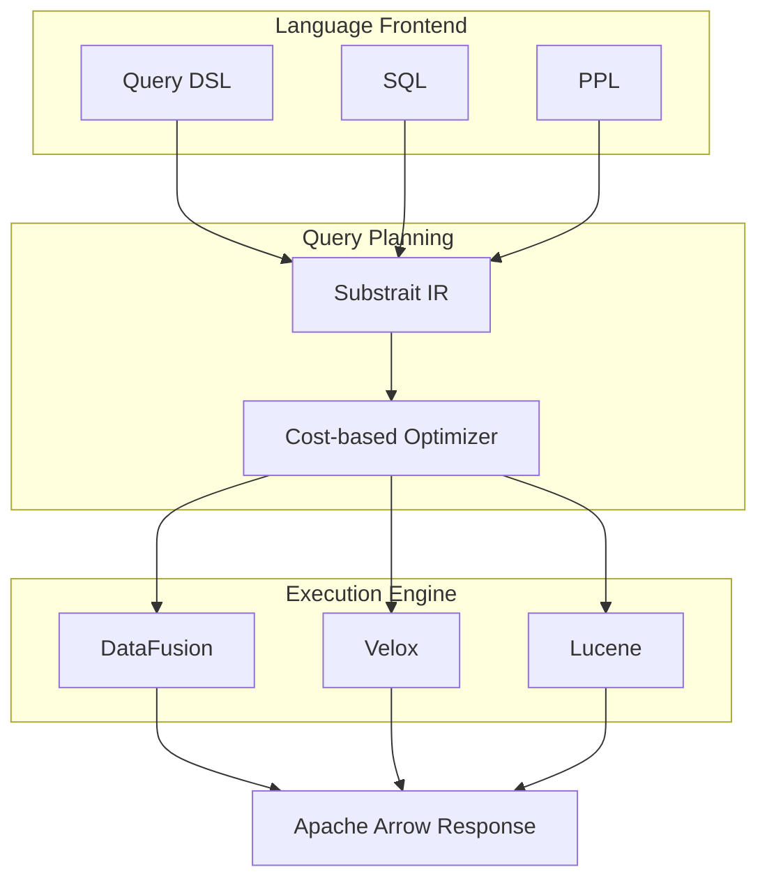

</div>
<div>

### <span class="text-cyan-400">Current Challenges</span>

- Constraints from tight coupling with Lucene
- Memory bottleneck in large-scale aggregations
- Duplicated expression engines across DSL/SQL/PPL

### <span class="text-cyan-400">Community Activity</span>

- **ByteDance**: OLAP plugin
- **Velox4J**: Velox integration proposal
- **Segmentless design**: For vector search

### <span class="text-cyan-400">Compatibility</span>

- Existing Lucene-based aggregations maintained
- Implemented as **opt-in plugin**

</div>
</div>

<div class="absolute bottom-4 right-4 text-xs text-gray-500">
<a href="https://github.com/opensearch-project/OpenSearch/issues/16897" target="_blank">RFC: Composable Query Engine</a>
</div>

---

# Streaming Query Architecture

<div class="grid grid-cols-2 gap-6 mt-2">
<div>

### <span class="text-cyan-400">Conventional vs Streaming</span>

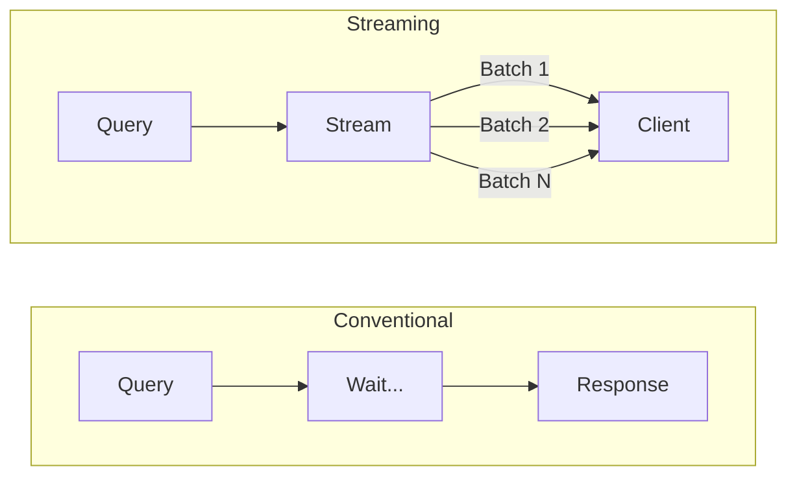

**Conventional**: Wait until all processing complete → High memory  
**New**: Incremental return via Arrow Batch → Low memory

</div>
<div>

### <span class="text-cyan-400">Expected Benefits</span>

| Metric         | Improvement            |
| ------------ | --------------- |
| Response Time     | **Up to 2x faster** |
| Memory Usage | Significant reduction        |
| Partial Results | Immediate return possible    |

### <span class="text-cyan-400">Goals for 3.5</span>

- **Default enable** streaming aggregations
- Query PlanningImprovement / Virtual Threads

### <span class="text-cyan-400">Supported Aggregations</span>

Numeric terms / Cardinality count (expanding)

</div>
</div>

<div class="absolute bottom-4 right-4 text-xs text-gray-500">
<a href="https://github.com/opensearch-project/OpenSearch/issues/14471" target="_blank">RFC: Streaming Aggregations</a>
</div>

---

# BFloat16 Support: 50% Memory Reduction Without Range Limits

<div class="grid grid-cols-2 gap-4 mt-2">
<div>

### <span class="text-cyan-400">Floating Point Format Comparison</span>

| Format | Bits | Range | Memory |
|------|--------|------|--------|
| FP32 | 32 | ±3.4×10³⁸ | 100% |
| FP16 | 16 | ±65,504 | 50% |
| **BFloat16** | 16 | ±3.4×10³⁸ | **50%** |

<div class="mt-4 text-sm">

FP16 has range limits and cannot be used with out-of-range values  
→ **BFloat16 achieves 50% reduction with same range as FP32**

</div>

</div>
<div class="text-sm">

### <span class="text-cyan-400">What is BFloat16?</span>

16-bit floating point format developed by Google for ML. Takes upper 16 bits of FP32, sacrificing precision to maintain range

```
FP32:     1bit sign + 8bit exponent + 23bit mantissa
BFloat16: 1bit sign + 8bit exponent +  7bit mantissa
```

7-bit mantissa → 2-3 digit precision, sufficient for distance calculations

### <span class="text-cyan-400">Hardware Acceleration</span>

Intel AVX512 BF16 instruction set enables hardware-level acceleration on next-gen processors

</div>
</div>

<div class="absolute bottom-4 right-4 text-xs text-gray-500">
<a href="https://github.com/opensearch-project/k-NN/issues/2510">#2510 Faiss SQbf16</a> ｜
<a href="https://github.com/opensearch-project/k-NN/issues/2811">#2811 Lucene half_float</a>
</div>

---

# Memory-Optimized Vector Search Improvement

<div class="grid grid-cols-2 gap-4 mt-2">
<div>

### <span class="text-cyan-400">Improvement Plan</span>

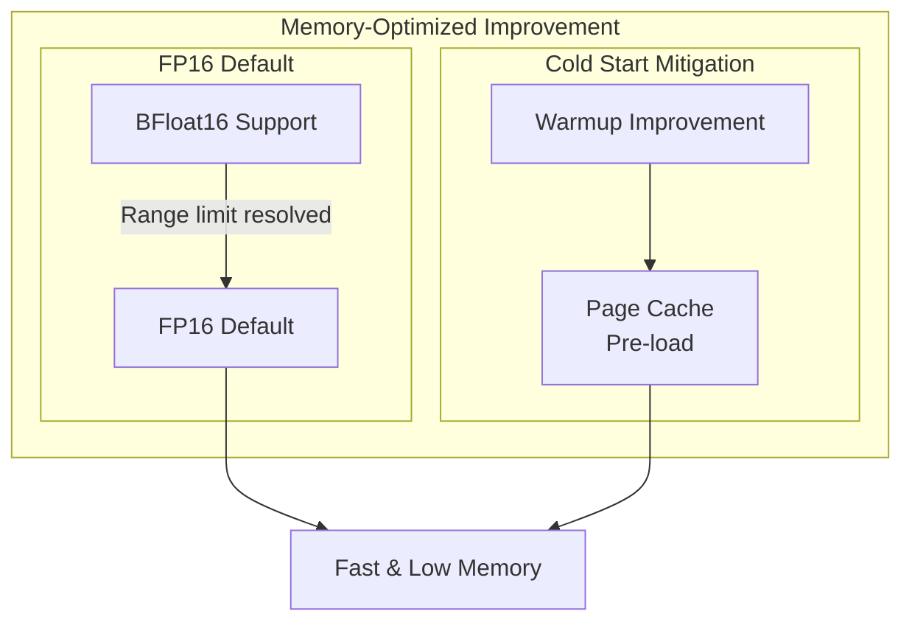

</div>
<div class="text-sm">

### <span class="text-cyan-400">FP16 Default</span>

Native SIMD scoring in v3.4.0 significantly improved FP16 performance. Once BFloat16 resolves range limits, FP16 can be default for **50% memory reduction**

### <span class="text-cyan-400">Cold Start Mitigation</span>

Previously, Warmup API only parsed section offsets, causing cold start on first query

Improved Warmup touches pages in 4KB units, kernel pre-loads into page cache → Reduced tail latency

</div>
</div>

<div class="absolute bottom-4 right-4 text-xs text-gray-500">
<a href="https://github.com/opensearch-project/k-NN/issues/2924">#2924 FP16 Default</a> ｜
<a href="https://github.com/opensearch-project/k-NN/issues/2939">#2939 Warmup</a>
</div>

---

# Disk-based Vector Search Improvement

<div class="grid grid-cols-2 gap-4 mt-2">
<div class="text-sm">

### <span class="text-cyan-400">What is Disk-based Vector Search?</span>

2-phase search for low-memory environments. Candidate filtering with quantized index (memory) → Rescoring with full-precision vectors (disk)

| Compression | Engine | Quantization |
|--------|----------|------------|
| 4x | Lucene | Scalar Quantization |
| 8x-32x | Faiss | Binary Quantization |

### <span class="text-cyan-400">Challenges</span>

- Latency in phase 2 is a challenge. Random I/O occurs because vectors are scattered on disk.
- Lucene doesn't support Binary Quantization. Faiss is the only option but has recall issues at 32x compression.

</div>
<div class="text-sm">

### <span class="text-cyan-400">Improvement Direction</span>

**Faiss: [Vector Reordering](https://github.com/opensearch-project/k-NN/issues/3096)**
- Places spatially close vectors near each other in memory
- Achieves sequential I/O through improved cache efficiency

**Lucene: [Better Binary Quantization](https://github.com/opensearch-project/k-NN/issues/2805)**
- Supports RaBitQ-based high-accuracy 1-bit quantization
- Higher recall compared to Faiss Binary Quantization

</div>
</div>

<div class="absolute bottom-4 right-4 text-xs text-gray-500">
<a href="https://github.com/opensearch-project/k-NN/issues/1779" target="_blank">RFC: Disk-Based Vector Search</a>
</div>

---

# AI/ML Roadmap: Remote Agentic Memory (3.5)

<div class="grid grid-cols-2 gap-6 mt-2">
<div>

### <span class="text-cyan-400">3.3: Local Agentic Memory</span>

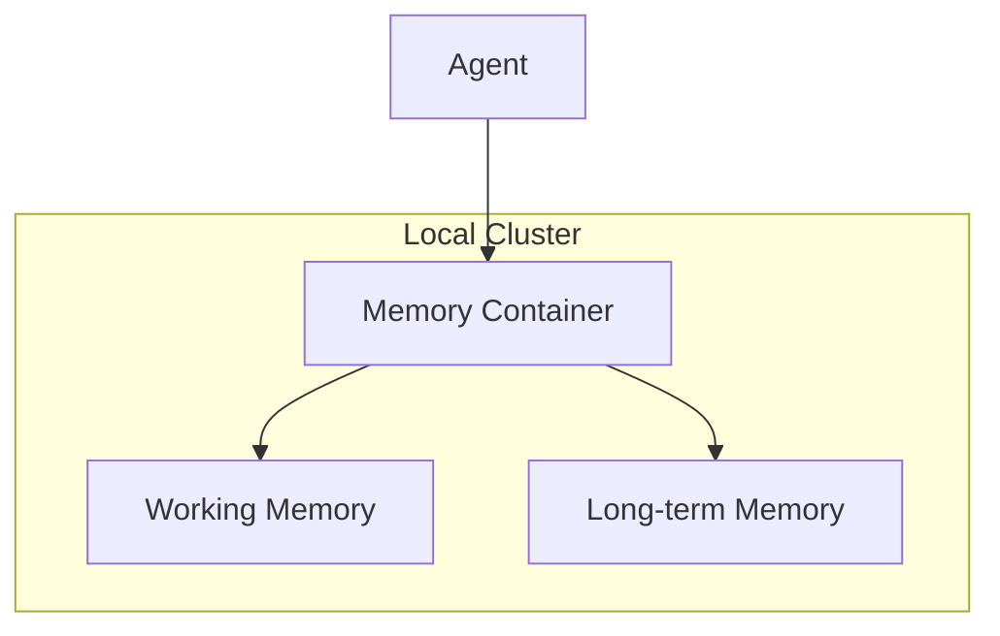

- Memory stored only within same cluster
- Agent and memory tightly coupled

</div>
<div>

### <span class="text-cyan-400">3.5: Remote Agentic Memory</span>

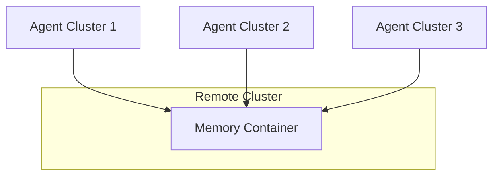

- Memory shared across multiple clusters
- Compute and storage separation
- Flexible configuration in managed environments

</div>
</div>

<div class="text-center mt-4 text-sm">

`memory_configuration.endpoint` specifies remote cluster

</div>

<div class="absolute bottom-4 right-4 text-xs text-gray-500">
<a href="https://github.com/opensearch-project/ml-commons/issues/3627" target="_blank">RFC: Remote Agentic Memory</a>
</div>

---

# 2026 OpenSearchCon

| Event                    | Date       | Location                            |
| --------------------------- | ---------- | ------------------------------- |
| OpenSearchCon China         | Mar 17-18 | Shanghai (Hilton Shanghai Hongqiao) |
| OpenSearchCon Europe        | Apr 16-17 | Prague                          |
| OpenSearchCon India         | Jun 15-16 | Mumbai (co-located with KubeCon India)    |
| OpenSearchCon North America | Sep 22-24 | San Jose, CA                    |

---

# Summary

<div class="grid grid-cols-2 gap-6 mt-4">
<div>

### <span class="text-cyan-400">2025 Technical Evolution</span>

| Area | Key Achievements |
|------|----------|
| **Vector / AI** | FP16, Lucene-on-Faiss, Agent Framework, MCP |
| **Search** | Workbench, UBI, Seismic |
| **Performance** | Star-tree Index, Derived Source |
| **Observability** | Discover UI Overhaul, PPL Calcite |

</div>
<div>

### <span class="text-cyan-400">2026 Focus Areas</span>

| Area | Roadmap |
|------|-------------|
| **Query Engine** | Composable Query Engine |
| **Streaming** | Apache Arrow/Flight |
| **Vector** | BFloat16, Memory-Optimized, Disk-based v2 |
| **AI/ML** | Remote Agentic Memory |

</div>
</div>

<div class="mt-4 text-center">

**Community Growth**: 1.3B downloads / 3,300+ contributors / 400+ organizations

</div>

---

# Join the Community!

<div class="grid grid-cols-3 gap-6 mt-6">
<div class="text-center">

<div class="text-lg mt-2 font-bold">Slack</div>
</div>
<div class="text-center">

<div class="text-lg mt-2 font-bold">Forum</div>
</div>
<div class="text-center">

<div class="text-lg mt-2 font-bold">GitHub</div>
</div>
</div>

<div class="grid grid-cols-2 gap-6 mt-6 text-sm">
<div class="bg-blue-900/30 rounded-lg p-4">

**Get Started Today**
- Try the Playground: playground.opensearch.org
- Read the docs: docs.opensearch.org
- Join a User Group

</div>
<div class="bg-green-900/30 rounded-lg p-4">

**Contribute**
- Report issues & PRs: GitHub
- [Apply for Ambassador](https://opensearch.org/blog/opensearch-ambassador-applications-are-now-open/) (Feb/Sep) 🔥 Now Open!
- Present at OpenSearchCon

</div>
</div>

---
layout: cover
---

# Thank you!

<div class="mt-8 text-xl">

Enjoy the rest of the sessions

</div>
