# Appendix: パフォーマンス詳細

---

# Approximation Framework: Range/Sort高速化

<div class="grid grid-cols-2 gap-6 mt-2">
<div>

### <span class="text-cyan-400 border-b border-cyan-400">仕組み</span>

従来のクエリを**近似処理**に変換し高速化

<Zoom>

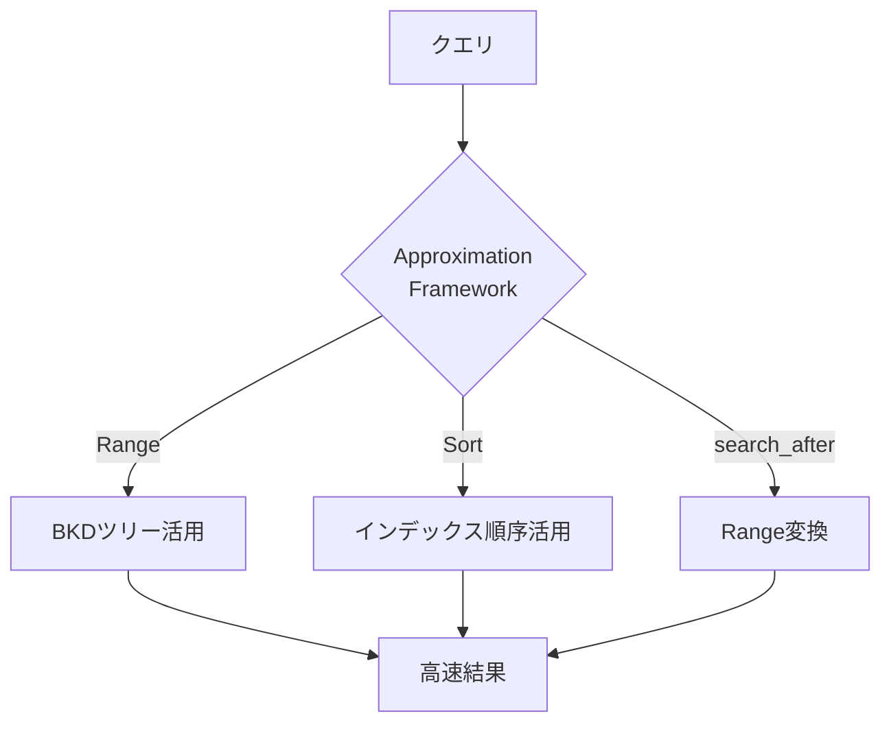

</Zoom>

</div>
<div>

### <span class="text-cyan-400 border-b border-cyan-400">対応クエリと効果</span>

| クエリ種別       | 改善          |
| ---------------- | ------------- |
| Range            | **90%高速化** |
| Sort (timestamp) | **75%高速化** |
| search_after     | **50x高速化** |

### <span class="text-cyan-400 border-b border-cyan-400">search_after改善</span>

- p90: 185ms → **8ms**
- BKDツリー走査でスキップ
- 深いページネーションに効果大

<div class="text-xs text-gray-400 mt-2">3.0で導入、3.2で拡張</div>

</div>
</div>

<div class="absolute bottom-4 right-4 text-xs text-gray-500">
<a href="https://opensearch.org/blog/opensearch-approximation-framework/" target="_blank">出典: OpenSearch Approximation Framework</a>
</div>

---

# Skip List: Date Histogram 96%高速化

<div class="grid grid-cols-2 gap-6 mt-2">
<div>

### <span class="text-cyan-400 border-b border-cyan-400">仕組み</span>

Doc Valuesの**ブロック毎にmin/max**を記録し、クエリ条件外のブロックをスキップ

<Zoom>

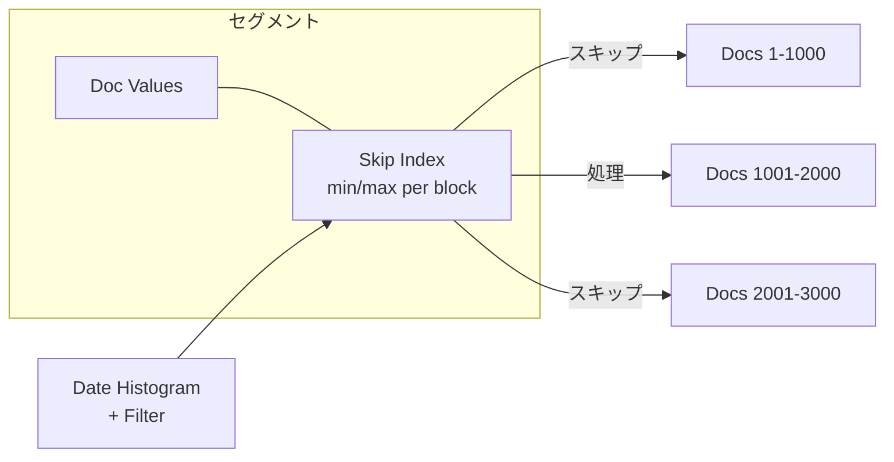

</Zoom>

</div>
<div>

### <span class="text-cyan-400 border-b border-cyan-400">ベンチマーク結果</span>

| クエリ                    | 改善          |
| ------------------------- | ------------- |
| Hourly + Filter           | **96%高速化** |
| Hourly + Filter + Metrics | **46%高速化** |

### <span class="text-cyan-400 border-b border-cyan-400">適用条件</span>

- 3.3で **@timestamp** に**デフォルト有効**
- 3.2で全数値フィールド対応
- フィルタ付きDate Histogram で効果大

<div class="text-xs text-gray-400 mt-2">
116M HTTPログでのベンチマーク
</div>

</div>
</div>

<div class="absolute bottom-4 right-4 text-xs text-gray-500">
<a href="https://github.com/opensearch-project/OpenSearch/issues/17965" target="_blank">出典: Skip List RFC</a>
</div>

---

# Star-tree インデックス: 集計最大 100 倍高速化

<div class="grid grid-cols-2 gap-6 mt-2">
<div>

### <span class="text-cyan-400 border-b border-cyan-400">事前集計による高速化</span>

| クエリ             | 通常  | Star-tree |
| ------------------ | ----- | --------- |
| status=200 (2億件) | 4.2秒 | **6.3ms** |
| status=400 (3千件) | 5ms   | **6.5ms** |

### <span class="text-cyan-400 border-b border-cyan-400">効果</span>

- クエリ処理量: **100分の1**
- **予測可能なレイテンシ**
- 高カーディナリティで特に効果大

<div class="mt-2 text-sm text-gray-400">
2.19で導入、3.1でGA、3.3でMulti-term 対応
</div>

</div>
<div>

<Zoom></Zoom>

<div class="text-xs text-gray-400 mt-2">
ディメンション値の組み合わせごとに事前集計
</div>

</div>
</div>

<div class="absolute bottom-4 right-4 text-xs text-gray-500">
<a href="https://opensearch.org/blog/the-power-of-star-tree-indexes-supercharging-opensearch-aggregations/" target="_blank">出典: The power of star-tree indexes</a>
</div>

---
layout: section
---

# Appendix: ベクトル検索詳細

---

# GPU Acceleration : ベクトルインデックス構築の高速化

<div class="grid grid-cols-2 gap-6 mt-2">
<div>

### <span class="text-cyan-400 border-b border-cyan-400">NVIDIA cuVS による9.3倍高速化</span>

| 指標             | 改善           |
| ---------------- | -------------- |
| インデックス構築 | **9.3x 高速**  |
| コスト効率       | **3.75x 改善** |
| CPU使用率        | **2.5x 削減**  |

<div class="mt-3 text-sm">

- 3.0: 実験的機能として導入
- 3.1: GA (一般提供開始)
- CAGRA → HNSW 自動変換

</div>

</div>
<div>

<Zoom></Zoom>

<div class="text-xs text-gray-400 mt-2">
GPUクラスタにインデックス構築をオフロード
</div>

</div>
</div>

<div class="absolute bottom-4 right-4 text-xs text-gray-500">
<a href="https://opensearch.org/blog/gpu-accelerated-vector-search-opensearch-new-frontier/" target="_blank">出典: GPU-accelerated vector search in OpenSearch</a>
</div>

---

# FP16ベクトル最適化: 検索55%高速化

<div class="grid grid-cols-2 gap-6 mt-2">
<div>

### <span class="text-cyan-400 border-b border-cyan-400">仕組み</span>

| 従来                        | 3.3最適化                       |
| --------------------------- | ------------------------------- |
| Java FP32 → 変換 → C++ FP16 | Java FP16 → **直接** → C++ SIMD |

- JNI経由でFP16データを**直接**C++ に渡す
- SIMD命令による距離計算の高速化
- 変換オーバーヘッドを排除

### <span class="text-cyan-400 border-b border-cyan-400">適用条件</span>

- **knn_vector** フィールドで **data_type: float16**
- Faiss / Luceneエンジン対応
- 3.3で自動適用

</div>
<div>

### <span class="text-cyan-400 border-b border-cyan-400">ベンチマーク結果</span>

| 構成               | 改善            |
| ------------------ | --------------- |
| シングルセグメント | **55.8%高速化** |
| マルチセグメント   | **16.2%高速化** |

### <span class="text-cyan-400 border-b border-cyan-400">なぜ高速化？</span>

1. **変換不要**: FP32→FP16変換をスキップ
2. **SIMD活用**: ベクトル演算を並列実行
3. **メモリ効率**: データ転送量が半減

</div>
</div>

<div class="absolute bottom-4 right-4 text-xs text-gray-500">
<a href="https://opensearch.org/blog/opensearch-3-3-performance-innovations-for-ai-search-solutions/" target="_blank">出典: OpenSearch 3.3 Performance Blog</a>
</div>

---

# ハイブリッド検索高速化: 65%レイテンシ改善

<div class="grid grid-cols-2 gap-4 mt-1">
<div>

### <span class="text-cyan-400 border-b border-cyan-400">Custom Bulk Scorer (3.1)</span>

<Zoom>

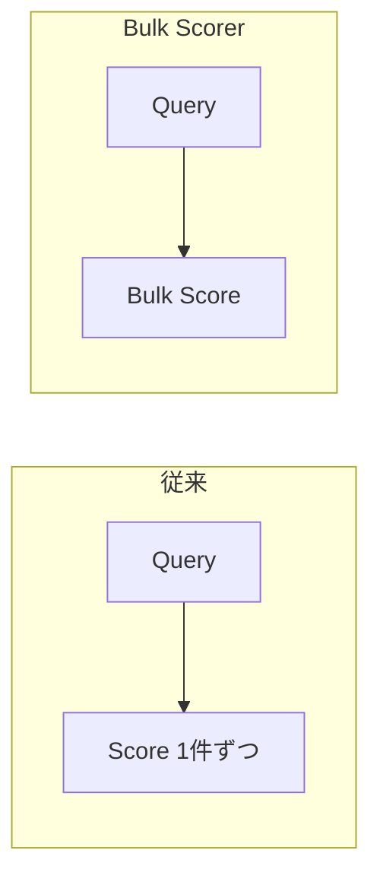

</Zoom>

- 複数ドキュメントを**一括スコアリング**
- **65%レイテンシ改善** / **3.5xスループット向上**

</div>
<div>

### <span class="text-cyan-400 border-b border-cyan-400">QueryCollectorContextSpec (3.3)</span>

- クエリコレクタの最適化
- さらに**20%レイテンシ改善**

### <span class="text-cyan-400 border-b border-cyan-400">ハイブリッド検索とは</span>

```
BM25 + kNN → スコア正規化 → 最終結果
```

セマンティック検索と全文検索の両方を活用

</div>
</div>

<div class="absolute bottom-4 right-4 text-xs text-gray-500">
<a href="https://opensearch.org/blog/opensearch-3-3-performance-innovations-for-ai-search-solutions/" target="_blank">出典: OpenSearch 3.3 Performance Blog</a>
</div>

---

# Byte/Binary Vectors: ストレージ90% 削減

<div class="grid grid-cols-2 gap-6 mt-2">
<div>

### <span class="text-cyan-400 border-b border-cyan-400">量子化オプション</span>

| タイプ      | サイズ      | 削減率  |
| ----------- | ----------- | ------- |
| FP32 (従来) | 4 bytes/dim | -       |
| FP16        | 2 bytes/dim | **50%** |
| Byte (INT8) | 1 byte/dim  | **75%** |
| Binary      | 1 bit/dim   | **97%** |

### <span class="text-cyan-400 border-b border-cyan-400">Binary Vectorsの利点</span>

- メモリ使用量: **最大97%削減**
- Hamming距離による高速計算
- 大規模データセットに最適

</div>
<div>

### <span class="text-cyan-400 border-b border-cyan-400">使用例</span>

```json
{
  "mappings": {
    "properties": {
      "embedding": {
        "type": "knn_vector",
        "dimension": 768,
        "data_type": "binary",
        "space_type": "hamming"
      }
    }
  }
}
```

### <span class="text-cyan-400 border-b border-cyan-400">適用シナリオ</span>

- 大規模画像検索
- 重複検出
- コスト重視のRAG アプリ

</div>
</div>

<div class="absolute bottom-4 right-4 text-xs text-gray-500">
<a href="https://opensearch.org/docs/latest/field-types/supported-field-types/knn-vector/" target="_blank">出典: OpenSearch knn_vector Documentation</a>
</div>

---

# Memory Optimized Vector Search

<div class="grid grid-cols-2 gap-4 mt-1 text-xs">
<div>

### <span class="text-cyan-400 border-b border-cyan-400">従来の課題</span>

| エンジン | 長所         | 短所                         |
| -------- | ------------ | ---------------------------- |
| Faiss    | SIMD高速計算 | 全インデックスをメモリに要求 |
| Lucene   | メモリ効率的 | 距離計算が遅い               |

### <span class="text-cyan-400 border-b border-cyan-400">Lucene-on-Faiss (3.1)</span>

- LuceneのHnswGraphSearcher + FaissのHNSWインデックス
- **オンデマンド読み込み**: 必要なバイトのみ読み込み

### <span class="text-cyan-400 border-b border-cyan-400">メモリ使用量比較 (768次元)</span>

| 構成            | 10M vectors | 100M vectors |
| --------------- | ----------- | ------------ |
| 従来Faiss       | ~30 GB      | ~300 GB      |
| Lucene-on-Faiss | ~25 MB      | ~250 MB      |

</div>
<div>

### <span class="text-cyan-400 border-b border-cyan-400">設定方法</span>

```json
{
  "settings": {
    "index.knn.memory_optimized_search": true
  }
}
```

### <span class="text-cyan-400 border-b border-cyan-400">ユースケース</span>

| 構成            | 推奨シナリオ           |
| --------------- | ---------------------- |
| 従来Faiss       | 最高性能、メモリ潤沢   |
| Lucene-on-Faiss | メモリ制約、コスト重視 |
| Disk-ANN + LoF  | **大規模、最小メモリ** |

</div>
</div>

<div class="absolute bottom-4 right-4 text-xs text-gray-500">
<a href="https://opensearch.org/blog/lucene-on-faiss-powering-opensearchs-high-performance-memory-efficient-vector-search/" target="_blank">出典: Lucene-on-Faiss Blog</a>
</div>

---
layout: section
---

# Appendix: AI/エージェント詳細

Late Interaction / MCP / Agentic Search / AI Search Flows / Search Relevance / UBI

---

# Late Interaction Models: 検索精度と効率の両立 (3.3)

<div class="grid grid-cols-2 gap-4 mt-1 text-sm">
<div>

### <span class="text-cyan-400 border-b border-cyan-400">3つのアプローチ比較</span>

| モデル           | 精度 | 効率 | 特徴               |
| ---------------- | ---- | ---- | ------------------ |
| Bi-encoder       | 中   | 高   | 単一ベクトル       |
| Cross-encoder    | 最高 | 低   | 全トークン相互作用 |
| Late Interaction | 高   | 中   | トークン単位マッチ |

### <span class="text-cyan-400 border-b border-cyan-400">Late Interactionの仕組み</span>

1. クエリ・文書を**独立してエンコード**
2. 各トークンに**個別のベクトル**を生成
3. **MaxSim**: 各クエリトークンの最大類似度を合計

</div>
<div>

### <span class="text-cyan-400 border-b border-cyan-400">ColBERT / ColPali</span>

- **ColBERT**: テキスト向けLate Interactionモデル
- **ColPali**: マルチモーダル対応（PDF、画像）

### <span class="text-cyan-400 border-b border-cyan-400">利点</span>

- 文書ベクトルの**事前計算が可能**
- トークンレベルの**細粒度マッチング**
- Bi-encoderより高精度、Cross-encoderより高速

</div>
</div>

<div class="absolute bottom-4 right-4 text-xs text-gray-500">
<a href="https://opensearch.org/blog/boost-search-relevance-with-late-interaction-models/" target="_blank">出典: Boost search relevance with late interaction models</a>
</div>

---

# Late Interaction: OpenSearch 3.3での実装

<div class="grid grid-cols-2 gap-4 mt-1">
<div>

### <span class="text-cyan-400 border-b border-cyan-400">2フェーズ検索戦略</span>

```
Phase 1: Bi-encoder で候補取得 (高速)
    ↓
Phase 2: Late Interaction でリランク (高精度)
```

### <span class="text-cyan-400 border-b border-cyan-400">lateInteractionScore 関数</span>

```json
{
  "script_score": {
    "script": {
      "source": "lateInteractionScore(
        params.query_vectors,
        'doc_vectors',
        params._source,
        params.space_type)",
      "params": {
        "query_vectors": [[1.0, 0.0], [0.0, 1.0]],
        "space_type": "cosinesimil"
      }
    }
  }
}
```

</div>
<div>

### <span class="text-cyan-400 border-b border-cyan-400">構成コンポーネント</span>

| コンポーネント                   | 役割                       |
| -------------------------------- | -------------------------- |
| ml-inference ingest processor    | 文書のマルチベクトル生成   |
| ml-inference search processor    | クエリのマルチベクトル生成 |
| lateInteractionScore             | MaxSimスコア計算           |

### <span class="text-cyan-400 border-b border-cyan-400">ユースケース</span>

- 専門文書検索（法律、医療、技術）
- マルチモーダル検索（PDF内の図表）
- 高精度が求められるRAGアプリケーション

</div>
</div>

<div class="absolute bottom-4 right-4 text-xs text-gray-500">
<a href="https://docs.opensearch.org/latest/search-plugins/search-relevance/rerank-by-field-late-interaction/" target="_blank">出典: Reranking with late interaction models</a>
</div>

---

# MCP: AIエージェントとOpenSearchの連携

<div class="grid grid-cols-2 gap-6 mt-2">
<div>

### <span class="text-cyan-400 border-b border-cyan-400">MCPとは</span>

Model Context Protocol - AIエージェントがツールを発見・実行するための標準プロトコル

### <span class="text-cyan-400 border-b border-cyan-400">3つの連携パターン</span>

| パターン | 説明 |
|---------|------|
| **ローカルMCP** | Claude Desktop等から接続 |
| **ビルトインMCP** | OpenSearch内蔵サーバー |
| **MCP Client** | 外部MCPサーバーを呼び出し |

</div>
<div>

### <span class="text-cyan-400 border-b border-cyan-400">主要ツール</span>

- **検索**: SearchIndexTool, VectorDBTool, RAGTool
- **分析**: PPLTool, LogPatternTool
- **運用**: ClusterHealthTool, AlertsTool

### <span class="text-cyan-400 border-b border-cyan-400">導入方法</span>

```bash
# ローカル
pip install opensearch-mcp-server-py

# ビルトイン: 3.0+で設定不要
```

</div>
</div>

<div class="absolute bottom-4 right-4 text-xs text-gray-500">
<a href="https://opensearch.org/blog/introducing-mcp-in-opensearch/" target="_blank">出典: Introducing MCP in OpenSearch</a>
</div>

---

# Agentic Search: 自然言語でデータ操作

<div class="grid grid-cols-2 gap-6 mt-2">
<div>

### <span class="text-cyan-400 border-b border-cyan-400">仕組み</span>

自然言語 → LLMがDSLクエリを自動生成 → 検索実行

```
「赤い靴で5000円以下」
  ↓ QueryPlanningTool
{ "query": { "bool": { "must": [...] }}}
```

### <span class="text-cyan-400 border-b border-cyan-400">2種類のエージェント</span>

|            | Conversational | Flow |
| ---------- | -------------- | ---- |
| 会話履歴   | ○              | ×    |
| 複数ツール | ○              | ×    |
| レイテンシ | 高め           | 低い |

</div>
<div>

### <span class="text-cyan-400 border-b border-cyan-400">利用可能なツール</span>

- **Query Planning** - DSL生成 (必須)
- **Search Index** - インデックス検索
- **Index Mapping** - スキーマ分析
- **Web Search** - 外部情報取得
- **MCP連携** - 外部サーバー呼び出し

### <span class="text-cyan-400 border-b border-cyan-400">対応モデル</span>

Amazon Bedrock Claude, OpenAI GPT, Cohere 等

<div class="mt-3 text-sm text-gray-400">
3.2で導入、3.4でDashboards UI追加
</div>

</div>
</div>

<div class="absolute bottom-4 right-4 text-xs text-gray-500">
<a href="https://docs.opensearch.org/latest/vector-search/ai-search/agentic-search/index/" target="_blank">出典: Agentic search documentation</a>
</div>

---

# Agentic Search UI (3.4)

<div class="grid grid-cols-2 gap-4 mt-1">
<div>

<Zoom></Zoom>

<div class="text-xs text-gray-400 mt-1">エージェント設定画面</div>

</div>
<div>

<Zoom></Zoom>

<div class="text-xs text-gray-400 mt-1">検索結果 - 意図を理解して商品を表示</div>

</div>
</div>

<div class="mt-2 text-sm">

**Dashboards** > **OpenSearch Plugins** > **AI Search Flows**

</div>

<div class="absolute bottom-4 right-4 text-xs text-gray-500">
<a href="https://opensearch.org/blog/opensearch-3-4s-agentic-search-in-opensearch-dashboards-hands-on-use-cases-and-examples/" target="_blank">出典: Agentic search in OpenSearch Dashboards</a>
</div>

---

# AI Search Flows: ノーコードでAI検索構築

<div class="grid grid-cols-2 gap-4 mt-1">
<div>

### <span class="text-cyan-400 border-b border-cyan-400">ワークフロービルダー</span>

<Zoom></Zoom>

<div class="text-xs text-gray-400 mt-1">IDE風UI: フロー概要 / 設定 / テスト</div>

</div>
<div>

### <span class="text-cyan-400 border-b border-cyan-400">プリセットテンプレート</span>

- Semantic / Hybrid / Multimodal Search
- RAG with Vector Retrieval
- **Agentic Search** (3.4)

### <span class="text-cyan-400 border-b border-cyan-400">できること</span>

- Ingest/Search パイプライン構築
- MLモデル連携設定
- サンプルデータでテスト

</div>
</div>

<div class="absolute bottom-4 right-4 text-xs text-gray-500">
<a href="https://docs.opensearch.org/latest/vector-search/ai-search/workflow-builder/" target="_blank">出典: AI Search Flows documentation</a>
</div>

---

# Search Relevance Workbench: 検索品質の可視化と改善

<div class="grid grid-cols-2 gap-6 mt-4">
<div>

### <span class="text-cyan-400 border-b border-cyan-400">概要</span>

検索設定の比較・評価をGUIで実現するDashboardsプラグイン

### <span class="text-cyan-400 border-b border-cyan-400">主要機能</span>

| 機能 | 説明 |
|------|------|
| **Single Query** | 2設定の結果を並列比較 |
| **Query Set** | 複数クエリで包括評価 |
| **Judgment List** | nDCG/Precision/Recallで定量評価 |

### <span class="text-cyan-400 border-b border-cyan-400">3.4の新機能</span>

- UBI連携によるJudgment自動生成
- LLM-as-a-Judge対応

</div>
<div>

### <span class="text-cyan-400 border-b border-cyan-400">評価ワークフロー</span>

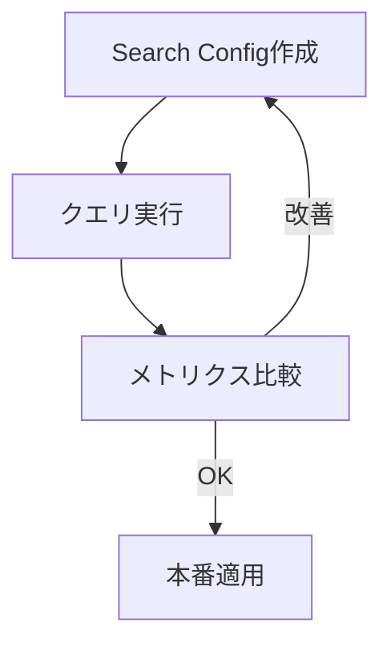

### <span class="text-cyan-400 border-b border-cyan-400">対象ユーザー</span>

- 検索エンジニア: 設定チューニング
- プロダクトマネージャー: 品質モニタリング
- データサイエンティスト: A/Bテスト評価

</div>
</div>

<div class="absolute bottom-4 right-4 text-xs text-gray-500">
<a href="https://docs.opensearch.org/latest/search-plugins/search-relevance/" target="_blank">出典: Search Relevance documentation</a>
</div>

---

# User Behavior Insights (UBI): 検索行動の収集と分析

<div class="grid grid-cols-2 gap-6 mt-4">
<div>

### <span class="text-cyan-400 border-b border-cyan-400">概要</span>

検索クエリとユーザーアクションを紐付けて記録・分析

### <span class="text-cyan-400 border-b border-cyan-400">収集データ</span>

| カテゴリ | 内容 |
|----------|------|
| **Query** | 検索クエリ、query_id |
| **Results** | 返却結果、順位 |
| **Events** | click, purchase, dwell_time |

### <span class="text-cyan-400 border-b border-cyan-400">導入</span>

```bash
# クライアントライブラリ
npm install ubi.js
```

</div>
<div>

### <span class="text-cyan-400 border-b border-cyan-400">活用シナリオ</span>

- **CTR分析**: クリック率の測定・改善
- **ゼロクリック検出**: 問題クエリの特定
- **Judgment生成**: 暗黙的フィードバックから自動作成
- **A/Bテスト**: Team Draft Interleaving対応

### <span class="text-cyan-400 border-b border-cyan-400">Search Relevance連携</span>


</div>
</div>

<div class="absolute bottom-4 left-4 text-sm text-gray-400">
2.15で導入 / UBI Specification 1.3.0
</div>

---
layout: section
---

# Appendix: MCP詳細

---

# MCP: AIエージェントとの連携 (3パターン)

<div class="grid grid-cols-3 gap-4 mt-4">
<div class="text-center">

### <span class="text-cyan-400 border-b border-cyan-400">1. ローカル MCP</span>

<Zoom>

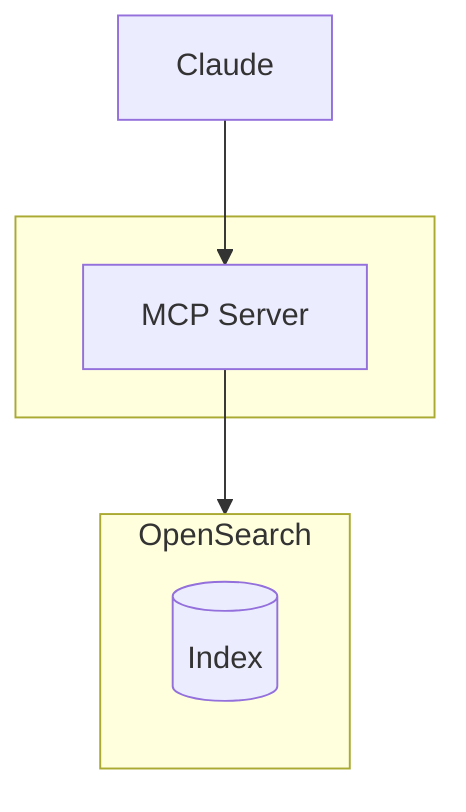

</Zoom>

</div>
<div class="text-center">

### <span class="text-cyan-400 border-b border-cyan-400">2. ビルトイン MCP</span>

<Zoom>

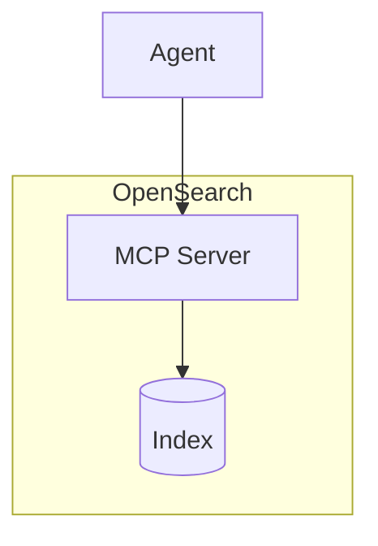

</Zoom>

</div>
<div class="text-center">

### <span class="text-cyan-400 border-b border-cyan-400">3. MCP Client</span>

<Zoom>

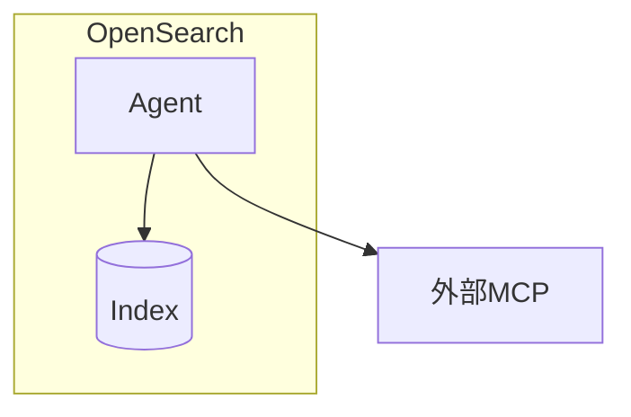

</Zoom>

</div>
</div>

<div class="absolute bottom-4 right-4 text-xs text-gray-500">
<a href="https://opensearch.org/blog/introducing-mcp-in-opensearch/" target="_blank">出典: Introducing MCP in OpenSearch</a>
</div>

---

# ローカル MCP Server

<div class="grid grid-cols-2 gap-4 mt-1">
<div>

### <span class="text-cyan-400 border-b border-cyan-400">概要</span>

**opensearch-mcp-server-py**: AIアシスタント向けMCPサーバー

```bash
pip install opensearch-mcp-server-py
```

- Claude Desktop / LangChain 統合
- stdio / SSE / Streamable HTTP
- Basic認証 / IAMロール

### <span class="text-cyan-400 border-b border-cyan-400">Skills Tools</span>

- DataDistributionTool
- LogPatternAnalysisTool
- LogPatternTool

</div>
<div>

### <span class="text-cyan-400 border-b border-cyan-400">Core Tools (デフォルト有効)</span>

<div class="text-xs">

ListIndexTool / IndexMappingTool / SearchIndexTool / GetShardsTool / ClusterHealthTool / CountTool / ExplainTool / MsearchTool / GenericOpenSearchApiTool

</div>

### <span class="text-cyan-400 border-b border-cyan-400">Additional Tools (オプション)</span>

<div class="text-xs">

GetClusterStateTool / GetSegmentsTool / CatNodesTool / GetNodesTool / GetIndexInfoTool / GetIndexStatsTool / GetQueryInsightsTool / GetNodesHotThreadsTool / GetAllocationTool / GetLongRunningTasksTool

</div>

</div>
</div>

<div class="absolute bottom-4 right-4 text-xs text-gray-500">
<a href="https://github.com/opensearch-project/opensearch-mcp-server-py" target="_blank">出典: opensearch-mcp-server-py</a>
</div>

---

# ビルトイン MCP Server (リモート)

<div class="grid grid-cols-2 gap-4 mt-1">
<div>

### <span class="text-cyan-400 border-b border-cyan-400">概要</span>

OpenSearch内蔵のMCPサーバー（3.0+)

- **Streamable HTTP** トランスポート
- エージェントがツールを発見・実行

### <span class="text-cyan-400 border-b border-cyan-400">MCP Server APIs</span>

```
POST /_plugins/_ml/mcp/tools/_register
GET  /_plugins/_ml/mcp/tools
DELETE /_plugins/_ml/mcp/tools/{name}
```

</div>
<div>

### <span class="text-cyan-400 border-b border-cyan-400">ビルトインツール</span>

<div class="text-xs">

**検索系**: SearchIndexTool / VectorDBTool / NeuralSparseSearchTool / RAGTool / ListIndexTool / IndexMappingTool

**AI/分析**: PPLTool / QueryPlanningTool / MLModelTool / DataDistributionTool / LogPatternTool / LogPatternAnalysisTool

**Observability**: SearchAlertsTool / SearchMonitorsTool / SearchAnomalyDetectorsTool / SearchAnomalyResultsTool / CreateAnomalyDetectorTool

**その他**: AgentTool / ConnectorTool / VisualizationTool / WebSearchTool / ReadFromScratchPadTool / WriteToScratchPadTool

</div>

</div>
</div>

<div class="absolute bottom-4 right-4 text-xs text-gray-500">
<a href="https://docs.opensearch.org/latest/ml-commons-plugin/agents-tools/tools/index/" target="_blank">出典: Tools documentation</a>
</div>

---
layout: section
---

# Appendix: Search Relevance詳細

---

# Search Relevance Workbench: Single Query Comparison

<div class="grid grid-cols-2 gap-6 mt-2">
<div>

### <span class="text-cyan-400 border-b border-cyan-400">操作手順</span>

1. **Search Configurationの定義**
   - 比較対象となる2つの検索設定を作成
   - `%SearchText%` プレースホルダでクエリを動的に置換

2. **クエリの実行**
   - 両設定に対して同一クエリを同時実行

3. **結果の比較分析**
   - 共通結果と固有結果を視覚的に識別

### <span class="text-cyan-400 border-b border-cyan-400">主な用途</span>

- 特定クエリの問題調査
- 設定変更の即時検証
- Hybrid Search導入効果の確認

</div>
<div>

### <span class="text-cyan-400 border-b border-cyan-400">比較結果の表示形式</span>

<div class="bg-gray-800/50 rounded-lg p-3 text-sm">

```
Query 1 (Keyword)    Query 2 (Hybrid)
─────────────────    ─────────────────
[A] Laptop Desk      [B] Lenovo Chromebook
[A] Foldable Table   [B] HP Laptop 15
[C] Laptop Case      [C] Laptop Case
[A] Laptop Backpack  [B] Dell Inspiron
```

<div class="mt-2 text-xs">
[A] Query 1固有  [B] Query 2固有  [C] 共通結果
</div>

</div>

<div class="mt-3 text-sm">

**結果サマリー:**
- 共通結果: 4件
- Query 1固有: 6件
- Query 2固有: 6件

</div>

</div>
</div>

<div class="absolute bottom-4 right-4 text-xs text-gray-500">
<a href="https://docs.opensearch.org/latest/search-plugins/search-relevance/comparing-search-results/" target="_blank">出典: Comparing search results</a>
</div>

---

# Search Relevance Workbench: Query Set Comparison

<div class="grid grid-cols-2 gap-6 mt-2">
<div>

### <span class="text-cyan-400 border-b border-cyan-400">複数クエリによる評価</span>

単一クエリでは全体像を把握できないため、Query Setによる包括的評価を実施

```json
// Query Set (NDJSON形式)
{"queryText": "laptop"}
{"queryText": "red shoes"}
{"queryText": "in-ear headphones"}
{"queryText": "portable bluetooth speakers"}
```

### <span class="text-cyan-400 border-b border-cyan-400">比較メトリクス</span>

| メトリクス | 説明 |
|-----------|------|
| **Jaccard** | 結果セットの重複率 |
| **RBO50** | 上位結果重視のランク相関 |
| **RBO90** | 全体結果重視のランク相関 |

</div>
<div>

### <span class="text-cyan-400 border-b border-cyan-400">メトリクスの解釈</span>

<div class="bg-gray-800/50 rounded-lg p-3 text-sm">

**Jaccard = 0.21** (低値)
- 結果セットの差異が大きい
- 設定変更による影響が顕著

**RBO50 = 0.65** (中程度)
- 上位結果は一定の一致を維持
- ユーザー可視範囲での安定性を確認

</div>

### <span class="text-cyan-400 border-b border-cyan-400">クエリタイプ別の傾向</span>

| クエリタイプ | 変化の程度 |
|-------------|-----------|
| カテゴリ指向 | 大 |
| 具体的な商品名 | 小 |

<div class="text-sm text-gray-400 mt-2">
RBO = Rank-Biased Overlap
</div>

</div>
</div>

<div class="absolute bottom-4 right-4 text-xs text-gray-500">
<a href="https://docs.opensearch.org/latest/search-plugins/search-relevance/explore-experiment-results/" target="_blank">出典: Exploring search evaluation results</a>
</div>

---

# Search Relevance Workbench: Judgment Listによる品質評価

<div class="grid grid-cols-2 gap-6 mt-2">
<div>

### <span class="text-cyan-400 border-b border-cyan-400">Judgment Listの概要</span>

クエリとドキュメントの関連度を定義したデータセット

<div class="bg-gray-800/50 rounded-lg p-3 text-sm mt-2">

| クエリ | ドキュメント | Rating |
|--------|-------------|--------|
| led tv | Samsung 55" | 4 (Perfect) |
| led tv | TV Stand | 1 (Fair) |
| led tv | HDMI Cable | 0 (Bad) |

</div>

### <span class="text-cyan-400 border-b border-cyan-400">評価スケール</span>

| スコア | 評価 | 説明 |
|-------|------|------|
| 4 | Perfect | 完全に適合 |
| 3 | Excellent | 高い関連性 |
| 2 | Good | 関連あり |
| 1 | Fair | 部分的に関連 |
| 0 | Bad | 無関係 |

</div>
<div>

### <span class="text-cyan-400 border-b border-cyan-400">評価メトリクス</span>

| メトリクス | 測定対象 |
|-----------|---------|
| **nDCG@k** | 上位k件のランキング品質 |
| **Precision@k** | 上位k件の適合率 |
| **Recall@k** | 関連文書の網羅率 |
| **MRR** | 最初の適合文書の順位 |

### <span class="text-cyan-400 border-b border-cyan-400">nDCGスコアの目安</span>

<div class="bg-gray-800/50 rounded-lg p-3 text-sm">

| スコア範囲 | 評価 |
|-----------|------|
| 1.0 | 理想的なランキング |
| 0.8以上 | 良好 |
| 0.5〜0.8 | 改善余地あり |
| 0.5未満 | 要改善 |

</div>

<div class="text-xs text-gray-400 mt-2">
nDCG = Normalized Discounted Cumulative Gain
</div>

</div>
</div>

---
layout: section
---

# Appendix: UBI詳細

---

# UBI: データ収集アーキテクチャ

<div class="grid grid-cols-2 gap-6 mt-2">
<div>

### <span class="text-cyan-400 border-b border-cyan-400">3つのデータストア</span>

| ストア | 内容 |
|--------|------|
| **Query** | 検索クエリ、タイムスタンプ、query_id |
| **Results** | 返却ドキュメント、スコア、順位 |
| **Events** | クリック、カート追加、購入等 |

### <span class="text-cyan-400 border-b border-cyan-400">query_idによる紐付け</span>

```
Query Store     Results Store    Events Store
    │               │                │
    └───── query_id ─────────────────┘
```

すべてのデータを`query_id`で関連付け

</div>
<div>

### <span class="text-cyan-400 border-b border-cyan-400">クライアント実装例</span>

```javascript
// ubi.js による自動収集
import { UbiClient } from '@opensearch/ubi';

const ubi = new UbiClient({
  endpoint: 'https://opensearch:9200',
  store: 'my_ubi_store'
});

// 検索実行時に自動でQuery/Results記録
const results = await ubi.search({
  query: { match: { title: 'laptop' } }
});

// イベント記録
ubi.trackEvent('click', {
  object_id: 'product-123',
  position: 3
});
```

</div>
</div>

<div class="absolute bottom-4 right-4 text-xs text-gray-500">
<a href="https://docs.opensearch.org/latest/search-plugins/ubi/index/" target="_blank">出典: User Behavior Insights documentation</a>
</div>

---

# UBI: 主要な活用シナリオ

<div class="grid grid-cols-3 gap-4 mt-4">
<div class="bg-gray-800/50 rounded-lg p-4">

### <span class="text-cyan-400 border-b border-cyan-400">検索品質分析</span>

- **Zero Result Rate**: 結果なしクエリの割合
- **Click-through Rate**: クリック率の推移
- **Mean Reciprocal Rank**: 最初のクリック位置

<div class="text-sm text-gray-400 mt-2">
問題のあるクエリパターンを特定
</div>

</div>
<div class="bg-gray-800/50 rounded-lg p-4">

### <span class="text-cyan-400 border-b border-cyan-400">暗黙的Judgment生成</span>

クリック・購入データから関連度を推定

| イベント | 推定Rating |
|---------|-----------|
| 購入 | 4 (Perfect) |
| カート追加 | 3 (Excellent) |
| クリック | 2 (Good) |
| 表示のみ | 0 (Bad) |

<div class="text-sm text-gray-400 mt-2">
Search Relevance Workbenchと連携
</div>

</div>
<div class="bg-gray-800/50 rounded-lg p-4">

### <span class="text-cyan-400 border-b border-cyan-400">A/Bテスト基盤</span>

- 検索設定ごとのKPI比較
- コンバージョン率の統計検定
- 段階的ロールアウト判断

<div class="text-sm text-gray-400 mt-2">
データドリブンな意思決定を支援
</div>

</div>
</div>

<div class="absolute bottom-4 right-4 text-xs text-gray-500">
<a href="https://opensearch.org/blog/user-behavior-insights-for-search-relevance/" target="_blank">出典: User Behavior Insights for Search Relevance</a>
</div>

---
layout: section
---

# その他機能詳細

Plan-Execute-Reflect / Derived Source / Pull-based Ingestion / Discover UI / Seismic

---

# Plan-Execute-Reflect Agent: 自律的な問題解決

<div class="mt-2">

<Zoom>

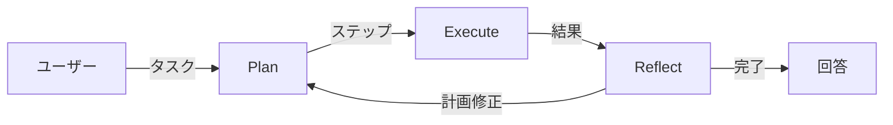

</Zoom>

</div>

<div class="grid grid-cols-2 gap-6 mt-2">
<div>

### <span class="text-cyan-400 border-b border-cyan-400">特徴</span>

- 複雑なタスクを自動でステップに分解
- 中間結果に基づき計画を動的に修正
- 非同期実行・MCP連携対応

</div>
<div>

### <span class="text-cyan-400 border-b border-cyan-400">活用例</span>

- マイクロサービスのトラブルシューティング
- ログ・トレース・メトリクスの相関分析

</div>
</div>

<div class="absolute bottom-4 left-4 text-sm text-gray-400">
3.0で導入
</div>

---

# Derived Source: ストレージコスト最大3倍削減

<div class="grid grid-cols-2 gap-6 mt-2">
<div>

### <span class="text-cyan-400 border-b border-cyan-400">一般フィールド (3.2)</span>

<Zoom>

</Zoom>

<div class="text-sm mt-2">

`_source`を保存せず`doc_values`等から動的に再構築

- ストレージ **41-58%削減**
- インデックス速度 **18%向上**
- Merge時間 **20-48%削減**

</div>

</div>
<div>

### <span class="text-cyan-400 border-b border-cyan-400">ベクトルフィールド (3.0)</span>

<Zoom>

</Zoom>

<div class="text-sm mt-2">

ベクトルを1バイトプレースホルダーに置換

- ストレージ **3倍削減**
- 検索レイテンシ **90%改善**
- 3.0以降デフォルト有効

</div>

</div>
</div>

---

# Pull-based Ingestion: ストリーミングデータの直接取り込み

<div class="grid grid-cols-2 gap-6 mt-2">
<div>

### <span class="text-cyan-400 border-b border-cyan-400">アーキテクチャ</span>

<Zoom>

</Zoom>

<div class="text-sm mt-2">
OpenSearchがKafka/Kinesis から直接データをPull
</div>

</div>
<div>

### <span class="text-cyan-400 border-b border-cyan-400">メリット</span>

- **バックプレッシャー制御**: 負荷に応じて速度自動調整
- **シンプル**: Logstash等の中間コンポーネント不要
- **安定**: 障害時の自動リカバリ
- **At-least-once保証**: 外部バージョニングで整合性確保

### <span class="text-cyan-400 border-b border-cyan-400">対応データソース</span>

- Apache Kafka
- Amazon Kinesis

<div class="mt-2 text-sm text-gray-400">
3.0で実験的機能として導入
</div>

</div>
</div>

---

# 新 Discover UI: 統合オブザーバビリティ体験

<div class="grid grid-cols-2 gap-6 mt-2">
<div>

### <span class="text-cyan-400 border-b border-cyan-400">ログ・トレース・メトリクスを統合</span>

<Zoom></Zoom>

<div class="text-xs text-gray-400 mt-1">
サービス別ログボリュームの自動可視化
</div>

</div>
<div>

### <span class="text-cyan-400 border-b border-cyan-400">React Flow によるサービスマップ</span>

<Zoom></Zoom>

<div class="text-xs text-gray-400 mt-1">
インタラクティブなトレース可視化
</div>

### <span class="text-cyan-400 border-b border-cyan-400">主な機能</span>

- 異常検知から関連ログへワンクリック
- 自動チャート選択
- PPLクエリをクリックで構築

</div>
</div>

---

# Seismic: Neural Sparse 検索最大 100 倍高速化

<div class="grid grid-cols-2 gap-6 mt-2">
<div>

### <span class="text-cyan-400 border-b border-cyan-400">特徴</span>

<Zoom>

</Zoom>

<div class="text-sm mt-2">

1. **クラスタ化転置インデックス**: 類似ドキュメントをグループ化
2. **要約ベクトル**: 各クラスタの代表トークンのみ保持
3. **2段階枝刈り**: トークン→クラスタ→ドキュメントで候補を絞り込み

</div>

</div>
<div>

### <span class="text-cyan-400 border-b border-cyan-400">ベンチマーク (12.9億ドキュメント)</span>

| 手法          | 平均レイテンシ |
| ------------- | -------------- |
| BM25          | 41.5ms         |
| Neural Sparse | 125ms          |
| **Seismic**   | **11.8ms**     |

従来比 **10倍高速**、BM25より **3.5倍高速**

### <span class="text-cyan-400 border-b border-cyan-400">ユースケース</span>

- 大規模セマンティック検索
- RAG アプリケーション
- ハイブリッド検索の高速化

<div class="mt-2 text-sm text-gray-400">
3.3で導入
</div>

</div>
</div>

---

# Seismic: Sparse Vectorの近似最近傍検索

<div class="grid grid-cols-2 gap-8 mt-4">
<div>

### <span class="text-cyan-400 border-b border-cyan-400">従来 vs Seismic</span>

|        | 従来       | Seismic        |
| ------ | ---------- | -------------- |
| 方式   | 全スキャン | **ANN (近似)** |
| Recall | 100%       | ~90%           |
| メモリ | 低         | ~1GB/100万doc  |

### <span class="text-cyan-400 border-b border-cyan-400">高速化とRecall低下の理由</span>

- クラスタの**要約ベクトル**で関連性を判定
- 低スコアのクラスタは**スキャン対象から除外**
- → スキャン量削減で **10倍高速化**
- → 除外クラスタ内の関連docは検索漏れに

</div>
<div>

### <span class="text-cyan-400 border-b border-cyan-400">Dense k-NNとの対比</span>

HNSWがDense vectorのANNであるように、SeismicはSparse vectorのANN

### <span class="text-cyan-400 border-b border-cyan-400">使い分け</span>

| 要件                 | 推奨              |
| -------------------- | ----------------- |
| 100%精度必須         | 従来Neural Sparse |
| 大規模・低レイテンシ | Seismic           |

### <span class="text-cyan-400 border-b border-cyan-400">ベストプラクティス</span>

- セグメント: **5M〜10M doc**
- メモリ: **1GB / 100万doc**

</div>
</div>


---
layout: section
---

# Foundation 詳細

メンバー / Governing Board / TSC / TAGs / Ambassadors

---

# Foundation メンバー一覧

組織としてプロジェクトに参加し、運営資金を提供。投票権・理事任命権の取得。

### <span class="text-cyan-400 border-b border-cyan-400">Premier Members</span>

<div class="flex flex-wrap gap-6 items-center justify-center my-4">
  
  <div class="flex flex-col items-center">
    
    <span class="text-green-400 text-xs">New in 2025</span>
  </div>
  
  
</div>

### <span class="text-cyan-400 border-b border-cyan-400">General Members</span>

<div class="grid grid-cols-6 gap-2 my-3">
  
  
  <div class="flex flex-col items-center">
    
    <span class="text-green-400 text-xs">New in 2025</span>
  </div>
  <div class="flex flex-col items-center">
    
    <span class="text-green-400 text-xs">New in 2025</span>
  </div>
  
  <div class="flex flex-col items-center">
    
    <span class="text-green-400 text-xs">New in 2025</span>
  </div>
  
  <div class="flex flex-col items-center">
    
    <span class="text-green-400 text-xs">New in 2025</span>
  </div>
  
  
  
  <div class="flex flex-col items-center">
    
    <span class="text-green-400 text-xs">New in 2025</span>
  </div>
</div>

---

# Governing Board

戦略・予算・方針の決定。Premier Memberが理事を任命、General Memberから代表を選出。

<div class="grid grid-cols-4 gap-4 text-center text-xs mt-2">
  <div class="flex flex-col items-center">
    <Zoom></Zoom>
    <div class="font-bold">Carl Meadows</div>
    <div class="text-gray-400">AWS</div>
    <div class="text-blue-400">Chair</div>
  </div>
  <div class="flex flex-col items-center">
    <Zoom></Zoom>
    <div class="font-bold">Andrew Ross</div>
    <div class="text-gray-400">AWS</div>
    <div class="text-blue-400">TSC Representative</div>
  </div>
  <div class="flex flex-col items-center">
    <Zoom></Zoom>
    <div class="font-bold">Verena Lommatzsch</div>
    <div class="text-gray-400">SAP</div>
    <div class="text-blue-400">Premier Member</div>
  </div>
  <div class="flex flex-col items-center">
    <Zoom></Zoom>
    <div class="font-bold">Shanshan Song</div>
    <div class="text-gray-400">Uber</div>
    <div class="text-blue-400">Premier Member</div>
  </div>
</div>

<div class="grid grid-cols-4 gap-4 text-center text-xs mt-4">
  <div class="flex flex-col items-center">
    <Zoom></Zoom>
    <div class="font-bold">Ben Slater</div>
    <div class="text-gray-400">NetApp</div>
    <div class="text-green-400">General Member</div>
  </div>
  <div class="flex flex-col items-center">
    <Zoom></Zoom>
    <div class="font-bold">Ed Anuff</div>
    <div class="text-gray-400">DataStax</div>
    <div class="text-green-400">General Member</div>
  </div>
  <div class="flex flex-col items-center">
    <Zoom></Zoom>
    <div class="font-bold">Mehul Shah</div>
    <div class="text-gray-400">Aryn</div>
    <div class="text-green-400">General Member</div>
  </div>
  <div class="flex flex-col items-center">
    <Zoom></Zoom>
    <div class="font-bold">Yakun Li</div>
    <div class="text-gray-400">ByteDance</div>
    <div class="text-green-400">General Member</div>
  </div>
</div>

---

# Technical Steering Committee (TSC)

技術的監督・ロードマップの決定。現TSCメンバーの投票による選出。

<div class="grid grid-cols-2 gap-6 text-sm">
<div>

| 所属      | メンバー ('YY=加入年)                                                         |
| --------- | ----------------------------------------------------------------------------- |
| Apple     | Mikhail Stepura '25                                                           |
| AWS       | **Chair** Andrew Ross '24<br>Pallavi Priyadarshini '24<br>Prudhvi Godithi '25 |
| ByteDance | Yakun Li '24                                                                  |
| Eliatra   | Nils Bandener '25                                                             |
| IBM       | Samuel Herman '25                                                             |

</div>
<div>

| 所属        | メンバー ('YY=加入年)                                  |
| ----------- | ------------------------------------------------------ |
| Independent | Amitai Stern '25                                       |
| OSC         | Eric Pugh '25                                          |
| Paessler    | Jonah Kowall '25                                       |
| Salesforce  | Bryan Burkholder '24                                   |
| SAP         | Karsten Schnitter '24                                  |
| Uber        | Yupeng Fu '24<br>Shubham Gupta '24<br>Michael Froh '25 |

</div>
</div>

---

# Technical Advisory Groups (TAGs)

TSCに報告する長期グループ。特定技術領域のニーズを監督・調整。ミーティングは公開、誰でも参加可能。

<div class="grid grid-cols-3 gap-4 text-sm">
<div class="border border-gray-600 rounded-lg p-3">

### <span class="text-cyan-400 border-b border-cyan-400">Build TAG</span>

ビルド・CI/CD関連

</div>
<div class="border border-purple-500 rounded-lg p-3">

### <span class="text-cyan-400 border-b border-cyan-400">Observability TAG</span>

ログ・メトリクス・トレース

OpenTelemetry, Prometheus,<br>Jaeger, Fluent Bit と連携

**2025年9月発足**

AWS, Uber, SAP, Apple, Paessler

</div>
<div class="border border-gray-600 rounded-lg p-3">

### <span class="text-cyan-400 border-b border-cyan-400">Security TAG</span>

セキュリティ関連

</div>
</div>

---

# Ambassadors

個人としてコミュニティ活動を推進するリーダーの認定。2025年9月にプログラム開始。

<div class="grid grid-cols-4 gap-3 text-xs mt-4">
  <div class="text-center">
    <Zoom></Zoom>
    <div class="font-bold mt-1">Amanda Katona</div>
    <div class="text-gray-400">NetApp</div>
  </div>
  <div class="text-center">
    <Zoom></Zoom>
    <div class="font-bold mt-1">Charlie Hull</div>
    <div class="text-gray-400">The Search Juggler</div>
  </div>
  <div class="text-center">
    <Zoom></Zoom>
    <div class="font-bold mt-1">Dotan Horovits</div>
    <div class="text-gray-400">AWS</div>
  </div>
  <div class="text-center">
    <Zoom></Zoom>
    <div class="font-bold mt-1">Eric Pugh</div>
    <div class="text-gray-400">OSC</div>
  </div>
  <div class="text-center">
    <Zoom></Zoom>
    <div class="font-bold mt-1">Itamar Syn-Hershko</div>
    <div class="text-gray-400">BigData Boutique</div>
  </div>
  <div class="text-center">
    <Zoom></Zoom>
    <div class="font-bold mt-1">Kassian Rosner Wren</div>
    <div class="text-gray-400">NetApp</div>
  </div>
  <div class="text-center">
    <Zoom></Zoom>
    <div class="font-bold mt-1">Kris Freedain</div>
    <div class="text-gray-400">AWS</div>
  </div>
  <div class="text-center">
    <Zoom></Zoom>
    <div class="font-bold mt-1">Laysa Uchoa</div>
    <div class="text-gray-400">Nordcloud</div>
  </div>
</div>

---

# Ambassador になるには

<div class="grid grid-cols-2 gap-4 mt-4">
<div class="border border-blue-500 rounded-lg p-4">

### <span class="text-cyan-400 border-b border-cyan-400">応募条件</span>

コード・コンテンツ・ドキュメント等で貢献実績があり、コミュニティ活動に1年間コミットできる方

</div>
<div class="border border-green-500 rounded-lg p-4">

### <span class="text-cyan-400 border-b border-cyan-400">応募プロセス</span>

年2回募集（**3月・9月**）→ 貢献実績を記載して応募 → Foundation審査 → 1年任期

</div>
<div class="border border-yellow-500 rounded-lg p-4">

### <span class="text-cyan-400 border-b border-cyan-400">特典</span>

公式サイト掲載 / コア貢献者とのネットワーキング / 限定リソース・ツールキット / Swag

</div>
<div class="border border-purple-500 rounded-lg p-4">

### <span class="text-cyan-400 border-b border-cyan-400">活動内容</span>

Meetup・ワークショップ開催 / ブログ・チュートリアル作成 / 新規貢献者のメンタリング

</div>
</div>


---
layout: section
---

# 2026年ロードマップ詳細

Composable Query Engine / ストリーミング / コア最適化 / ベクトル検索 / AI/ML

---

# Composable Query Engine

<div class="grid grid-cols-2 gap-6 mt-2">
<div>

### <span class="text-cyan-400 border-b border-cyan-400">新アーキテクチャ</span>

<Zoom>

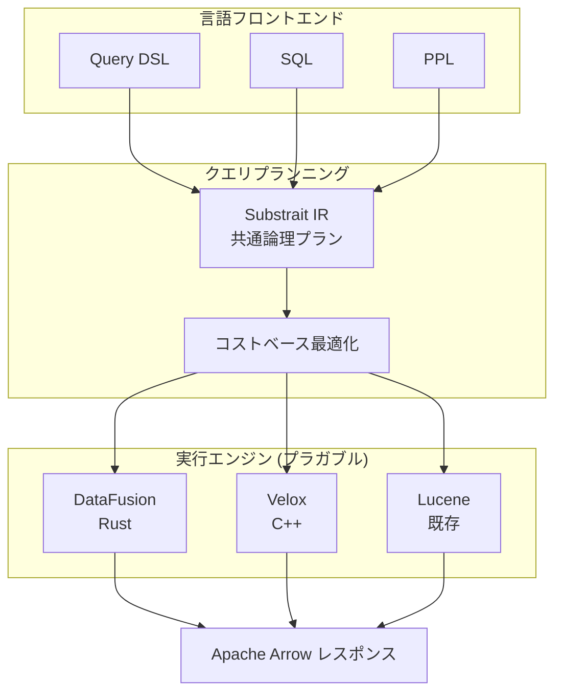

</Zoom>

</div>
<div>

### <span class="text-cyan-400 border-b border-cyan-400">現状の課題</span>

- Luceneとの密結合による制約
- 大規模集計でのメモリボトルネック
- DSL/SQL/PPLで重複した式エンジン

### <span class="text-cyan-400 border-b border-cyan-400">コミュニティの動き</span>

- **ByteDance**: OLAPプラグイン提供
- **Velox4J**: Velox統合の提案
- **Segmentless設計**: ベクトル検索向け

### <span class="text-cyan-400 border-b border-cyan-400">互換性</span>

- 既存Luceneベースの集計は維持
- **opt-inプラグイン**として実装

</div>
</div>

---

# ストリーミングクエリアーキテクチャ

<div class="grid grid-cols-2 gap-6 mt-2">
<div>

### <span class="text-cyan-400 border-b border-cyan-400">従来 vs ストリーミング</span>

<Zoom>

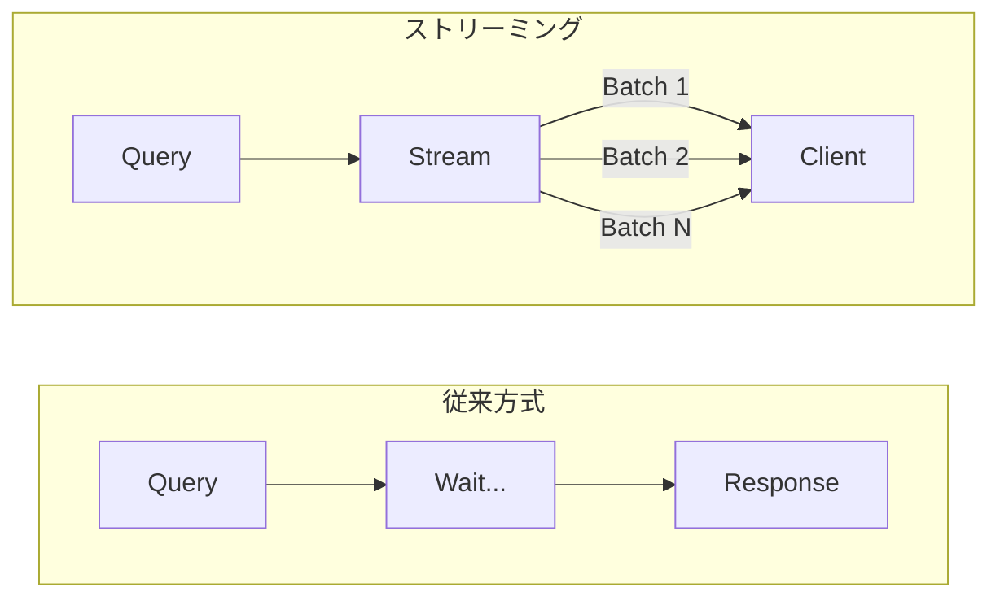

</Zoom>

**従来**: 全処理完了まで待機 → メモリ大  
**新方式**: Arrow Batchで逐次返却 → 低メモリ

</div>
<div>

### <span class="text-cyan-400 border-b border-cyan-400">期待される効果</span>

| 指標         | 改善            |
| ------------ | --------------- |
| 応答時間     | **最大2倍高速** |
| メモリ使用量 | 大幅削減        |
| 部分結果     | 即時返却可能    |

### <span class="text-cyan-400 border-b border-cyan-400">3.5での目標</span>

- ストリーミング集計を**デフォルト有効化**
- クエリプランニング改善 / Virtual Threads

### <span class="text-cyan-400 border-b border-cyan-400">対応集計</span>

Numeric terms / Cardinality count（今後拡張）

</div>
</div>

---

# コア検索エンジン最適化 (2026)

<div class="grid grid-cols-2 gap-6 mt-2">
<div>

### <span class="text-cyan-400 border-b border-cyan-400">Skip List拡張</span>

3.4でサブ集計対応を拡張:

- Range / Auto Date Histogram
- Min / Max 集計の高速化
- `DocValuesSkipper`による事前集計活用

### <span class="text-cyan-400 border-b border-cyan-400">Bulk Collection API</span>

Lucene 10.3/10.4の新APIを活用:

- `LeafCollector#collectRange`
- `NumericDocValues#longValues`
- `DocIdStream#intoArray`

→ 仮想呼び出しオーバーヘッド削減

</div>
<div>

### <span class="text-cyan-400 border-b border-cyan-400">セグメント内並列検索</span>

Lucene 10で導入された機能を活用:

- 単一セグメントをDoc IDで分割
- 複数スレッドで並列処理
- 大規模セグメントでのCPU利用率向上

### <span class="text-cyan-400 border-b border-cyan-400">その他の最適化</span>

- **Missing Terms Aggregator**: Rare Terms最適化の拡張
- **gRPC Search API**: 50+集計タイプのProtobuf対応
- **Concurrent Search改善**: 負荷分散の最適化

</div>
</div>

---

# ベクトル検索ロードマップ (2026)

<div class="grid grid-cols-2 gap-4 mt-1 text-sm">
<div>

### <span class="text-cyan-400 border-b border-cyan-400">BFloat16サポート</span>

| 形式         | 範囲          | メモリ削減 |
| ------------ | ------------- | ---------- |
| FP32         | ± 3.4 × 10³⁸     | -          |
| FP16         | ± 65,504       | 50%        |
| **BFloat16** | **± 3.4 × 10³⁸** | **50%**    |

- FP16の範囲制限を解消
- Intel AVX512 BF16命令でハードウェア加速

### <span class="text-cyan-400 border-b border-cyan-400">メモリ最適化検索</span>

- Warmup機能でテールレイテンシ削減
- FP16をデフォルト化 → メモリ50%削減

</div>
<div>

### <span class="text-cyan-400 border-b border-cyan-400">ディスクベース検索 v2</span>

- **BPGP**: ベクトル再配置でディスク読み取り最適化
- **Gorder-PQ**: 優先度キューによる効率化
- **Better Binary Quantization**: Flat/近似検索対応

### <span class="text-cyan-400 border-b border-cyan-400">GPU Acceleration の改善</span>

- インデックスファイル転送の最適化
- **2倍の高速化**を目標

### <span class="text-cyan-400 border-b border-cyan-400">拡張性向上</span>

k-NNインターフェースをコアに移動 → JVector等対応

</div>
</div>

---

# AI/ML ロードマップ (2026)

<div class="grid grid-cols-2 gap-4 mt-1">
<div>

### <span class="text-cyan-400 border-b border-cyan-400">Agentic Conversation Memory</span>

Built-inエージェント向け永続的コンテキスト管理:

- セッション間の会話履歴保持
- ツール実行トレースの記録
- リモートメモリストレージ対応

### <span class="text-cyan-400 border-b border-cyan-400">Context Management & Hook System</span>

LLMコンテキストウィンドウの動的最適化:

- Sliding Window / Summarization Manager
- Tools Output Truncate

</div>
<div>

### <span class="text-cyan-400 border-b border-cyan-400">MCP拡張</span>

- **Passthrough Headers**: 認証情報の透過的転送
- **OAuth 2.x対応**: MCP仕様準拠の認証

### <span class="text-cyan-400 border-b border-cyan-400">Connector改善</span>

- リトライポリシー: ストリーミング対応
- Terraform Provider: ML Connector/Model対応

### <span class="text-cyan-400 border-b border-cyan-400">3.5ターゲット</span>

Context Management API / Remote Agentic Memory

</div>
</div>

---

# Pluggable Per-Field Codecs (2026)

<div class="grid grid-cols-2 gap-4 mt-1">
<div>

### <span class="text-cyan-400 border-b border-cyan-400">現状の課題</span>

複数プラグインが同一インデックスで共存不可:

- k-NN + Seismic → CodecServiceFactory競合
- 各プラグインが独自のCodecをラップ

### <span class="text-cyan-400 border-b border-cyan-400">解決策: Per-Field Codec Builder</span>

```java
interface PerFieldCodecBuilder {
  Optional<PerFieldDocValuesFormat> docValuesFormat();
  Optional<PerFieldKnnVectorsFormat> knnVectorsFormat();
}
```

### <span class="text-cyan-400 border-b border-cyan-400">メリット</span>

- k-NN + Seismic共存可能 / 後方互換性維持

</div>
<div>

### <span class="text-cyan-400 border-b border-cyan-400">新アーキテクチャ</span>

<Zoom>

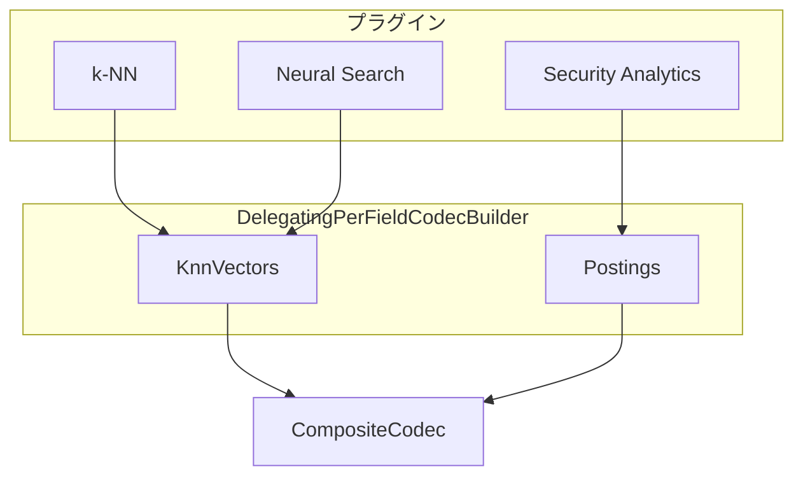

</Zoom>

</div>
</div>

---

# PPL Unified Query API (2026)

<div class="grid grid-cols-2 gap-4 mt-1">
<div>

### <span class="text-cyan-400 border-b border-cyan-400">現状の課題</span>

PPL処理パスが複数存在:

- Calcite V3 / Async Query / Spark で別実装
- コード重複、動作の乖離リスク

### <span class="text-cyan-400 border-b border-cyan-400">Unified Query API</span>

```
PPL → UnifiedParser → AST → Planner → Execute
```

| コンポーネント | 統合内容             |
| -------------- | -------------------- |
| Calcite V3     | Planner/Compiler共有 |
| Async Query    | Parser/Validator統合 |

</div>
<div>

### <span class="text-cyan-400 border-b border-cyan-400">新PPLコマンド (3.5)</span>

- **nomv**: 多値→単一値変換
- **inputlookup**: インデックス参照簡略化
- **array_agg pushdown**: TopHits集計へ変換

### <span class="text-cyan-400 border-b border-cyan-400">メリット</span>

- 一貫したPPL動作
- メンテナンスコスト削減
- 新機能の一括展開

</div>
</div>

---

# ベクトル検索 詳細ロードマップ (2026)

<div class="grid grid-cols-2 gap-4 mt-1 text-sm">
<div>

### <span class="text-cyan-400 border-b border-cyan-400">NVQ (Non-Uniform Vector Quantization)</span>

Exact Scoring/Re-Ranking向け新量子化:

- **3-3.4倍**のストレージ削減
- **<0.01 recall@10**の精度維持
- 最終リランキング / コールドストレージ向け

### <span class="text-cyan-400 border-b border-cyan-400">Radial Search for Disk-based</span>

- 現状: k-NN検索のみ対応
- 目標: min_score指定での全件取得

### <span class="text-cyan-400 border-b border-cyan-400">Cosine Similarity改善</span>

Derived Source有効時の元ベクトル返却対応

</div>
<div>

### <span class="text-cyan-400 border-b border-cyan-400">Pull-based Ingestion改善</span>

Kafka/Kinesis からの取り込み強化:

- **Lag Catch-up待機**: サービング前に同期完了
- シャード再配置時の整合性向上

### <span class="text-cyan-400 border-b border-cyan-400">マルチクライアントベンチマーク</span>

OSBでの並列クライアントテスト:

- `clients: [2,4,8,16,32]`指定

</div>
</div>

---

# Dashboards & Observability (2026)

<div class="grid grid-cols-2 gap-4 mt-1">
<div>

### <span class="text-cyan-400 border-b border-cyan-400">Dashboards改善</span>

**Explore機能強化**:

- 任意のインターバル指定（10秒単位など）

**バージョン分離ビジョン**:

- OpenSearch本体とDashboardsの独立リリース

**Anonymous Login改善**:

- Basic認証フォームなしでのAnonymousログイン

</div>
<div>

### <span class="text-cyan-400 border-b border-cyan-400">Observability TAG</span>

- ベストプラクティス定義
- Logs/Metrics/Traces の一元管理

### <span class="text-cyan-400 border-b border-cyan-400">Security Analytics</span>

- INVESTIGATION フィールド追加
- AI/LLM連携時のコンテキスト改善

</div>
</div>

---

# インフラ & ビルド改善 (2026)

<div class="grid grid-cols-2 gap-4 mt-1">
<div>

### <span class="text-cyan-400 border-b border-cyan-400">CI/CD改善</span>

**LLMによるPRレビュー**:

- Gradle checks前のdiff分析
- Amazon Bedrockアクセス追加

**AlmaLinux 10移行**:

- AlmaLinux 8のサポート終了対応
- 2029年完全移行予定

</div>
<div>

### <span class="text-cyan-400 border-b border-cyan-400">Remote Metadata SDK</span>

- リモートストアのスキーマバージョン管理
- プラグイン起動時の自動チェック

### <span class="text-cyan-400 border-b border-cyan-400">Terraform Provider</span>

ML Commons API対応:

- ML Connector / Model Group / Model リソース

</div>
</div>

---

# 3.5 リリース予定機能まとめ

<div class="grid grid-cols-3 gap-3 mt-2 text-xs">
<div class="bg-blue-900/30 rounded-lg p-2">

### <span class="text-cyan-400">AI/ML</span>

- Agentic Conversation Memory
- Context Management API
- MCP Header Passthrough

</div>
<div class="bg-green-900/30 rounded-lg p-2">

### <span class="text-cyan-400">検索エンジン</span>

- Pluggable Per-Field Codecs
- PPL Unified Query API
- nomv / inputlookup

</div>
<div class="bg-purple-900/30 rounded-lg p-2">

### <span class="text-cyan-400">ベクトル検索</span>

- NVQ Quantization
- Radial Search (Disk)
- Cosine元ベクトル返却

</div>
</div>

<div class="grid grid-cols-3 gap-3 mt-2 text-xs">
<div class="bg-orange-900/30 rounded-lg p-2">

### <span class="text-cyan-400">Dashboards</span>

- 任意インターバル指定
- Anonymous Login改善

</div>
<div class="bg-red-900/30 rounded-lg p-2">

### <span class="text-cyan-400">Security</span>

- INVESTIGATION フィールド
- 検出ルール強化

</div>
<div class="bg-gray-700/30 rounded-lg p-2">

### <span class="text-cyan-400">インフラ</span>

- LLM PRレビュー
- AlmaLinux 10移行

</div>
</div>

<div class="mt-3 text-center text-gray-400 text-sm">
リリース予定: 2026年Q2
</div>
