<style>
:not(pre) > code {
  background-color: #374151 !important;
  color: #e5e7eb !important;
}
</style>

# OpenSearch 2025年 - 2026年

プロジェクト・コミュニティの成長とソフトウェアの進歩

<div class="mt-8 text-gray-400">
Amazon Web Services Japan G.K.
<br>
Analytics Solutions Architect
<br>
Takayuki Enomoto
</div>

---
layout: section
---

# 2025年のハイライト

---
layout: default
---

<div class="absolute inset-0 overflow-hidden">
  <Zoom></Zoom>
</div>

---

# OpenSearch Project Overview

<div class="grid grid-cols-3 gap-6 mt-4">
  <div class="text-center">
    <div class="text-2xl">⬇️</div>
    <div class="text-5xl font-bold text-blue-400">1.3B+</div>
    <div class="text-base text-white">総ダウンロード数</div>
  </div>
  <div class="text-center">
    <div class="text-2xl">📊</div>
    <div class="text-5xl font-bold text-blue-400">1M+</div>
    <div class="text-base text-white">ページビュー</div>
  </div>
  <div class="text-center">
    <div class="text-2xl">🏢</div>
    <div class="text-5xl font-bold text-blue-400">100+</div>
    <div class="text-base text-white">ソリューションプロバイダー</div>
  </div>
</div>

<div class="grid grid-cols-4 gap-4 mt-6">
  <div class="text-center">
    <div class="text-xl">📦</div>
    <div class="text-4xl font-bold text-green-400">140+</div>
    <div class="text-sm text-white">リポジトリ</div>
  </div>
  <div class="text-center">
    <div class="text-xl">👥</div>
    <div class="text-4xl font-bold text-green-400">3.3K+</div>
    <div class="text-sm text-white">コントリビューター</div>
  </div>
  <div class="text-center">
    <div class="text-xl">🌐</div>
    <div class="text-4xl font-bold text-green-400">400+</div>
    <div class="text-sm text-white">参加組織</div>
  </div>
  <div class="text-center">
    <div class="text-xl">💬</div>
    <div class="text-4xl font-bold text-green-400">7K+</div>
    <div class="text-sm text-white">フォーラムメンバー</div>
  </div>
</div>

<div class="grid grid-cols-2 gap-8 mt-6">
  <div class="text-center">
    <div class="text-xl">💜</div>
    <div class="text-4xl font-bold text-purple-400">4K+</div>
    <div class="text-sm text-white">Slack メンバー</div>
  </div>
  <div class="text-center">
    <div class="text-xl">🚀</div>
    <div class="text-4xl font-bold text-purple-400">8週間</div>
    <div class="text-sm text-white">リリースサイクル</div>
  </div>
</div>

<div class="absolute bottom-4 right-4 text-xs text-gray-500">
<a href="https://youtu.be/cUx4-c73RJ4?t=62" target="_blank">OpenSearchCon Japan 2025 - Keynote: Opening Remarks (Bianca Lewis)</a>
</div>

---

# 2025年リリースと主要アップデート

<div class="grid grid-cols-5 gap-6 mt-4">
<div class="col-span-2">

### <span class="text-cyan-400 border-b border-cyan-400">リリースタイムライン</span>

<div class="grid grid-cols-3 gap-1 mt-4 text-center text-sm">
<div class="p-2 rounded bg-gray-700/50">1月</div>
<div class="p-2 rounded bg-cyan-600 text-white font-bold">2月<br/>2.19</div>
<div class="p-2 rounded bg-gray-700/50">3月</div>
<div class="p-2 rounded bg-gray-700/50">4月</div>
<div class="p-2 rounded bg-yellow-500 text-black font-bold">5月<br/>3.0★</div>
<div class="p-2 rounded bg-cyan-600 text-white font-bold">6月<br/>3.1</div>
<div class="p-2 rounded bg-gray-700/50">7月</div>
<div class="p-2 rounded bg-cyan-600 text-white font-bold">8月<br/>3.2</div>
<div class="p-2 rounded bg-gray-700/50">9月</div>
<div class="p-2 rounded bg-cyan-600 text-white font-bold">10月<br/>3.3</div>
<div class="p-2 rounded bg-gray-700/50">11月</div>
<div class="p-2 rounded bg-cyan-600 text-white font-bold">12月<br/>3.4</div>
</div>

</div>
<div class="col-span-3">

### <span class="text-cyan-400 border-b border-cyan-400">主要アップデート領域</span>

<div class="grid grid-cols-2 gap-3 mt-4">
<div class="bg-blue-900/30 rounded-lg p-3">
<div class="text-blue-400 font-bold">コアエンジン最適化</div>
<div class="text-lg text-white">11.3x 高速化</div>
</div>
<div class="bg-teal-900/30 rounded-lg p-3">
<div class="text-teal-400 font-bold">コスト効率の改善</div>
<div class="text-lg text-white">ストレージ 58% 削減、ワークロード分離、クエリモニタリング</div>
</div>
<div class="bg-green-900/30 rounded-lg p-3">
<div class="text-green-400 font-bold">検索の改善</div>
<div class="text-lg text-white">エージェント検索、メモリ最適化ベクトル検索</div>
</div>
<div class="bg-purple-900/30 rounded-lg p-3">
<div class="text-purple-400 font-bold">精度・ランキング改善</div>
<div class="text-lg text-white">リスコアリングの追加、量子化ベクトルの検索精度改善、検索品質評価</div>
</div>
<div class="bg-yellow-900/30 rounded-lg p-3">
<div class="text-purple-400 font-bold">AI/エージェント対応</div>
<div class="text-lg text-white">エージェント実装、MCP対応、エージェントメモリ</div>
</div>
<div class="bg-orange-900/30 rounded-lg p-3">
<div class="text-orange-400 font-bold">Observability</div>
<div class="text-lg text-white">統合UI + PPL刷新</div>
</div>
</div>

</div>
</div>

---

# コアエンジン最適化: 11.3x 高速化を支える技術

<div class="grid grid-cols-2 gap-6 mt-2">
<div>
<div class="text-cyan-400 font-bold mb-2">レイテンシ推移 (幾何平均)</div>
<Zoom>

</Zoom>
<div class="text-center text-sm text-gray-400 mt-1">OS 1.3 → 3.3: 159ms → 14ms</div>
</div>

<div>
<div class="text-cyan-400 font-bold mb-2">要素技術 <span class="text-gray-500 font-normal text-sm">(クリックで詳細)</span></div>
<div class="grid grid-cols-2 gap-2">

<TechCard title="gRPC/Protobuf" color="blue">
v3.2でGA。多重化・バイナリプロトコルでスループット20%向上、クライアント処理時間50%削減。
</TechCard>

<TechCard title="Concurrent Segment Search" color="blue">
セグメント並列処理。v3.0でautoモード有効化、v3.3でThread Balancing追加（大きいセグメントから順に空きスレッドへ割当、tail latency 3-5%↓）。
</TechCard>

<TechCard title="Approximation Framework" color="green">
v3.0でGA。Range/Sort/search_afterで必要件数が集まったら走査停止。数値インデックス（BKDツリー）活用で50倍以上高速化。
</TechCard>

<TechCard title="Range Query" color="green">
v2.17で最適化。BKDツリー活用で数値範囲検索を90%高速化。時系列データのフィルタリングに効果的。
</TechCard>

<TechCard title="Skip List" color="purple">
v3.0で導入、v3.3でtimestampフィールドにデフォルト有効。Date Histogramで該当バケットのみ処理、96%高速化。
</TechCard>

<TechCard title="Star-tree Index" color="purple">
v2.19で導入。事前集計インデックスでMulti-terms集計を40倍高速化。ダッシュボード向けに最適。
</TechCard>

<TechCard title="Streaming Aggregation" color="purple">
v3.3で実験的導入。Apache Arrowで高カーディナリティ集計を2倍高速化。メモリ効率も向上。
</TechCard>

<TechCard title="Lucene 10 / JDK 21+" color="orange">
v3.0でLucene 10.1/JDK 21、v3.3でLucene 10.3/JDK 24。SIMD最適化でテキスト検索89%高速化。
</TechCard>

</div>
</div>
</div>

<div class="absolute bottom-4 right-4 text-xs text-gray-500">
<a href="https://opensearch.org/blog/opensearch-3-3-performance-innovations-for-ai-search-solutions/" target="_blank">出典: OpenSearch 3.3 Performance Blog</a>
</div>

---

# Approximation Framework: 早期終了による高速化

<div class="grid grid-cols-2 gap-6 mt-4">
<div>

### <span class="text-cyan-400">従来の問題と解決策</span>

Lucene は**全セグメントを走査**し必要以上のドキュメントを処理

→ BKDツリーを活用し、**必要件数で走査を停止**

<div class="mt-4 space-y-2 text-sm">
<div class="bg-yellow-900/30 rounded p-2">
<b class="text-yellow-400">Range</b>: BKDツリーを走査、size件で停止
</div>
<div class="bg-green-900/30 rounded p-2">
<b class="text-green-400">Sort</b>: match_all+sortをRange化<br/>
<span class="text-xs text-gray-400 ml-4">ASC→左から / DESC→右から走査</span>
</div>
<div class="bg-blue-900/30 rounded p-2">
<b class="text-blue-400">search_after</b>: 指定位置からのRangeに変換<br/>
<span class="text-xs text-gray-400 ml-4">前ページの走査をスキップ</span>
</div>
</div>

</div>
<div>

### <span class="text-cyan-400">ベンチマーク結果</span>

| クエリ種別 | 改善 |
|-----------|------|
| Range | **90%高速化** |
| Sort (timestamp) | **75%高速化** |
| search_after | **50x高速化** |

<div class="mt-4 bg-gray-800/50 rounded p-3 text-sm">
<div class="text-gray-400 mb-1">具体例:</div>
<div>search_after: 185ms → <b class="text-cyan-400">8ms</b></div>
<div>desc_sort: 2,111ms → <b class="text-cyan-400">6ms</b></div>
</div>

<div class="text-xs text-gray-400 mt-3">v3.0で導入、v3.2で全数値型対応</div>

</div>
</div>

---

# Skip List: フィルタ付き集計を96%高速化

<div class="grid grid-cols-2 gap-6 mt-2">
<div>

### <span class="text-cyan-400">仕組み</span>

Doc Valuesの**ブロック毎にmin/max**を記録

<div class="mt-4 bg-gray-800/50 rounded-lg p-3 text-sm font-mono">
<div class="text-gray-400 mb-2">Block min/max index:</div>
<div class="flex gap-2">
  <div class="bg-gray-700 rounded px-2 py-1 opacity-50">1-100</div>
  <div class="bg-cyan-900 rounded px-2 py-1 border border-cyan-500">101-200 ✓</div>
  <div class="bg-gray-700 rounded px-2 py-1 opacity-50">201-300</div>
</div>
<div class="text-gray-500 mt-2 text-xs">→ 条件外ブロックをスキップ</div>
</div>

</div>
<div>

### <span class="text-cyan-400">ベンチマーク結果</span>

| クエリ | 改善 |
|--------|------|
| Date Histogram + Filter | **96%高速化** |
| + Metrics集計 | **46%高速化** |

### <span class="text-cyan-400">適用条件</span>

- v3.3で **@timestamp** に**デフォルト有効**
- v3.2で**全数値フィールド**対応
- Range Filter + 集計全般で効果

<div class="text-xs text-gray-400 mt-2">116M HTTPログでのベンチマーク</div>

</div>
</div>

---

# Star-tree Index: 集計最大100倍高速化

<div class="grid grid-cols-2 gap-6 mt-2">
<div>

### <span class="text-cyan-400">事前集計による高速化</span>

| クエリ | 通常 | Star-tree |
|--------|------|-----------|
| status=200 (2億件) | 4.2秒 | **6.3ms** |
| status=400 (3千件) | 5ms | **6.5ms** |

### <span class="text-cyan-400">効果</span>

- クエリ処理量: **100分の1**
- **予測可能なレイテンシ**
- 高カーディナリティで特に効果大

### <span class="text-cyan-400">適用条件</span>

- **追記オンリー**のインデックス（更新・削除なし）
- ログ・メトリクス等の**時系列データ向け**

<div class="text-xs text-gray-400 mt-2">v2.19で導入、v3.1でGA、v3.3でMulti-term対応</div>

</div>
<div>

<Zoom></Zoom>

<div class="text-xs text-gray-400 mt-2">
ディメンション値の組み合わせごとに事前集計
</div>

</div>
</div>

---

# コスト効率・運用: 主要技術

<div class="grid grid-cols-2 gap-4 mt-4 text-sm">
<div class="bg-blue-900/30 rounded-lg p-4">

### <span class="text-cyan-400">ストレージ使用量の削減</span>

- Derived Sourceにより、_sourceフィールドを保存せず必要時に再構築することでストレージを削減。58%削減、マージも20-48%高速化

</div>
<div class="bg-green-900/30 rounded-lg p-4">

### <span class="text-cyan-400">ワークロード管理</span>

- Workload Managementによりリソース使用量の制限・配分を実現
- インデックス、リクエスト種別、ユーザーおよびロール単位でルールを適用することが可能

</div>
</div>

<div class="grid grid-cols-2 gap-4 mt-3 text-sm">
<div class="bg-purple-900/30 rounded-lg p-4">

### <span class="text-cyan-400">クエリ性能分析</span>

- Query Insights により Top-N クエリの遅延・リソース消費をリアルタイムで可視化し、ボトルネックを特定
- Live queries dashboards により実行中の long-running query の特定も容易に

</div>
<div class="bg-orange-900/30 rounded-lg p-4">

### <span class="text-cyan-400">検索・書込の分離</span>

- 検索・書込ノードを分離し、ワークロード特性に応じて異なるハードウェアの割り当てやスケーリングが可能に
- read-only レプリカと write レプリカの概念を追加することで、時系列データの世代管理がより容易に

</div>
</div>

---

# Derived Source: ストレージコスト削減 (3.0/3.2)

<div class="grid grid-cols-2 gap-6 mt-2">
<div>

### <span class="text-cyan-400 border-b border-cyan-400">一般フィールド (3.2)</span>

<Zoom>

</Zoom>

<div class="text-sm mt-2">

`_source` を保存せず `doc_values` 等から動的に再構築

- ストレージ **41-58%削減** / Merge **20-48%高速化**

</div>

</div>
<div>

### <span class="text-cyan-400 border-b border-cyan-400">ベクトルフィールド (3.0)</span>

<Zoom>

</Zoom>

<div class="text-sm mt-2">

ベクトルを1バイトプレースホルダーに置換

- ストレージ **3倍削減** / 3.0以降デフォルト有効

</div>

</div>
</div>

---

# Workload Management: リソースの制限・配分 (2.18)

<div class="grid grid-cols-2 gap-6 mt-2">
<div>

### <span class="text-cyan-400 border-b border-cyan-400">Dashboards UI</span>

<Zoom></Zoom>

<div class="text-sm mt-2">

CPU / メモリ使用量をワークロードグループ別に可視化

</div>

</div>
<div>

### <span class="text-cyan-400 border-b border-cyan-400">ルール適用単位</span>

- インデックスパターン（例: `logs-*`）
- リクエスト種別 / ユーザー / ロール

### <span class="text-cyan-400 border-b border-cyan-400">制御可能なリソース</span>

- CPU 使用率 / メモリ使用量
- 閾値超過時に reject または cancel

### <span class="text-cyan-400 border-b border-cyan-400">効果</span>

重いクエリが他のワークロードに影響しない

</div>
</div>

---

# Query Insights: クエリ性能の可視化 (2.12)

<div class="grid grid-cols-2 gap-6 mt-2">
<div>

### <span class="text-cyan-400 border-b border-cyan-400">Top-N Queries</span>

<Zoom></Zoom>

<div class="text-sm mt-2">

レイテンシ / CPU / メモリ消費の上位クエリを特定

</div>

</div>
<div>

### <span class="text-cyan-400 border-b border-cyan-400">主な機能</span>

- **Top-N 分析**: 重いクエリをランキング表示
- **グルーピング**: 類似クエリをまとめて分析
- **履歴エクスポート**: ローカルインデックスに保存

### <span class="text-cyan-400 border-b border-cyan-400">Live Queries (3.1)</span>

- 実行中クエリのリアルタイム監視
- Long-running クエリの即座の特定

</div>
</div>

---

# Reader/Writer 分離: 柔軟なスケーリング (3.0 experimental)

<div class="grid grid-cols-2 gap-6 mt-2">
<div>

<Zoom></Zoom>

</div>
<div>

### <span class="text-cyan-400 border-b border-cyan-400">メリット</span>

- **独立スケーリング**: 検索負荷に応じて Search ノードだけ増減
- **コスト最適化**: Writer は高 I/O、Reader は高メモリ
- **障害分離**: Writer 障害が検索に影響しない

### <span class="text-cyan-400 border-b border-cyan-400">ベンチマーク結果</span>

- クエリレイテンシ **34% 改善**
- コスト **8% 削減**

</div>
</div>

<div class="absolute bottom-4 right-4 text-xs text-gray-500">
<a href="https://opensearch.org/blog/improve-opensearch-cluster-performance-by-separating-search-and-indexing-workloads/" target="_blank">出典: Separating search and indexing workloads</a>
</div>

---

# 検索: 新機能・機能改善

<div class="grid grid-cols-2 gap-6 mt-4">
<div class="bg-blue-900/30 rounded-lg p-5">

### <span class="text-cyan-400">新機能</span>

- **Agentic Search**: 自然言語から最適クエリを自動生成
- **Semantic Field/Highlighting**: パイプライン不要のセマンティック検索
- **BM25F**: 複数フィールドのスコアリング改善
- **マルチベクトル対応**: Late Interaction で精度向上
- **Template Query**: プレースホルダ変数対応

</div>
<div class="bg-green-900/30 rounded-lg p-5">

### <span class="text-cyan-400">機能改善</span>

- **Hybrid Query**: Collapse / Pagination / Score Explanation
- **ML Inference Extension**: クエリ外の外部パラメーターも ML モデルに渡せる
- **Terms Lookup by Query**: 別インデックスへのクエリ結果で動的フィルタ（サブクエリ的）

</div>
</div>

---

# 検索: 精度・ランキング / 性能

<div class="grid grid-cols-2 gap-6 mt-4">
<div class="bg-purple-900/30 rounded-lg p-5">

### <span class="text-cyan-400">精度・ランキング</span>

- **RRF / Z-score 正規化**: ハイブリッド検索のスコア統合改善
- **Asymmetric Distance**: クエリ精度を維持した量子化
- **Random Rotation**: 量子化時の情報損失を軽減
- **Maximal Marginal Relevance**: 結果の多様性確保
- **Learning to Rank**: ML モデルによるリスコアリング
- **Search Relevance Workbench**: 検索品質の評価・比較ツール
- **UBI**: ユーザー行動データの収集・分析

</div>
<div class="bg-orange-900/30 rounded-lg p-5">

### <span class="text-cyan-400">検索性能</span>

- **ベクトル検索**
  - Lucene-on-Faiss: スループット 2x
  - NVIDIA cuVS: インデックス構築 9x 高速化
- **スパース検索**
  - Seismic: 最大 100x 高速化
- **ハイブリッド検索**
  - Bulk Scorer: レイテンシ 85% 削減
- **ML 推論**
  - Skip Existing: 未変更入力スキップ、コスト 70% 削減

</div>
</div>

---

# Agentic Search: 自然言語からクエリを生成 (3.2+)

<div class="grid grid-cols-2 gap-4 mt-1">
<div>

<Zoom></Zoom>

<div class="text-xs text-gray-400 mt-1">エージェント設定画面（Dashboards > AI Search Flows）</div>

</div>
<div>

### <span class="text-cyan-400 border-b border-cyan-400">Agentic Query</span>

```json
GET /products/_search?search_pipeline=agentic-pipeline
{ "query": { "agentic": {
    "query_text": "赤い靴で5000円以下" }}}
```


### <span class="text-cyan-400 border-b border-cyan-400">変換後の Query DSL</span>

```json
{ "query": { "bool": { "must": [
    { "match": { "color": "red" }},
    { "match": { "category": "shoes" }},
    { "range": { "price": { "lte": 5000 }}}]}}}
```

</div>
</div>

<div class="absolute bottom-4 right-4 text-xs text-gray-500">
<a href="https://docs.opensearch.org/latest/query-dsl/specialized/agentic/" target="_blank">出典: Agentic query documentation</a>
</div>

---

# Semantic Field: セマンティック検索をより簡単に (3.3+)

<div class="grid grid-cols-2 gap-6 mt-2">
<div>

### <span class="text-cyan-400">特徴</span>
- semantic フィールドに model_id を指定するだけ
- Ingest Pipeline / Search Pipeline 不要
- knn_vector / rank_features が自動生成される
- Dense / Sparse 両モデルに対応

### <span class="text-cyan-400">考慮事項</span>
- モデル差し替え時はインデックスの再作成が必要 (従来の Neural Search はパイプライン変更のみでモデル更新可能)

</div>
<div>

```json
// マッピング定義
"content": {
  "type": "semantic",
  "model_id": "my-model"
}
```

```json
// 自動生成されるフィールド
"content_semantic_info": {
  "embedding": {
    "type": "knn_vector",
    "dimension": 384,
    "method": { "engine": "faiss" }
  },
  "model": { "id": "...", "name": "..." }
}
```

</div>
</div>

<div class="absolute bottom-4 right-4 text-xs text-gray-500">
<a href="https://docs.opensearch.org/latest/field-types/supported-field-types/semantic/" target="_blank">出典: Semantic field type documentation</a>
</div>

---

# Terms Lookup by Query: 動的フィルタリング (3.3)

<div class="grid grid-cols-2 gap-6 mt-2">
<div>

### <span class="text-cyan-400 border-b border-cyan-400">概要</span>

別インデックスへのクエリ結果を使って動的にフィルタ（サブクエリ的な機能）

### <span class="text-cyan-400 border-b border-cyan-400">ユースケース</span>

- ユーザーの購入履歴から関連商品を除外
- 権限テーブルに基づくドキュメントフィルタ
- リアルタイムの在庫状況でフィルタ

</div>
<div>

### <span class="text-cyan-400 border-b border-cyan-400">クエリ例</span>

```json
GET products/_search
{
  "query": {
    "terms": {
      "product_id": {
        "index": "user_purchases",
        "query": {
          "term": { "user_id": "user123" }
        },
        "path": "purchased_product_ids"
      }
    }
  }
}
```

</div>
</div>

<div class="absolute bottom-4 right-4 text-xs text-gray-500">
<a href="https://docs.opensearch.org/latest/query-dsl/term/terms/" target="_blank">出典: Terms query documentation</a>
</div>

---

# Maximal Marginal Relevance (MMR): 結果の多様性確保 (3.2)

<div class="grid grid-cols-2 gap-6 mt-2">
<div>

### <span class="text-cyan-400">特徴</span>

- 関連性と多様性のバランスを自動調整
- 冗長な結果を排除し、情報の網羅性を向上
  - 例: 「Python入門」で検索 → 同じ本の異なる版ではなく、様々な入門書を返す

### <span class="text-cyan-400">MMRの仕組み</span>

```
MMR = (1-λ) × 関連性 - λ × 既選択との類似度
```

- **関連性**: クエリとの類似度
- **多様性**: 既に選択された結果との差異
- **λ (diversity)**: 1に近いほど多様性重視

</div>
<div>

### <span class="text-cyan-400">設定例</span>

```json
{
  "query": { "knn": { "my_vector": {
    "vector": [0.12, 0.54, 0.91],
    "k": 10 } } },
  "ext": { "mmr": { "diversity": 0.7 } }
}
```

### <span class="text-cyan-400">効果</span>

- RAG での情報の網羅性向上
- 商品検索での多様な選択肢提示

</div>
</div>

<div class="absolute bottom-4 right-4 text-xs text-gray-500">
<a href="https://opensearch.org/blog/improving-vector-search-diversity-through-native-mmr/" target="_blank">出典: Improving vector search diversity through native MMR</a>
</div>

---

# Learning to Rank: ML モデルによるリスコアリング (2.19)

<div class="grid grid-cols-2 gap-6 mt-2">
<div>

### <span class="text-cyan-400">特徴</span>

- XGBoost / RankLib の軽量 ML モデルでリスコアリング
- Feature Set: 検索クエリを特徴として定義
- Feature Logging: 学習データ収集機能
- 元は外部プラグイン → 2.19 で公式プラグインに

### <span class="text-cyan-400">ユースケース</span>

- クリックスルー率を考慮したランキング
- ビジネスルールと関連性の組み合わせ
- A/B テストによるモデル改善

</div>
<div>

### <span class="text-cyan-400">使用例</span>

```json
// Feature Set の定義
PUT _ltr/_featureset/my_features
{ "featureset": { "features": [
  { "name": "title_match",
    "params": ["keywords"],
    "template": { "match": { "title": "{{keywords}}" }}
  }]}}
```

```json
// LTR を使った検索
POST my_index/_search
{ "query": { "sltr": {
    "params": { "keywords": "検索語" },
    "model": "my_model" }}}
```

</div>
</div>

<div class="absolute bottom-4 right-4 text-xs text-gray-500">
<a href="https://docs.opensearch.org/latest/search-plugins/ltr/index/" target="_blank">出典: Learning to Rank documentation</a>
</div>

---

# Lucene-on-Faiss: メモリ効率的なベクトル検索 (3.1)

<div class="grid grid-cols-2 gap-6 mt-4">
<div>

### <span class="text-cyan-400">処理の流れ</span>

<Zoom></Zoom>

- Lucene が次の訪問ノードを決定。Faiss インデックスから必要なベクトルのみ読み込み
- Faiss 上で 距離計算を行い、結果を Lucene に返却

</div>
<div>

### <span class="text-cyan-400">特徴</span>

- 訪問するノードのベクトルのみをディスクからオンデマンドで読み込むことでメモリを削減。
  - 30GB の Faiss インデックスを 8GB メモリのインスタンス (t2.large) で処理することができた。
- Lucene の早期終了ロジックにより、検索速度に改善がみられる場合も
  - 32x 量子化されたインデックスのベンチマークでは QPS が約 2 倍向上した。

</div>
</div>

<div class="absolute bottom-4 right-4 text-xs text-gray-500">
<a href="https://opensearch.org/blog/lucene-on-faiss-powering-opensearchs-high-performance-memory-efficient-vector-search/" target="_blank">出典: Lucene-on-Faiss Blog</a>
</div>

---

# ADC + Random Rotation: 量子化精度の改善 (3.2)

<div class="grid grid-cols-2 gap-4 mt-2">
<div>

### <span class="text-cyan-400 border-b border-cyan-400">Random Rotation</span>

<Zoom></Zoom>

<div class="mt-2 text-sm">

**課題**: 量子化時に特定次元の情報が失われやすい

**解決**: ランダム回転で情報を全次元に分散
→ **Recall が最大 5% 向上**

</div>

</div>
<div>

### <span class="text-cyan-400 border-b border-cyan-400">ADC (Asymmetric Distance)</span>

<Zoom></Zoom>

<div class="mt-2 text-sm">

**課題**: クエリもドキュメントも量子化すると誤差が2倍

**解決**: クエリはフル精度のまま距離計算
→ **Recall が最大 10% 向上**

</div>

</div>
</div>

<div class="absolute bottom-4 right-4 text-xs text-gray-500">
<a href="https://opensearch.org/blog/the-benefits-of-random-rotation-in-quantized-vector-search/" target="_blank">出典: Random Rotation Blog</a> / 
<a href="https://opensearch.org/blog/asymmetric-distance-computation-for-binary-quantization/" target="_blank">ADC Blog</a>
</div>

---

# Skip Existing: ML推論コストの削減 (3.2)

<div class="grid grid-cols-2 gap-6 mt-2">
<div>

<Zoom></Zoom>

</div>
<div>

### <span class="text-cyan-400 border-b border-cyan-400">特徴</span>

- 入力フィールドが変更されていなければ既存エンベディングを再利用
- `text_embedding`, `sparse_encoding`, `text_image_embedding` に対応
- **変更なしドキュメントで処理時間 84% 削減**

### <span class="text-cyan-400 border-b border-cyan-400">設定例</span>

```json
{
  "text_embedding": {
    "model_id": "...",
    "field_map": { "text": "embedding" },
    "skip_existing": true
  }
}
```

</div>
</div>

<div class="absolute bottom-4 right-4 text-xs text-gray-500">
<a href="https://opensearch.org/blog/optimizing-inference-processors-for-cost-efficiency-and-performance/" target="_blank">出典: Optimizing inference processors Blog</a>
</div>

---

# 検索品質: Search Relevance Workbench

**Query Set Comparison** - 複数クエリでパターンを発見

<div class="grid grid-cols-3 gap-4 mt-2">
<div class="text-center">
<div class="text-sm font-bold text-cyan-400 mb-2">1. Query Set 作成</div>
<Zoom></Zoom>
<div class="text-xs text-gray-400 mt-2 text-left">
評価対象のクエリ集合を定義<br/>
• 実ユーザーのクエリログからサンプリング<br/>
• 問題のあるクエリを手動で追加も可
</div>
</div>
<div class="text-center">
<div class="text-sm font-bold text-cyan-400 mb-2">2. Search Config 定義</div>
<Zoom></Zoom>
<div class="text-xs text-gray-400 mt-2 text-left">
比較する検索設定を2つ定義<br/>
• クエリ本文 + パイプライン<br/>
• 例: keyword vs hybrid search
</div>
</div>
<div class="text-center">
<div class="text-sm font-bold text-cyan-400 mb-2">3. 実験結果</div>
<Zoom></Zoom>
<div class="text-xs text-gray-400 mt-2 text-left">
• Jaccard / RBO: 結果の変化を測定<br/>
• nDCG: Judgment で定量評価<br/>
• Judgment: Explicit / UBI / LLM
</div>
</div>
</div>

<div class="absolute bottom-4 right-4 text-xs text-gray-500">
<a href="https://opensearch.org/blog/taking-your-first-steps-towards-search-relevance/" target="_blank">出典: OpenSearch Blog</a>
</div>

---

# 検索品質: User Behavior Insights (UBI)

検索クエリとユーザーアクションを紐付けて記録

<div class="grid grid-cols-2 gap-6 mt-4">
<div class="space-y-3">

### <span class="text-red-400">主な機能</span>

- **イベント収集**: クエリ / 結果 / イベント（click, purchase 等）を記録
- **CTR 分析**: クリック率やゼロクリック検索を検出
- **A/B テスト**: Team Draft Interleaving で設定を比較

### <span class="text-cyan-400">SRW との連携</span>

- クリック等のユーザー行動を **暗黙的 Judgment** として活用
- 人手のラベリング不要で nDCG 評価が可能に

</div>
<div>

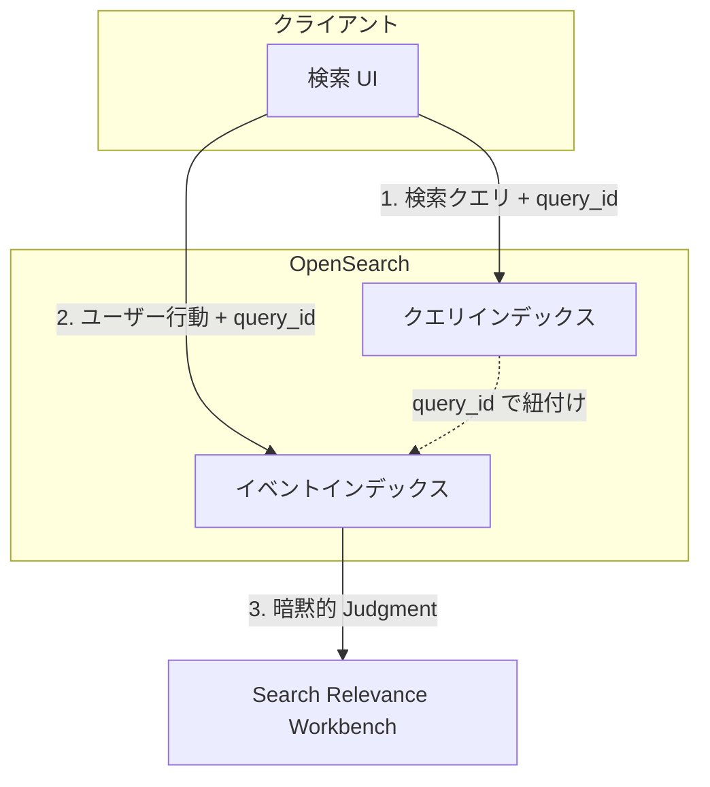

</div>
</div>

<div class="absolute bottom-4 right-4 text-xs text-gray-500">
<a href="https://docs.opensearch.org/docs/search-plugins/ubi/index/" target="_blank">出典: OpenSearch Documentation</a>
</div>


---

# AI/エージェント: OpenSearch をエージェントに組み込む

<div class="grid grid-cols-2 gap-6 mt-6">
<div class="bg-blue-900/30 rounded-lg p-5">

### <span class="text-cyan-400">MCP サーバー提供</span>

- 外部エージェントから OpenSearch を呼び出し可能
- ローカル / ビルトイン MCP サーバー

### <span class="text-cyan-400">会話メモリ</span>

- エージェントの会話履歴を OpenSearch に保存
- コンテキスト維持による精度向上

</div>
<div class="bg-green-900/30 rounded-lg p-5">

### <span class="text-cyan-400">ノーコード構築</span>

- **AI Search Flows**: RAG / エージェントをノーコード構築
- **Processor Chains**: 検索パイプラインの入出力を加工

### <span class="text-cyan-400">エージェント実行基盤</span>

- OpenSearch 上でエージェントを作成・実行
- **Plan-Execute-Reflect** で複雑タスクを分解

</div>
</div>

---

# MCP: AIエージェントとの連携 (3パターン)

<div class="grid grid-cols-3 gap-4 mt-4">
<div class="text-center">

### <span class="text-cyan-400 border-b border-cyan-400">1. ローカル MCP</span>

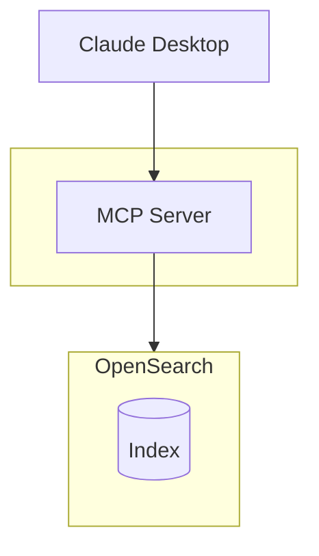

<div class="text-sm mt-2">

`pip install opensearch-mcp-server-py`

</div>

</div>
<div class="text-center">

### <span class="text-cyan-400 border-b border-cyan-400">2. ビルトイン MCP</span>

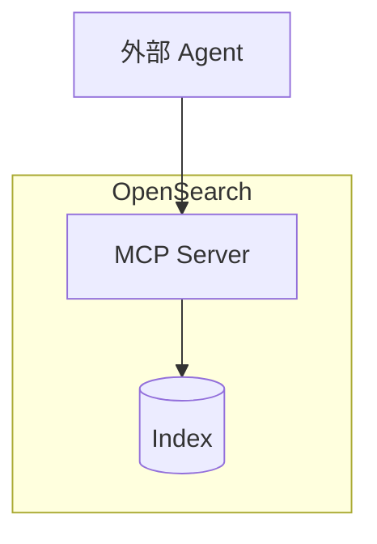

<div class="text-sm mt-2">

3.0+ で設定不要

</div>

</div>
<div class="text-center">

### <span class="text-cyan-400 border-b border-cyan-400">3. MCP Client</span>

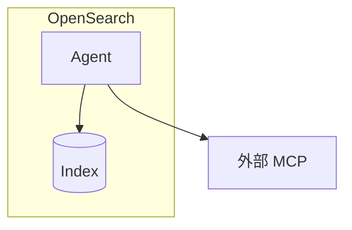

<div class="text-sm mt-2">

外部ツールを呼び出し

</div>

</div>
</div>

<div class="absolute bottom-4 right-4 text-xs text-gray-500">
<a href="https://opensearch.org/blog/introducing-mcp-in-opensearch/" target="_blank">出典: Introducing MCP in OpenSearch</a>
</div>

---

# Agentic Memory: 短期記憶と長期記憶の処理 (3.3)

<div class="mt-4">

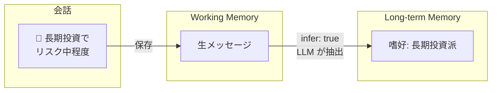

</div>

<div class="grid grid-cols-2 gap-8 mt-4">
<div>

### <span class="text-cyan-400 border-b border-cyan-400">Working Memory（短期）</span>

- 会話の**生データをそのまま保存**
- セッション中のコンテキスト維持
- トークン制限内で直接参照

</div>
<div>

### <span class="text-cyan-400 border-b border-cyan-400">Long-term Memory（長期）</span>

- LLM が**重要情報を自動抽出**
- SEMANTIC / USER_PREFERENCE / SUMMARY
- セッションを超えて永続化

</div>
</div>

<div class="absolute bottom-4 right-4 text-xs text-gray-500">
<a href="https://opensearch.org/blog/opensearch-as-an-agentic-memory-solution-building-context-aware-agents-using-persistent-memory/" target="_blank">出典: OpenSearch as an Agentic Memory Solution</a>
</div>

---

# AI Search Flows: ノーコードでAI検索構築

<div class="grid grid-cols-2 gap-4 mt-1">
<div>

### <span class="text-cyan-400 border-b border-cyan-400">ワークフロービルダー</span>

<Zoom></Zoom>

<div class="text-xs text-gray-400 mt-1">IDE風UI: フロー概要 / 設定 / テスト</div>

</div>
<div>

### <span class="text-cyan-400 border-b border-cyan-400">プリセットテンプレート</span>

- Semantic / Hybrid / Multimodal Search
- RAG with Vector Retrieval
- **Agentic Search** (3.4)

### <span class="text-cyan-400 border-b border-cyan-400">できること</span>

- Ingest/Search パイプライン構築
- MLモデル連携設定
- サンプルデータでテスト

</div>
</div>

<div class="absolute bottom-4 right-4 text-xs text-gray-500">
<a href="https://docs.opensearch.org/latest/vector-search/ai-search/workflow-builder/" target="_blank">出典: AI Search Flows documentation</a>
</div>

---

# Plan-Execute-Reflect Agent: 自律的な問題解決 (3.0)

<div class="grid grid-cols-5 gap-4 mt-2">
<div class="col-span-2">

### <span class="text-cyan-400">特徴</span>

- 複雑なタスクを自動でステップに分解
- 中間結果に基づき計画を動的に修正
- 非同期実行・MCP連携対応

### <span class="text-cyan-400">ユースケース</span>

- マイクロサービスのトラブルシューティング
- ログ・トレース・メトリクスの相関分析

</div>
<div class="col-span-3">

```mermaid {scale: 0.38, theme: 'dark'}
sequenceDiagram
    participant U as クライアント
    participant PER as PER Agent
    participant LLM
    participant EX as Executor Agent
    participant T as Tools/MCP
    participant I as Index

    U->>PER: タスク
    
    loop 完了まで繰り返し
        rect rgb(50, 50, 80)
        Note over PER,LLM: 1. Plan
        PER->>LLM: プロンプト
        LLM-->>PER: ステップ生成
        end
        
        rect rgb(50, 80, 50)
        Note over PER,I: 2. Execute
        PER->>EX: ステップ実行
        EX->>T: ツール呼び出し
        T->>I: 検索/取得
        I-->>T: 結果
        T-->>EX: 結果
        EX-->>PER: 実行結果
        end
        
        rect rgb(80, 50, 50)
        Note over PER,LLM: 3. Reflect
        PER->>LLM: 結果評価
        LLM-->>PER: 継続 or 完了
        end
    end
    
    PER-->>U: 回答
```

</div>
</div>

---

# Observability: 主要技術 (1/2)

<div class="grid grid-cols-2 gap-6 mt-6">
<div class="bg-blue-900/30 rounded-lg p-5">

### <span class="text-cyan-400">Discover UI 刷新</span>

- ログ / トレース / 可視化を統合した新 UI（3.3 プレビュー、3.4 デフォルト）
- **自動チャート選択**: データパターンに応じた最適な可視化
- **Discover Traces**: クリックで PPL クエリを構築（3.3）
- **AI 支援**: コンテキスト認識チャット UI（3.3 experimental）

</div>
<div class="bg-green-900/30 rounded-lg p-5">

### <span class="text-cyan-400">PPL 強化</span>

- **Apache Calcite** エンジン導入（3.0）、デフォルト化（3.3）
- lookup / join / subsearch（3.0）
- flatten / expand / json_extract（3.1）
- timechart / bin / regex / rex / spath（3.3）
- chart / streamstats（3.4）
- 集約関数 / フィルタのプッシュダウン最適化（3.2）

</div>
</div>

---

# Observability: 主要技術 (2/2)

<div class="grid grid-cols-2 gap-6 mt-6">
<div class="bg-purple-900/30 rounded-lg p-5">

### <span class="text-cyan-400">Trace Analytics 刷新</span>

- **OpenTelemetry 完全互換**（3.2）
- React Flow でサービスマップを可視化（3.3）
- カスタムインデックス名 / フィールドマッピング対応（3.1）
- クロスクラスター検索でマルチクラスタ分析（3.1）

</div>
<div class="bg-orange-900/30 rounded-lg p-5">

### <span class="text-cyan-400">その他の強化</span>

- Discover から異常検出器を直接起動（3.0）
- 異常検出の結果フラット化でダッシュボード改善（2.19）
- スパイク / ディップ検出の細分化設定（2.19）
- ML Commons の OpenTelemetry メトリクス統合（3.1）

</div>
</div>

---

# 新 Discover UI: 統合オブザーバビリティ体験

<div class="grid grid-cols-2 gap-6 mt-2">
<div>

### <span class="text-cyan-400 border-b border-cyan-400">ログ・トレース・メトリクスを統合</span>

<Zoom></Zoom>

<div class="text-sm mt-2">

サービス別ログボリュームの自動可視化

</div>

</div>
<div>

### <span class="text-cyan-400 border-b border-cyan-400">React Flow サービスマップ</span>

<Zoom></Zoom>

<div class="text-sm mt-2">

インタラクティブなトレース可視化

</div>

</div>
</div>

<div class="absolute bottom-4 left-4 text-sm text-gray-400">
3.3 プレビュー / 3.4 デフォルト
</div>

---

# PPL on Apache Calcite: クエリエンジンの刷新 (3.0)

<div class="grid grid-cols-2 gap-6 mt-2">
<div>

<Zoom></Zoom>

</div>
<div>

### <span class="text-cyan-400">特徴</span>

- **Apache Calcite** ベースの新クエリエンジン
- 3.0 で導入、3.3 でデフォルト化
- SQL/PPL の統一的な最適化基盤
- 集約関数 / フィルタのプッシュダウン (3.2)

### <span class="text-cyan-400">新機能</span>

- `lookup` / `join` / `subsearch` (3.0)
- `flatten` / `expand` / `json_extract` (3.1)
- `timechart` / `bin` / `rex` / `spath` (3.3)
- `chart` / `streamstats` (3.4)

</div>
</div>

<div class="absolute bottom-4 right-4 text-xs text-gray-500">
<a href="https://opensearch.org/blog/enhanced-log-analysis-with-opensearch-ppl-introducing-lookup-join-and-subsearch/" target="_blank">出典: Enhanced log analysis with OpenSearch PPL</a>
</div>

---

# 運用ツールのアップデート

<div class="grid grid-cols-2 gap-4 mt-4 text-sm">
<div class="bg-orange-900/30 rounded-lg p-4">

### <span class="text-orange-400">Data Prepper</span>

データ収集・変換・ルーティングパイプライン

- SQS / Kinesis / Lambda ソース追加
- MySQL / PostgreSQL の CDC 対応 (Aurora/RDS のみ)
- Kafka シンク、条件付きルーティング

</div>
<div class="bg-blue-900/30 rounded-lg p-4">

### <span class="text-cyan-400">Migration Assistant</span>

Elasticsearch → OpenSearch 移行ツールキット

- EKS / Helm デプロイ対応
- トラフィックリプレイ改善
- メタデータ移行の自動化

</div>
<div class="bg-green-900/30 rounded-lg p-4">

### <span class="text-green-400">OpenSearch Benchmark</span>

パフォーマンス測定・負荷テストツール

- Redline Testing: 限界性能の自動検出
- カスタムワークロード作成の簡素化
- レポート機能の強化

</div>
<div class="bg-purple-900/30 rounded-lg p-4">

### <span class="text-purple-400">Prometheus Exporter</span>

OpenSearch メトリクスを Prometheus 形式で公開

- OpenSearch プロジェクトに移行 (3.2)
- 公式サポート・メンテナンス体制
- Grafana ダッシュボード連携

</div>
</div>

---

# Data Prepper: RDS/Aurora CDC 対応

<div class="grid grid-cols-5 gap-4 mt-2">
<div class="col-span-2">

### <span class="text-cyan-400">特徴</span>

- MySQL / PostgreSQL の CDC (Change Data Capture)
- Aurora / RDS に対応
- Export: 初期ロード (S3 経由)
- Stream: binlog / WAL からリアルタイム同期
- INSERT / UPDATE / DELETE を検出

### <span class="text-cyan-400">ユースケース</span>

- RDB → OpenSearch のリアルタイム検索
- データレイク構築
- イベント駆動アーキテクチャ

</div>
<div class="col-span-3">

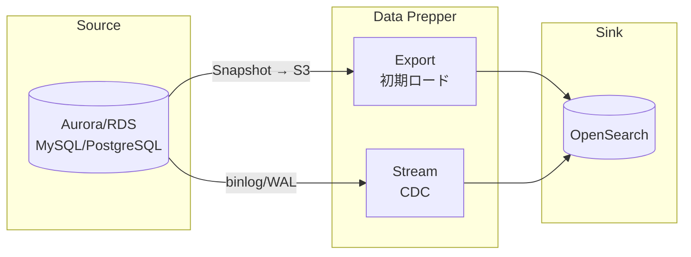

</div>
</div>

<div class="absolute bottom-4 right-4 text-xs text-gray-500">
<a href="https://docs.opensearch.org/latest/data-prepper/pipelines/configuration/sources/rds/" target="_blank">出典: Data Prepper RDS source documentation</a>
</div>

---

# Migration Assistant: 柔軟な移行オプション

<div class="grid grid-cols-2 gap-4 mt-2">
<div>

### <span class="text-cyan-400">3つの移行シナリオ</span>

1. **Backfill のみ** - Snapshot → RFS
2. **Live Capture のみ** - Traffic Replay
3. **両方** - ゼロダウンタイム移行

### <span class="text-cyan-400">EKS / Helm 対応</span>

- クラウド非依存（AWS 以外でも利用可）
- Argo Workflows による自動化
- Pod 単位のスケーリング

### <span class="text-cyan-400">メタデータ変換</span>

- dense_vector → knn_vector
- flattened → flat_object

</div>
<div>

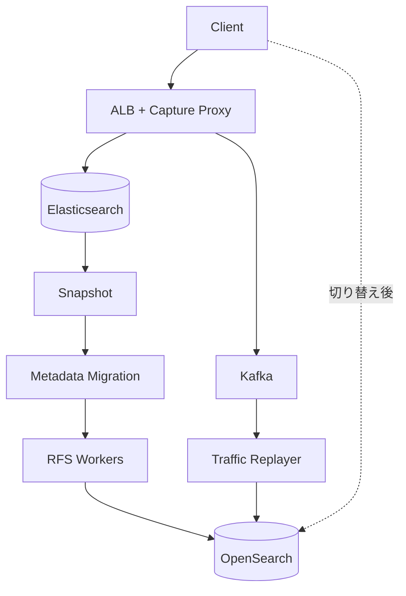

</div>
</div>

<div class="absolute bottom-4 right-4 text-xs text-gray-500">
<a href="https://docs.opensearch.org/latest/migration-assistant/" target="_blank">出典: Migration Assistant documentation</a>
</div>

---

# Reindex-from-Snapshot (RFS): 高速データ移行

<div class="grid grid-cols-2 gap-4 mt-2">
<div>

### <span class="text-yellow-400">通常の Snapshot Restore との違い</span>

| | Snapshot Restore | RFS |
|---|:---:|:---:|
| メジャーバージョン跨ぎ | ❌ 1つまで | ✅ 複数OK |
| ES 6.x → OS 2.x | ❌ | ✅ |
| ソースクラスタ負荷 | 高い | **ゼロ** |
| シャード並列処理 | ❌ | ✅ |

### <span class="text-cyan-400">仕組み</span>

Snapshot 内の Lucene ファイルから `_source` を直接抽出し、ターゲットに Bulk API で再インデックス

</div>
<div>


</div>
</div>

<div class="absolute bottom-4 right-4 text-xs text-gray-500">
<a href="https://aws.amazon.com/jp/blogs/big-data/accelerate-your-migration-to-amazon-opensearch-service-with-reindexing-from-snapshot/" target="_blank">出典: AWS Blog</a>
</div>

---
layout: section
---

# 2025 活動振り返り

Foundation・コミュニティ・イベント

---

# OpenSearch Software Foundation とは

<div class="text-sm mb-2">

**2024年9月** Linux Foundation 傘下で設立。ベンダー中立なガバナンスでプロジェクトの長期的な持続性の確保。

</div>

<div class="flex justify-center gap-8 mt-2 text-xs">
<div class="border border-blue-500 rounded-lg p-3 w-56 text-center">

### <span class="text-cyan-400 border-b border-cyan-400">Governing Board</span>

戦略・予算・方針を決定

</div>
<div class="text-2xl self-center">⟷</div>
<div class="border border-green-500 rounded-lg p-3 w-56 text-center">

### <span class="text-cyan-400 border-b border-cyan-400">Technical Steering Committee (TSC)</span>

技術的方向性を決定

</div>
</div>

<div class="flex justify-center mt-2 text-xs text-gray-400">
<div class="w-56 text-center">↑ 理事を任命</div>
<div class="w-16"></div>
<div class="w-56 text-center">↑ 報告</div>
</div>

<div class="flex justify-center gap-8 text-xs">
<div class="border border-yellow-500 rounded-lg p-3 w-56 text-center">

### <span class="text-cyan-400 border-b border-cyan-400">Members</span>

組織として参加・資金提供

</div>
<div class="w-16"></div>
<div class="border border-orange-500 rounded-lg p-3 w-56 text-center">

### <span class="text-cyan-400 border-b border-cyan-400">Technical Advisory Groups (TAGs)</span>

技術領域ごとの専門グループ

</div>
</div>

<div class="flex justify-center mt-4">
<div class="border border-purple-500 rounded-lg p-2 px-6 text-xs text-center">

**Ambassadors** - 個人としてコミュニティ活動を推進

</div>
</div>

---

# Foundation メンバー

<div class="text-sm mb-2">組織としてプロジェクトに参加し、運営資金を提供。投票権・理事任命権の取得。</div>

### <span class="text-cyan-400">Premier Members</span>

<div class="flex flex-wrap gap-6 items-center justify-center my-3">
  
  <div class="flex flex-col items-center">
    
    <span class="text-green-400 text-xs">New in 2025</span>
  </div>
  
  
</div>

### <span class="text-cyan-400">General Members</span>

<div class="grid grid-cols-6 gap-2 my-2">
  
  
  <div class="flex flex-col items-center">
    
    <span class="text-green-400 text-xs">New</span>
  </div>
  <div class="flex flex-col items-center">
    
    <span class="text-green-400 text-xs">New</span>
  </div>
  
  <div class="flex flex-col items-center">
    
    <span class="text-green-400 text-xs">New</span>
  </div>
  
  <div class="flex flex-col items-center">
    
    <span class="text-green-400 text-xs">New</span>
  </div>
  
  
  
  <div class="flex flex-col items-center">
    
    <span class="text-green-400 text-xs">New</span>
  </div>
</div>

---

# Governing Board

<div class="text-sm mb-2">戦略・予算・方針の決定。Premier Memberが理事を任命、General Memberから代表を選出。</div>

<div class="grid grid-cols-4 gap-4 text-center text-xs mt-2">
  <div class="flex flex-col items-center">
    
    <div class="font-bold">Carl Meadows</div>
    <div class="text-gray-400">AWS</div>
    <div class="text-blue-400">Chair</div>
  </div>
  <div class="flex flex-col items-center">
    
    <div class="font-bold">Andrew Ross</div>
    <div class="text-gray-400">AWS</div>
    <div class="text-blue-400">TSC Representative</div>
  </div>
  <div class="flex flex-col items-center">
    
    <div class="font-bold">Verena Lommatzsch</div>
    <div class="text-gray-400">SAP</div>
    <div class="text-blue-400">Premier Member</div>
  </div>
  <div class="flex flex-col items-center">
    
    <div class="font-bold">Shanshan Song</div>
    <div class="text-gray-400">Uber</div>
    <div class="text-blue-400">Premier Member</div>
  </div>
</div>

<div class="grid grid-cols-4 gap-4 text-center text-xs mt-3">
  <div class="flex flex-col items-center">
    
    <div class="font-bold">Ben Slater</div>
    <div class="text-gray-400">NetApp</div>
    <div class="text-green-400">General Member</div>
  </div>
  <div class="flex flex-col items-center">
    
    <div class="font-bold">Ed Anuff</div>
    <div class="text-gray-400">DataStax</div>
    <div class="text-green-400">General Member</div>
  </div>
  <div class="flex flex-col items-center">
    
    <div class="font-bold">Mehul Shah</div>
    <div class="text-gray-400">Aryn</div>
    <div class="text-green-400">General Member</div>
  </div>
  <div class="flex flex-col items-center">
    
    <div class="font-bold">Yakun Li</div>
    <div class="text-gray-400">ByteDance</div>
    <div class="text-green-400">General Member</div>
  </div>
</div>

---

# Technical Steering Committee (TSC)

<div class="text-sm mb-2">技術的監督・ロードマップの決定。現TSCメンバーの投票による選出。</div>

<div class="grid grid-cols-2 gap-6 text-sm">
<div>

| 所属      | メンバー ('YY=加入年)                                                         |
| --------- | ----------------------------------------------------------------------------- |
| Apple     | Mikhail Stepura '25                                                           |
| AWS       | **Chair** Andrew Ross '24<br>Pallavi Priyadarshini '24<br>Prudhvi Godithi '25 |
| ByteDance | Yakun Li '24                                                                  |
| Eliatra   | Nils Bandener '25                                                             |
| IBM       | Samuel Herman '25                                                             |

</div>
<div>

| 所属        | メンバー ('YY=加入年)                                  |
| ----------- | ------------------------------------------------------ |
| Independent | Amitai Stern '25                                       |
| OSC         | Eric Pugh '25                                          |
| Paessler    | Jonah Kowall '25                                       |
| Salesforce  | Bryan Burkholder '24                                   |
| SAP         | Karsten Schnitter '24                                  |
| Uber        | Yupeng Fu '24<br>Shubham Gupta '24<br>Michael Froh '25 |

</div>
</div>

---

# Technical Advisory Groups (TAGs)

<div class="text-sm mb-2">TSCに報告する長期グループ。特定技術領域のニーズを監督・調整。ミーティングは公開、誰でも参加可能。</div>

<div class="grid grid-cols-3 gap-4 text-sm mt-4">
<div class="border border-gray-600 rounded-lg p-4">

### <span class="text-cyan-400">Build TAG</span>

ビルド・CI/CD関連

</div>
<div class="border border-purple-500 rounded-lg p-4">

### <span class="text-cyan-400">Observability TAG</span>

ログ・メトリクス・トレース

OpenTelemetry, Prometheus,<br>Jaeger, Fluent Bit と連携

**2025年9月発足**

AWS, Uber, SAP, Apple, Paessler

</div>
<div class="border border-gray-600 rounded-lg p-4">

### <span class="text-cyan-400">Security TAG</span>

セキュリティ関連

</div>
</div>

---

# Ambassadors

<div class="text-sm mb-2">個人としてコミュニティ活動を推進するリーダーの認定。2025年9月にプログラム開始。</div>

<div class="grid grid-cols-4 gap-3 text-xs mt-2">
  <div class="text-center">
    
    <div class="font-bold mt-1">Amanda Katona</div>
    <div class="text-gray-400">NetApp</div>
  </div>
  <div class="text-center">
    
    <div class="font-bold mt-1">Charlie Hull</div>
    <div class="text-gray-400">The Search Juggler</div>
  </div>
  <div class="text-center">
    
    <div class="font-bold mt-1">Dotan Horovits</div>
    <div class="text-gray-400">AWS</div>
  </div>
  <div class="text-center">
    
    <div class="font-bold mt-1">Eric Pugh</div>
    <div class="text-gray-400">OSC</div>
  </div>
  <div class="text-center">
    
    <div class="font-bold mt-1">Itamar Syn-Hershko</div>
    <div class="text-gray-400">BigData Boutique</div>
  </div>
  <div class="text-center">
    
    <div class="font-bold mt-1">Kassian Rosner Wren</div>
    <div class="text-gray-400">NetApp</div>
  </div>
  <div class="text-center">
    
    <div class="font-bold mt-1">Kris Freedain</div>
    <div class="text-gray-400">AWS</div>
  </div>
  <div class="text-center">
    
    <div class="font-bold mt-1">Laysa Uchoa</div>
    <div class="text-gray-400">Nordcloud</div>
  </div>
</div>

<div class="grid grid-cols-2 gap-4 mt-4 text-xs">
<div class="border border-blue-500 rounded-lg p-3">

**応募条件**: コード・コンテンツ・ドキュメント等で貢献実績があり、コミュニティ活動に1年間コミットできる方

</div>
<div class="border border-green-500 rounded-lg p-3">

**応募プロセス**: 年2回募集（3月・9月）→ 貢献実績を記載して応募 → Foundation審査 → 1年任期

</div>
</div>

---

# User Group の成長

技術セッション・ハンズオン・ユースケース共有・コントリビューター育成を各地で実施

<UserGroupMap />

<div class="flex justify-between text-sm mt-2">
  <div>ピンをクリックでグループ詳細を表示 <span class="inline-block w-3 h-3 rounded-full bg-sky-500 border-2 border-white ml-2"></span> Japan</div>
  <div class="flex gap-6">
    <div class="text-center"><div class="text-2xl font-bold">19</div><div class="text-xs opacity-70">Countries</div></div>
    <div class="text-center"><div class="text-2xl font-bold">37</div><div class="text-xs opacity-70">Groups</div></div>
    <div class="text-center"><div class="text-2xl font-bold">7,933</div><div class="text-xs opacity-70">Members</div></div>
  </div>
</div>

---

# OpenSearchCon

<div class="grid grid-cols-3 gap-4">
<div class="col-span-1">

OpenSearchプロジェクトの公式カンファレンス

- 技術セッション・ワークショップ
- 最新機能の発表
- コミュニティ交流

<a href="https://www.youtube.com/@OpenSearchProject/playlists" target="_blank" class="text-xs text-blue-400 hover:underline">全プレイリスト</a>

</div>
<div class="col-span-2 space-y-3">

<div>
<div class="text-sm font-bold mb-1">2025 <span class="text-gray-400 font-normal">5都市</span></div>
<div class="grid grid-cols-5 gap-1 text-base">
<div class="bg-gray-800 rounded p-2 text-center"><a href="https://events.linuxfoundation.org/archive/2025/opensearchcon-europe/" target="_blank" class="text-blue-400 hover:underline font-bold">Europe</a><div class="text-gray-500 text-xs">4-5月</div><a href="https://www.youtube.com/playlist?list=PLzgr9zSpws16qm6E3OsNqzR8iFA3eScak" target="_blank" class="text-blue-400 hover:underline">Videos</a></div>
<div class="bg-gray-800 rounded p-2 text-center"><a href="https://events.linuxfoundation.org/archive/2025/opensearchcon-india/" target="_blank" class="text-blue-400 hover:underline font-bold">India</a><div class="text-gray-500 text-xs">6月</div><a href="https://www.youtube.com/playlist?list=PLzgr9zSpws17d1gG58q3WpqEB1Cu5U2vj" target="_blank" class="text-blue-400 hover:underline">Videos</a></div>
<div class="bg-gray-800 rounded p-2 text-center"><a href="https://events.linuxfoundation.org/archive/2025/opensearchcon-north-america/" target="_blank" class="text-blue-400 hover:underline font-bold">N.America</a><div class="text-gray-500 text-xs">9月</div><a href="https://www.youtube.com/playlist?list=PLzgr9zSpws14nCUmupVPypGXq87rcFp5Y" target="_blank" class="text-blue-400 hover:underline">Videos</a></div>
<div class="bg-gray-800 rounded p-2 text-center"><a href="https://events.linuxfoundation.org/opensearchcon-korea/" target="_blank" class="text-blue-400 hover:underline font-bold">Korea</a><div class="text-gray-500 text-xs">11月</div><a href="https://www.youtube.com/playlist?list=PLzgr9zSpws16DPeI08ZXYQI2zz-EuJfyA" target="_blank" class="text-blue-400 hover:underline">Videos</a></div>
<div class="bg-gray-800 rounded p-2 text-center"><a href="https://events.linuxfoundation.org/opensearchcon-japan/" target="_blank" class="text-blue-400 hover:underline font-bold">Japan</a><div class="text-gray-500 text-xs">12月</div><a href="https://www.youtube.com/playlist?list=PLzgr9zSpws14G2KEgIMXAx6OceBgMin91" target="_blank" class="text-blue-400 hover:underline">Videos</a></div>
</div>
</div>

<div>
<div class="text-sm font-bold mb-1">2024 <span class="text-gray-400 font-normal">3都市</span></div>
<div class="grid grid-cols-5 gap-1 text-base">
<div class="bg-gray-800 rounded p-2 text-center"><span class="font-bold">Europe</span><div class="text-gray-500 text-xs">ベルリン</div><a href="https://www.youtube.com/playlist?list=PLzgr9zSpws14zCETcKtCBwcOuTGMccpV9" target="_blank" class="text-blue-400 hover:underline">Videos</a></div>
<div class="bg-gray-800 rounded p-2 text-center"><span class="font-bold">India</span><div class="text-gray-500 text-xs">ベンガルール</div><a href="https://www.youtube.com/playlist?list=PLzgr9zSpws14KqWMk7IaR2roc62ocYADi" target="_blank" class="text-blue-400 hover:underline">Videos</a></div>
<div class="bg-gray-800 rounded p-2 text-center"><span class="font-bold">N.America</span><div class="text-gray-500 text-xs">サンフランシスコ</div><a href="https://www.youtube.com/playlist?list=PLzgr9zSpws17ZYDb12UTIgEXq5vrUA4b1" target="_blank" class="text-blue-400 hover:underline">Videos</a></div>
</div>
</div>

<div class="grid grid-cols-2 gap-2">
<div>
<div class="text-sm font-bold mb-1">2023</div>
<div class="bg-gray-800 rounded p-2 text-center"><span class="font-bold">N.America</span><span class="text-gray-500 text-sm ml-1">シアトル</span><a href="https://www.youtube.com/playlist?list=PLzgr9zSpws166-ndhm5W49L9bJmiWjsrm" target="_blank" class="text-blue-400 hover:underline ml-2">Videos</a></div>
</div>
<div>
<div class="text-sm font-bold mb-1">2022 <span class="text-gray-400 font-normal">初開催</span></div>
<div class="bg-gray-800 rounded p-2 text-center"><span class="font-bold">N.America</span><span class="text-gray-500 text-sm ml-1">シアトル</span><a href="https://www.youtube.com/playlist?list=PLzgr9zSpws14N5WSzs1OgBahFiN5ymjGo" target="_blank" class="text-blue-400 hover:underline ml-2">Videos</a></div>
</div>
</div>

</div>
</div>

<div class="absolute bottom-4 right-4 text-xs text-gray-500">
<a href="https://opensearch.org/events/" target="_blank" class="text-blue-400 hover:underline">出典: opensearch.org</a>
</div>

---

# OpenSearchCon Japan 2025

<div class="grid grid-cols-3 gap-4 mt-2">
<div class="bg-gray-800 rounded-lg p-4 text-center">
<div class="text-5xl font-bold text-blue-400">131</div>
<div class="text-gray-300">In-Person Attendees</div>
</div>
<div class="bg-gray-800 rounded-lg p-4 text-center">
<div class="text-5xl font-bold text-blue-400">42</div>
<div class="text-gray-300">Organizations</div>
</div>
<div class="bg-gray-800 rounded-lg p-4 text-center">
<div class="text-5xl font-bold text-blue-400">22</div>
<div class="text-gray-300">Conference Sessions</div>
</div>
</div>

<div class="grid grid-cols-2 gap-6 mt-4">
<div class="bg-gray-800 rounded-lg p-4">
<div class="text-sm font-bold text-gray-300 mb-2">Industry</div>
<div class="space-y-1 text-xs">
<div class="flex items-center gap-2"><div class="w-32 bg-blue-500 h-3 rounded" style="width: 66%"></div><span>IT 66%</span></div>
<div class="flex items-center gap-2"><div class="w-32 bg-blue-400 h-3 rounded" style="width: 11%"></div><span>Telecom 11%</span></div>
<div class="flex items-center gap-2"><div class="w-32 bg-blue-300 h-3 rounded" style="width: 8%"></div><span>Consumer Goods 8%</span></div>
<div class="flex items-center gap-2"><div class="w-32 bg-cyan-400 h-3 rounded" style="width: 6%"></div><span>Professional Services 6%</span></div>
<div class="flex items-center gap-2"><div class="w-32 bg-cyan-300 h-3 rounded" style="width: 9%"></div><span>Other 9%</span></div>
</div>
</div>
<div class="bg-gray-800 rounded-lg p-4">
<div class="text-sm font-bold text-gray-300 mb-2">Attendees by Region</div>
<div class="space-y-1 text-xs">
<div class="flex items-center gap-2"><div class="bg-blue-500 h-3 rounded" style="width: 75%"></div><span>Japan 75%</span></div>
<div class="flex items-center gap-2"><div class="bg-blue-400 h-3 rounded" style="width: 21%"></div><span>USA 21%</span></div>
<div class="flex items-center gap-2"><div class="bg-blue-300 h-3 rounded" style="width: 4%"></div><span>Other 4%</span></div>
</div>
<div class="text-sm font-bold text-gray-300 mt-3 mb-2">Primarily Attended For</div>
<div class="space-y-1 text-xs">
<div class="flex items-center gap-2"><div class="bg-orange-400 h-3 rounded" style="width: 60%"></div><span>Conference 60%</span></div>
<div class="flex items-center gap-2"><div class="bg-yellow-400 h-3 rounded" style="width: 40%"></div><span>Networking 40%</span></div>
</div>
</div>
</div>

<div class="absolute bottom-4 right-4 text-xs text-gray-500">
<a href="https://events.linuxfoundation.org/wp-content/uploads/2025/12/OpenSearchCon_Japan25_PostEventReport.pdf" target="_blank" class="text-blue-400 hover:underline">出典: Post Event Report (PDF)</a>
</div>

---
layout: section
---

# 2026年のロードマップ

---

# 2026年ロードマップ概要

<div class="grid grid-cols-3 gap-4 mt-2 text-sm">
<div class="bg-blue-900/40 rounded-lg p-3">

### <span class="text-cyan-400">🔄 Streaming Query</span>

- **v3.5**: Streaming Aggregations デフォルト化
- Apache Arrow形式でブロック処理
- メモリ効率向上・応答時間短縮

</div>
<div class="bg-purple-900/40 rounded-lg p-3">

### <span class="text-cyan-400">🧩 Composable Engine</span>

- Substrait IR による統一論理プラン
- DataFusion / Velox 実行エンジン
- DSL/SQL/PPL の共通最適化

</div>
<div class="bg-green-900/40 rounded-lg p-3">

### <span class="text-cyan-400">⚡ gRPC API 拡張</span>

- 50+ Aggregation 対応
- Python SDK (PyPI公開済)
- REST API との機能パリティ

</div>
<div class="bg-orange-900/40 rounded-lg p-3">

### <span class="text-cyan-400">🔍 Core Performance</span>

- Skip-list: サブ集計対応
- Bulk Collection API (Lucene 10.4)
- **Intra-segment 並列検索**

</div>
<div class="bg-pink-900/40 rounded-lg p-3">

### <span class="text-cyan-400">🎯 Vector Search</span>

- BFloat16 対応 (メモリ50%削減)
- Memory-Optimized 検索の改善
- Disk-based v2 (BPGP/Gorder-PQ)
- GPU転送最適化で2x高速化

</div>
<div class="bg-teal-900/40 rounded-lg p-3">

### <span class="text-cyan-400">🔌 拡張性</span>

- Vector Engine 統一 I/F
- k-NN / JVector 共通化
- Neural Search プラグイン分離

</div>
</div>

<div class="mt-4 text-center text-xs text-gray-400">
📋 <a href="https://github.com/orgs/opensearch-project/projects/206" class="text-cyan-400">GitHub Roadmap</a> ｜ 
📖 <a href="https://opensearch.org/blog/opensearch-3-3-performance-innovations-for-ai-search-solutions/" class="text-cyan-400">Performance Blog (2025/12)</a>
</div>

---

# Composable Query Engine

<div class="grid grid-cols-2 gap-6 mt-2">
<div>

### <span class="text-cyan-400">新アーキテクチャ</span>

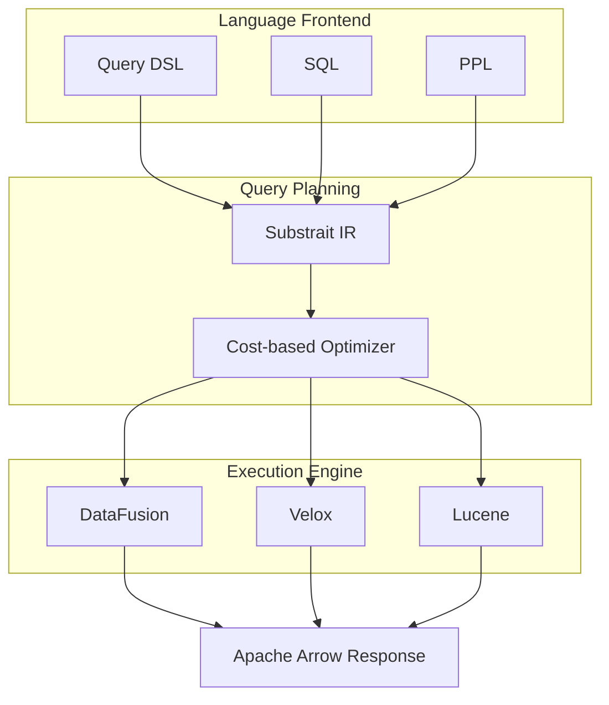

</div>
<div>

### <span class="text-cyan-400">現状の課題</span>

- Luceneとの密結合による制約
- 大規模集計でのメモリボトルネック
- DSL/SQL/PPLで重複した式エンジン

### <span class="text-cyan-400">コミュニティの動き</span>

- **ByteDance**: OLAPプラグイン提供
- **Velox4J**: Velox統合の提案
- **Segmentless設計**: ベクトル検索向け

### <span class="text-cyan-400">互換性</span>

- 既存Luceneベースの集計は維持
- **opt-inプラグイン**として実装

</div>
</div>

<div class="absolute bottom-4 right-4 text-xs text-gray-500">
<a href="https://github.com/opensearch-project/OpenSearch/issues/16897" target="_blank">RFC: Composable Query Engine</a>
</div>

---

# ストリーミングクエリアーキテクチャ

<div class="grid grid-cols-2 gap-6 mt-2">
<div>

### <span class="text-cyan-400">従来 vs ストリーミング</span>

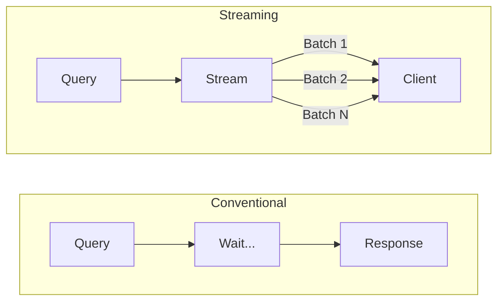

**従来**: 全処理完了まで待機 → メモリ大  
**新方式**: Arrow Batchで逐次返却 → 低メモリ

</div>
<div>

### <span class="text-cyan-400">期待される効果</span>

| 指標         | 改善            |
| ------------ | --------------- |
| 応答時間     | **最大2倍高速** |
| メモリ使用量 | 大幅削減        |
| 部分結果     | 即時返却可能    |

### <span class="text-cyan-400">3.5での目標</span>

- ストリーミング集計を**デフォルト有効化**
- クエリプランニング改善 / Virtual Threads

### <span class="text-cyan-400">対応集計</span>

Numeric terms / Cardinality count（今後拡張）

</div>
</div>

<div class="absolute bottom-4 right-4 text-xs text-gray-500">
<a href="https://github.com/opensearch-project/OpenSearch/issues/14471" target="_blank">RFC: Streaming Aggregations</a>
</div>

---

# BFloat16 対応: 範囲制限なしで50%メモリ削減

<div class="grid grid-cols-2 gap-4 mt-2">
<div>

### <span class="text-cyan-400">浮動小数点形式の比較</span>

| 形式 | ビット | 範囲 | メモリ |
|------|--------|------|--------|
| FP32 | 32 | ±3.4×10³⁸ | 100% |
| FP16 | 16 | ±65,504 | 50% |
| **BFloat16** | 16 | ±3.4×10³⁸ | **50%** |

<div class="mt-4 text-sm">

FP16 は範囲制限があり、範囲外の値があると使えない  
→ **BFloat16 なら FP32 と同じ範囲で 50% 削減**

</div>

</div>
<div class="text-sm">

### <span class="text-cyan-400">BFloat16 とは</span>

Google が機械学習用に開発した16bit浮動小数点形式。FP32 の上位16bitをそのまま切り取った構造で、精度を犠牲に範囲を維持

```
FP32:     1bit符号 + 8bit指数 + 23bit仮数
BFloat16: 1bit符号 + 8bit指数 +  7bit仮数
```

仮数部 7bit → 精度 2〜3桁だが距離計算には十分

### <span class="text-cyan-400">ハードウェアアクセラレーション</span>

Intel AVX512 BF16 命令セットにより、新世代プロセッサでハードウェアレベルの高速化が可能

</div>
</div>

<div class="absolute bottom-4 right-4 text-xs text-gray-500">
<a href="https://github.com/opensearch-project/k-NN/issues/2510">#2510 Faiss SQbf16</a> ｜
<a href="https://github.com/opensearch-project/k-NN/issues/2811">#2811 Lucene half_float</a>
</div>

---

# Memory-Optimized Vector Search 改善

<div class="grid grid-cols-2 gap-4 mt-2">
<div>

### <span class="text-cyan-400">改善計画</span>

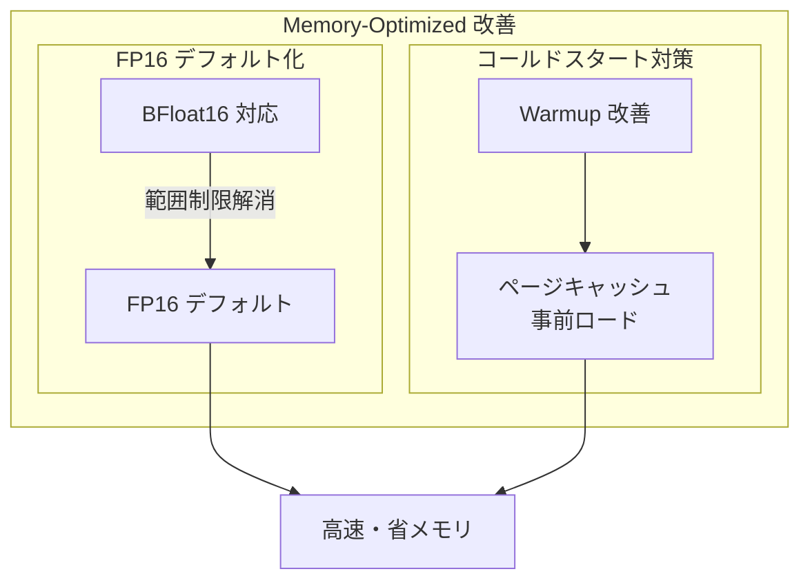

</div>
<div class="text-sm">

### <span class="text-cyan-400">FP16 デフォルト化</span>

v3.4.0 で Native SIMD scoring が導入され、FP16 のパフォーマンスが大幅改善。BFloat16 対応により範囲制限が解消されれば、FP16 をデフォルト化して **メモリ50%削減** が可能に

### <span class="text-cyan-400">コールドスタート対策</span>

従来は Warmup API を呼んでもセクションオフセットの解析のみで、最初のクエリで cold start が発生していた

Warmup 改善により 4KB 単位でページを touch し、カーネルがページキャッシュに事前ロード → テールレイテンシ削減

</div>
</div>

<div class="absolute bottom-4 right-4 text-xs text-gray-500">
<a href="https://github.com/opensearch-project/k-NN/issues/2924">#2924 FP16 Default</a> ｜
<a href="https://github.com/opensearch-project/k-NN/issues/2939">#2939 Warmup</a>
</div>

---

# Disk-based Vector Search 改善

<div class="grid grid-cols-2 gap-4 mt-2">
<div class="text-sm">

### <span class="text-cyan-400">Disk-based Vector Search とは</span>

低メモリ環境向けの 2 フェーズ検索。量子化インデックス（メモリ）で候補絞り込み → フル精度ベクトル（ディスク）で再スコアリング

| 圧縮率 | エンジン | 量子化方式 |
|--------|----------|------------|
| 4x | Lucene | Scalar Quantization |
| 8x〜32x | Faiss | Binary Quantization |

### <span class="text-cyan-400">課題</span>

- 第2フェーズにおけるレイテンシが課題。ベクトルがディスク上に散在するためランダム I/O が発生する。
- Lucene では Binary Quantization がサポートされていない。Faiss が唯一の選択肢となるが 32x 圧縮時の Recall に課題がある。

</div>
<div class="text-sm">

### <span class="text-cyan-400">改善の方向性</span>

**Faiss 向け: [Vector Reordering](https://github.com/opensearch-project/k-NN/issues/3096)**
- Bipartite Graph Partitioning によるベクトル再配置
- Gorder-PQ によるグラフ隣接関係の最適化
- シーケンシャル I/O で**レイテンシ改善**

**Lucene 向け: [Better Binary Quantization](https://github.com/opensearch-project/k-NN/issues/2805)**
- RaBitQ ベースの高精度 1bit 量子化に対応
- Faiss の Bianry Quantization と比較して高 Recall

</div>
</div>

<div class="absolute bottom-4 right-4 text-xs text-gray-500">
<a href="https://github.com/opensearch-project/k-NN/issues/1779" target="_blank">RFC: Disk-Based Vector Search</a>
</div>

---

# AI/ML ロードマップ: Remote Agentic Memory (3.5)

<div class="grid grid-cols-2 gap-6 mt-2">
<div>

### <span class="text-cyan-400">3.3: Local Agentic Memory</span>

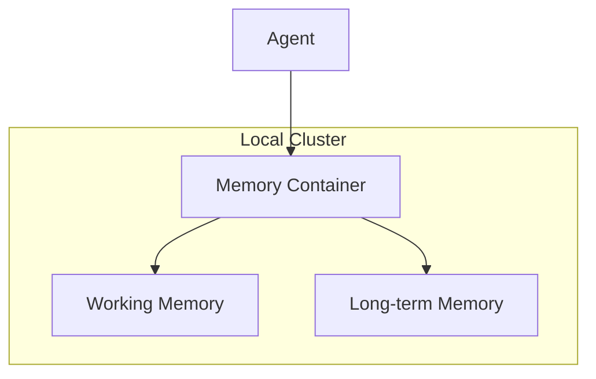

- 同一クラスター内でのみメモリ保存
- エージェントとメモリが密結合

</div>
<div>

### <span class="text-cyan-400">3.5: Remote Agentic Memory</span>

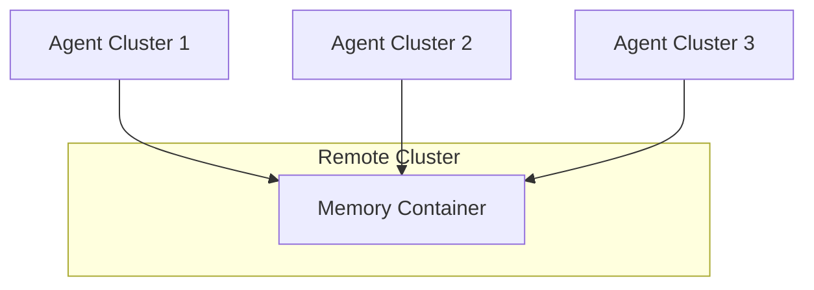

- 複数クラスターでメモリ共有
- コンピュートとストレージの分離
- マネージド環境での柔軟な構成

</div>
</div>

<div class="text-center mt-4 text-sm">

`memory_configuration.endpoint` でリモートクラスターを指定

</div>

<div class="absolute bottom-4 right-4 text-xs text-gray-500">
<a href="https://github.com/opensearch-project/ml-commons/issues/3627" target="_blank">RFC: Remote Agentic Memory</a>
</div>

---

# 2026年 OpenSearchCon

| イベント                    | 日程       | 場所                            |
| --------------------------- | ---------- | ------------------------------- |
| OpenSearchCon China         | 3月17-18日 | 上海 (Hilton Shanghai Hongqiao) |
| OpenSearchCon Europe        | 4月16-17日 | プラハ                          |
| OpenSearchCon India         | 6月15-16日 | ムンバイ (KubeCon India併催)    |
| OpenSearchCon North America | 9月22-24日 | サンノゼ, CA                    |

---

# まとめ

<div class="grid grid-cols-2 gap-6 mt-4">
<div>

### <span class="text-cyan-400">2025年の技術的進化</span>

| 領域 | 主な成果 |
|------|----------|
| **Vector / AI** | FP16、Lucene-on-Faiss、Agent Framework、MCP |
| **Search** | Workbench、UBI、Seismic |
| **Performance** | Star-tree Index、Derived Source |
| **Observability** | Discover UI刷新、PPL Calcite |

</div>
<div>

### <span class="text-cyan-400">2026年の注目領域</span>

| 領域 | ロードマップ |
|------|-------------|
| **Query Engine** | Composable Query Engine |
| **Streaming** | Apache Arrow/Flight |
| **Vector** | BFloat16、Memory-Optimized、Disk-based v2 |
| **AI/ML** | Remote Agentic Memory |

</div>
</div>

<div class="mt-4 text-center">

**コミュニティの成長**: ダウンロード13億回 / コントリビューター3,300名 / 参加組織400社

</div>

---

# コミュニティに参加しよう！

<div class="grid grid-cols-3 gap-6 mt-6">
<div class="text-center">

<div class="text-lg mt-2 font-bold">Slack</div>
</div>
<div class="text-center">

<div class="text-lg mt-2 font-bold">Forum</div>
</div>
<div class="text-center">

<div class="text-lg mt-2 font-bold">GitHub</div>
</div>
</div>

<div class="grid grid-cols-2 gap-6 mt-6 text-sm">
<div class="bg-blue-900/30 rounded-lg p-4">

**今日から始められること**
- Playground で試す: playground.opensearch.org
- ドキュメントを読む: docs.opensearch.org
- User Group Japan に参加

</div>
<div class="bg-green-900/30 rounded-lg p-4">

**コントリビュート**
- Issue報告・PR: GitHub
- [Ambassadorに応募](https://opensearch.org/blog/opensearch-ambassador-applications-are-now-open/)（2月・9月）🔥 Now Open!
- OpenSearchCon で発表

</div>
</div>

---
layout: cover
---

# Thank you!

<div class="mt-8 text-xl">

引き続きセッションをお楽しみください

</div>


